# c1w2

contents

* [1. logistic regression as a neural network](c1w2.md#1-logistic-regression-as-a-neural-network)
  * [1.1. binary classification](c1w2.md#11-binary-classification)
  * [1.2. logistic regression](c1w2.md#12-logistic-regression)
  * [1.3. logistic regression cost function](c1w2.md#13-logistic-regression-cost-function)
  * [1.4. gradient descent](c1w2.md#14-gradient-descent)
  * [1.5. derivatives](c1w2.md#15-derivatives)
  * [1.6. more derivative examples](c1w2.md#16-more-derivative-examples)
  * [1.7. computation graph](c1w2.md#17-computation-graph)
  * [1.8. derivatives with a computation graph](c1w2.md#18-derivatives-with-a-computation-graph)
  * [1.9. logistic regression gradient descent](c1w2.md#19-logistic-regression-gradient-descent)
  * [1.10. gradient descent on m examples](c1w2.md#110-gradient-descent-on-m-examples)
* [2. python & vectorization](c1w2.md#2-python--vectorization)
  * [2.1. vectorization](c1w2.md#21-vectorization)
  * [2.2. more examples of vectorization](c1w2.md#22-more-examples-of-vectorization)
  * [2.3. vectorizing logistic regression](c1w2.md#23-vectorizing-logistic-regression)
  * [2.4. vectorizing logistic regression's gradient output](c1w2.md#24-vectorizing-logistic-regressions-gradient-output)
  * [2.5. broadcasting in python](c1w2.md#25-broadcasting-in-python)
  * [2.6. a note on python/numpy vectors](c1w2.md#26-a-note-on-pythonnumpy-vectors)
  * [2.7. quick tour of jupyter/ipython notebooks](c1w2.md#27-quick-tour-of-jupyteripython-notebooks)
  * [2.8. explanation of logistic regression cost function](c1w2.md#28-explanation-of-logistic-regression-cost-function)
  * [2.9. programming assignments](c1w2.md#29-programming-assignments)

## 1. logistic regression as a neural network

### 1.1. binary classification

维度为(64, 64, 3)的图片 ===&gt; img vector: x=维度为(64\*64\*3=12288, 1)的列向量。($$n_x=12288$$)

$$(x,y), x \in R^{n_x}, y \in \{0,1\}$$ 

$$m=m_{train}$$个训练样本：$${(x^{(1)}, y^{(1)}), ..., (x^{(m)}, y^{(m)})}$$, 

$$m_{test}$$个测试样本。

$$X$$表示一个$$n_x * m$$的训练样本矩阵,在python里就是`X.shape=(n_x,m)` $$Y$$表示一个$$1 * m$$的向量,在python里是`Y.shape=(1,m)`

### 1.2. logistic regression

given $$x$$, want $$\hat {y}=P(y=1\|x), x \in R^{n_x}$$

params: $$w \in R^{n_x}, b \in R$$

output: $$\hat {y}= \sigma(w^Tx+b), \sigma(z)=\frac{1}{1+e^{(-z)}}$$

### 1.3. logistic regression cost function

$$(x^{(i)},y^{(i)})$$ 表示第i个样本。

**Loss(error) function只针对一条训练样本：**

* square error的loss function:

  $$L(\hat {y}, y)=1/2*(\hat {y} - y)^2$$

* logistic regression的loss function: 

  $$L(\hat {y}, y)=-(ylog\hat {y}+(1-y)log(1-\hat {y}))$$

if $$y=1, L(\hat {y}, y) = -log\hat {y}$$, want $$log\hat {y}$$ large, want $$\hat {y}$$ large

if $$y=0, L(\hat {y}, y) = -log(1-\hat {y})$$, want $$\hat {y}$$ small

**Cost function针对全体训练样本:** 

$$J(w,b)=1/m\sum ^m_{i=1}L(\hat {y}^{(i)}, y^{(i)})=-1/m\sum^m_{i=1}[y^{(i)}log\hat {y}^{(i)}+(1-y^{(i)})log(1-\hat {y}^{(i)})]$$

### 1.4. gradient descent

lr的$$J(w,b)$$是一个凸函数，所以有全局最优。 因为有全局最优，所以lr的初始化一般是0，不用随机。梯度下降：不断重复 $$w=w-\alpha \frac{dJ(w)}{dw}$$ 直到收敛。后续，用$$dw$$来指代$$\frac{dJ(w)}{dw}$$。梯度下降的公式：

$$w=w-\alpha dw$$

$$b=b-\alpha db$$

### 1.5. derivatives

derivative = slope，就是$$dy/dx=\Delta y/\Delta x$$

### 1.6. more derivative examples

$$f(a)=log_e(a)=ln(a), df(a)/da=\frac{1}{a}$$

### 1.7. computation graph

正向计算图算出输出，算每个参数的梯度就反向算。


### 1.8. derivatives with a computation graph

$$J=3v,v=a+u,u=bc$$ 

$$\frac {dJ}{dv}=3, \frac{dv}{da}=1$$ 

$$so, \frac {dJ}{da}=\frac {dJ}{dv}\frac {dv}{da}=3*1=3$$ 

$$if\ b=2,then\ \frac{dJ}{dc}=\frac{dJ}{dv}\frac{dv}{du}\frac{du}{dc}=3*1*b=3*1*2=6$$ 

**写代码时，将$$\frac{dFinalOutputVar}{dvar}$$记为$$dvar$$(最后输出对这个变量的偏导)**


### 1.9. logistic regression gradient descent

$$z=w^Tx+b$$ 

$$\hat {y}=a=\sigma (z)$$ 

$$L(a,y)=-(ylog(a)+(1-y)log(1-a))$$


### 1.10. gradient descent on m examples

首先，根据J的公式，可以知道dJ/dw1其实就是对每个样本的dw1求和，然后/m。

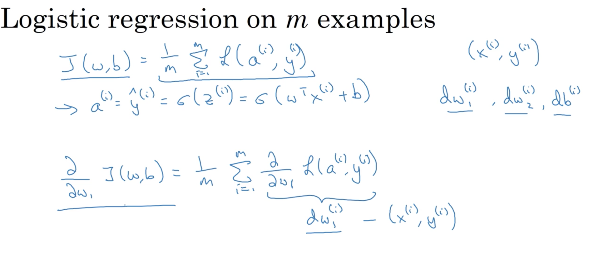

每一次迭代，遍历m个样本，算出J/dw1/dw2/db，然后用这些梯度去更新一次w1/w2/b。

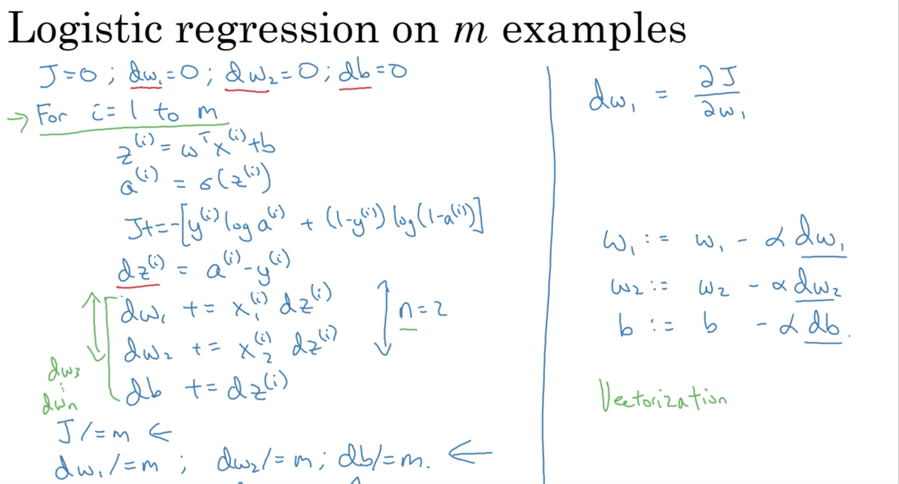

但这的for loop太多了。。所以我们需要vectorization!

## 2. python & vectorization

### 2.1. vectorization

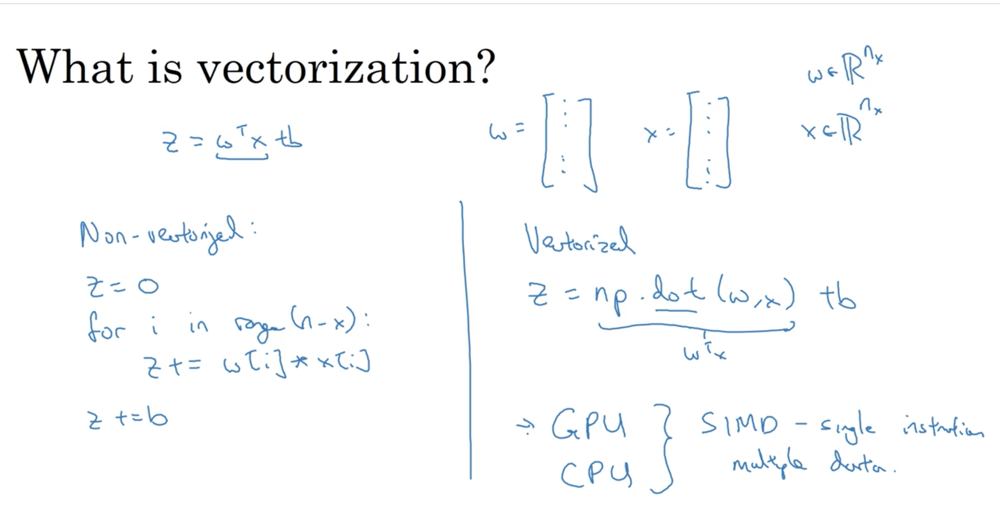

对于两个100w维的向量进行点乘，vectorization(1.5ms) 比for loop(470ms+)快

### 2.2. more examples of vectorization

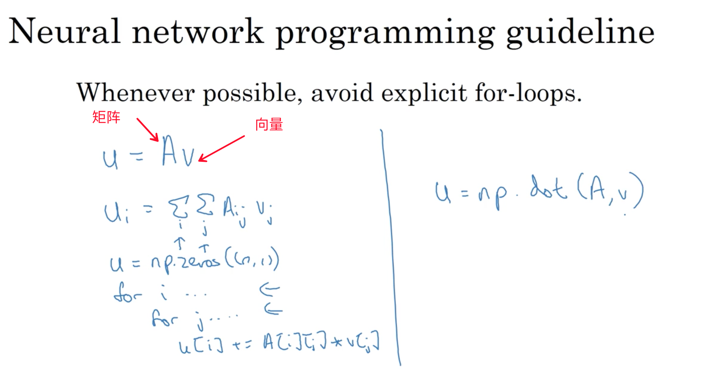

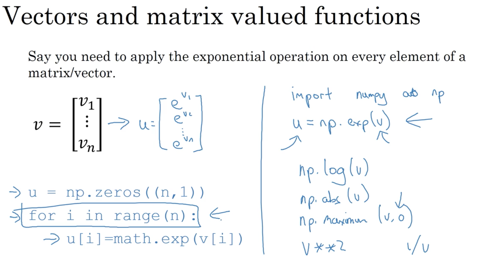

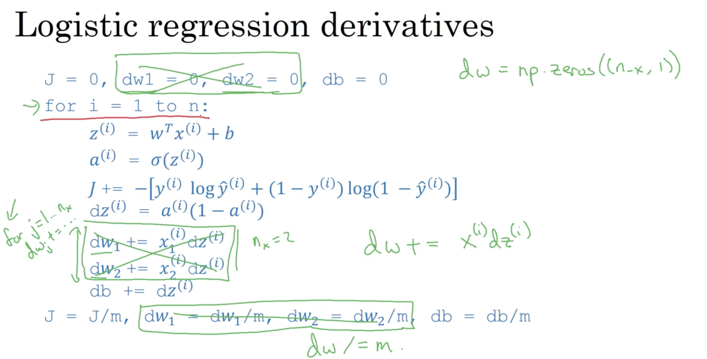 

如上图，将$$n_x$$维的dw变为一个np.array即可干掉内层的for loop。

### 2.3. vectorizing logistic regression

可见，整个求$$Z$$的过程可以变成一句话，而求A时，需要封装一个基于numpy的sigmoid函数。

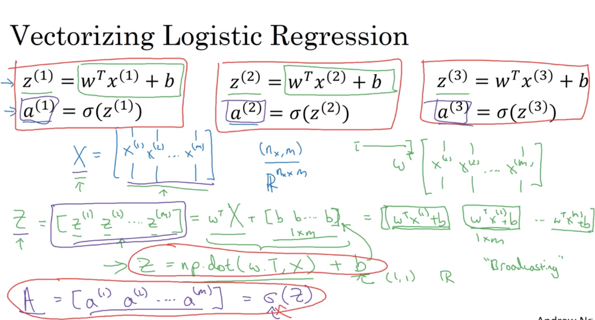

### 2.4. vectorizing logistic regression's gradient output

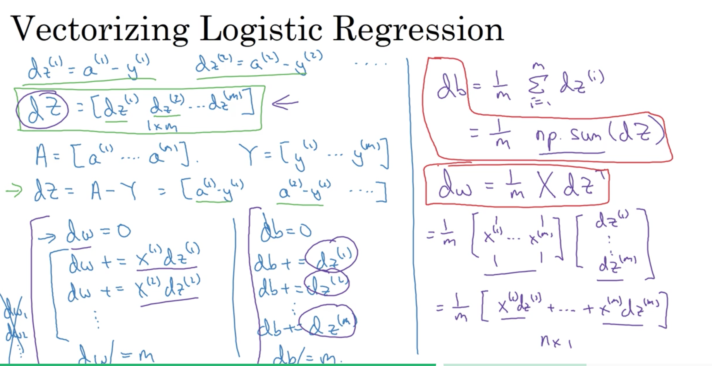

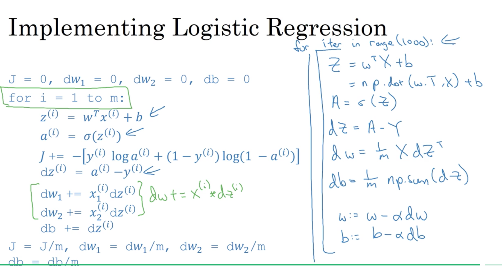

### 2.5. broadcasting in python

```python
A = ndarray([[1,2,3,4],[2,3,4,5],[3,4,5,6]]) # 3*4
calc = A.sum(axis=0) # A的每列求和,得到1*4
calc2 = A.sum(axis=1) # A的每行求和,得到3*1
A/calc.reshape(1,4) #得到一个3*4的矩阵，就是broadcasting。其实等价于A/calc，但为了保险，可以调用reshape(1,4)来确保无误
```

小结：

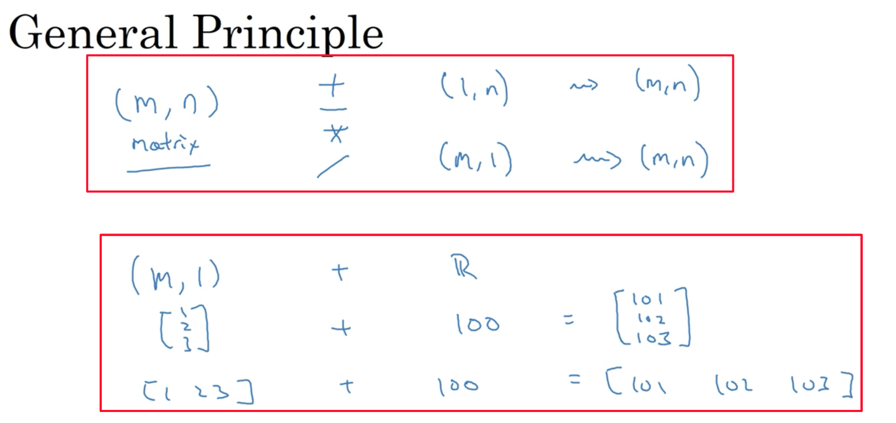

### 2.6. a note on python/numpy vectors

[numpy的broadcasting文档](https://docs.scipy.org/doc/numpy-1.10.1/user/basics.broadcasting.html)

其实就两个准则：

* they are equal, or
* one of them is 1

```python
a=np.random.randn(5) # a.shape=(5,)是一个vector(rank 1 array)，不是一个矩阵，所以a.T还是(5,)，np.dot(a,a.T)=np.dot(a.T,a)是个1*1的数字

b=np.random.randn(5,1) # a.shape=(5,1),  a.T.shape=(1,5), np.dot(a,a.T)是一个5*5的，np.dot(a.T,a)是一个1*1的矩阵（类似array[[0.444]]））

## 可以加一句：
assert(a.shape == (5, 1))
## 如果不小心搞了个rank 1 array,也可以手动a.reshape((5,1))=a.reshape(5,1)
```

### 2.7. quick tour of jupyter/ipython notebooks

### 2.8. explanation of logistic regression cost function

单个样本的loss function, log越大，loss越小：

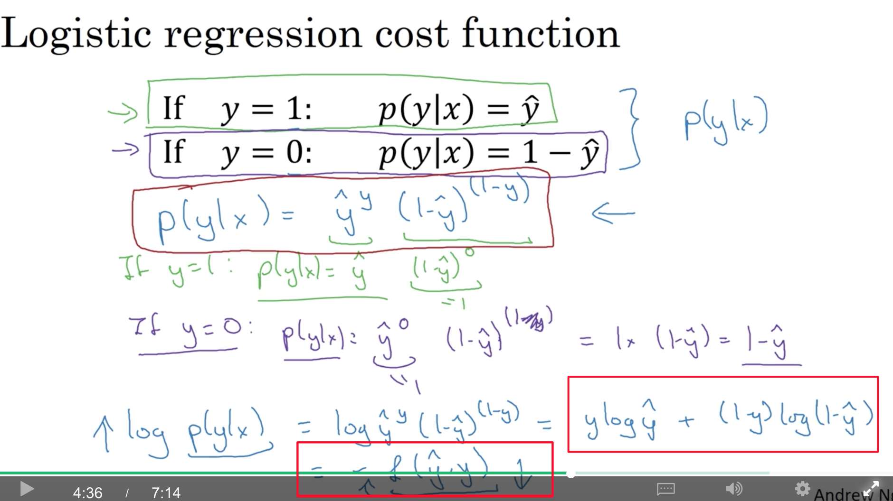

如果是iid（独立同分布），那么，m个样本的cost function，其实就叫对数似然。对他求极大似然估计，其实就是对m个样本求每个cost function的min:

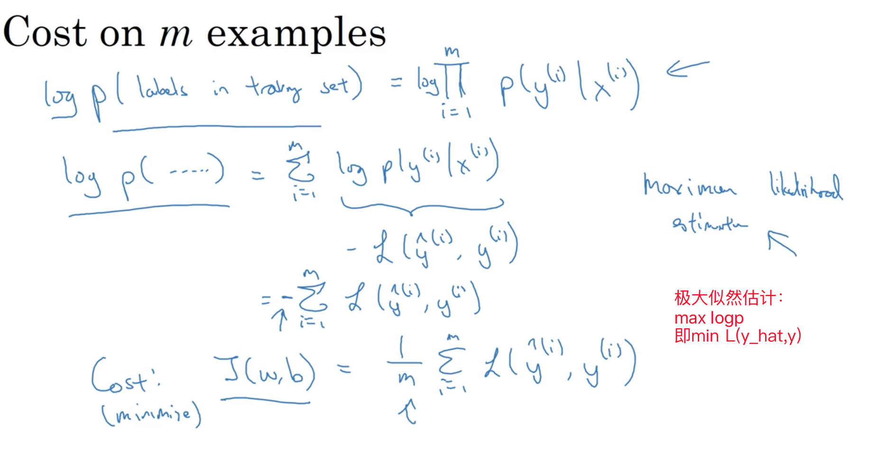

### 2.9. programming assignments

squeeze

```python
np.squeeze(a, axis=None)
## 删掉维数是一的部分，axis可以是Int/int数组，表示只去掉指定下标的部分，如果该部分维数不是1，会报错
x = np.array([[[0], [1], [2]]])
x.shape=(1,3,1)
np.squeeze(x)=array([0,1,2]) # shape=(3,)
np.squeeze(x, axis=(2,))=array([[0, 1, 2]]) # shape=(1,3)
```

把一个shape是(a,b,c,d)的array转成一个type是(b \* c \* d,a)的array:

```python
X_flatten = X.reshape(X.shape[0], -1).T
```

图片的预处理：

* Figure out the dimensions and shapes of the problem (m_train, m_test, num_px, ...)
* Reshape the datasets such that each example is now a vector of size (num_px \* num_px \* 3, 1)
* "Standardize" the data: 对图片而言，所有元素除以255就可以了
