# c1w4

contents

* [1. deep neural network](c1w4.md#1-deep-neural-network)
  * [1.1. deep L-layer neural network](c1w4.md#11-deep-l-layer-neural-network)
  * [1.2. forward propagation in a deep network](c1w4.md#12-forward-propagation-in-a-deep-network)
  * [1.3. getting your matrix dimensions right](c1w4.md#13-getting-your-matrix-dimensions-right)
  * [1.4. why deep representations?](c1w4.md#14-why-deep-representations)
  * [1.5. building blocks of deep neural networks](c1w4.md#15-building-blocks-of-deep-neural-networks)
  * [1.6. forward and backward propagation](c1w4.md#16-forward-and-backward-propagation)
  * [1.7. parameters vs hyperparameters](c1w4.md#17-parameters-vs-hyperparameters)
  * [1.8. what does this have to do with the brain?](c1w4.md#18-what-does-this-have-to-do-with-the-brain)
  * [1.9. others](c1w4.md#19-others)

## 1. deep neural network

### 1.1. deep L-layer neural network

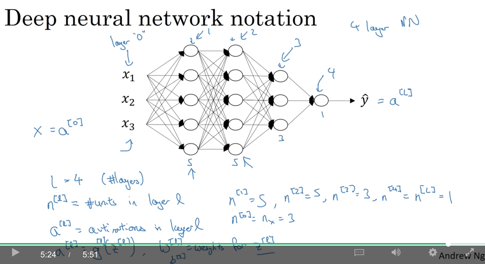

### 1.2. forward propagation in a deep network

$z^{[l](https://github.com/daiwk/dl.ai/tree/25c8f46b54640a1c8e355fe1ab09833b262f2741/c1/i/README.md)}$表示第l层的第i个训练样本\(列向量\)，$Z^{\[l\]}$表示将第l层的这$m$个训练样本全部水平地放在一起形成的矩阵。以此vectorization的方法，可以避免从1-&gt;$m$的这个for-loop。

另外，从第1层到第4层这个for-loop是无法避免的。

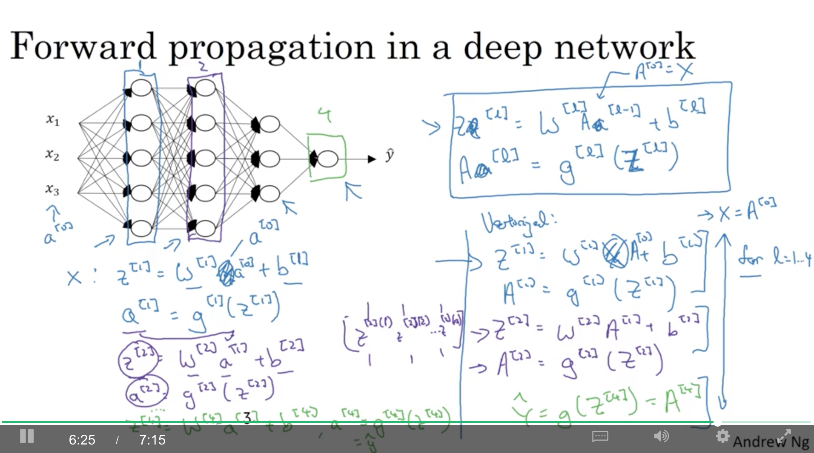

### 1.3. getting your matrix dimensions right

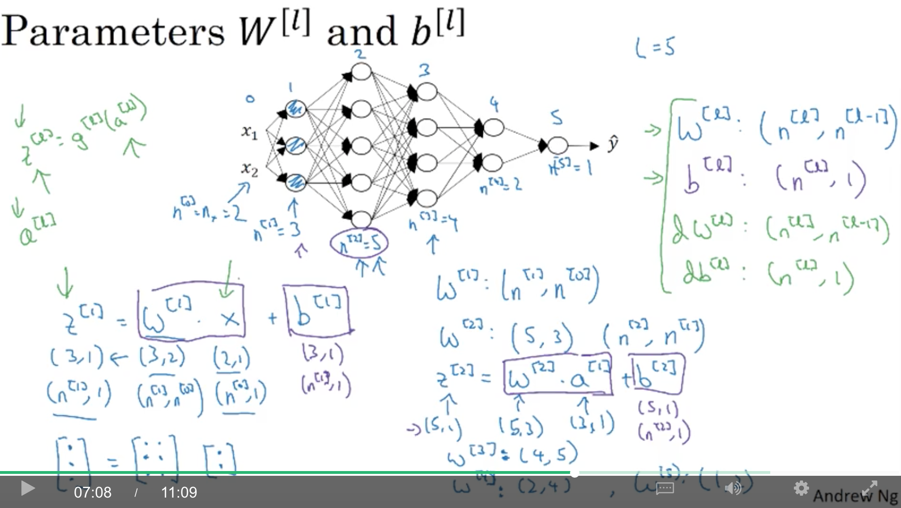

vectorized之后，$b^{\[l\]}$仍然是$\(n^{\[l\]},1\)$维，只是因为broadcasting，才复制m遍，变成了$\(n^{\[l\]},m\)$维。

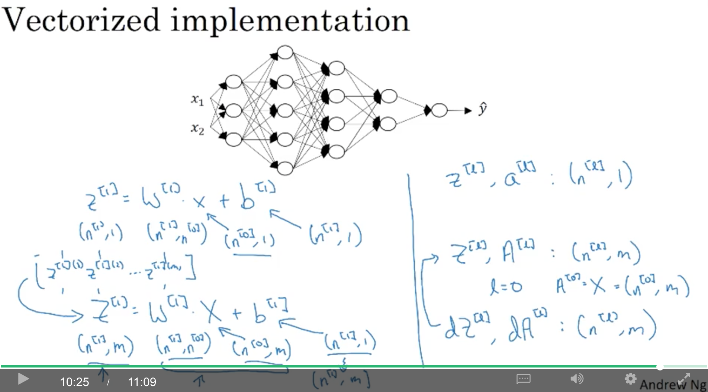

### 1.4. why deep representations?

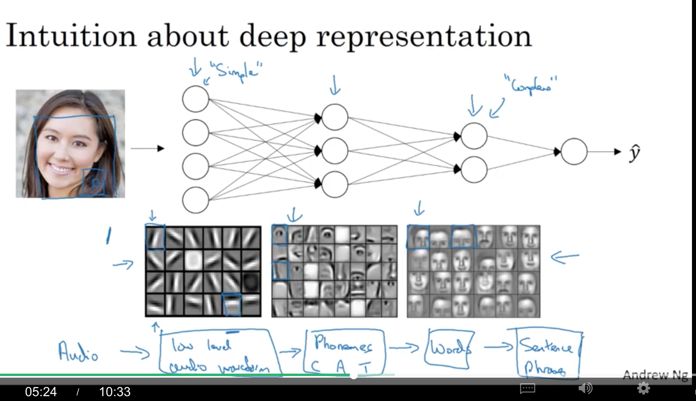

对于$\(x\_1,x\_2,...x\_n\)$的异或（XOR）操作，如果用树型结构，n个叶子节点，则树深度是$log\_2n+1$\(深度为k的满二叉树的第i层上有$2^{i-1}$个结点,总共至多有$2^k-1$个结点\)，即只需要$O\(log\_2n\)$层的树就能完成。

而如果采用单隐层，则需要$2^{\(n-1\)}$个节点

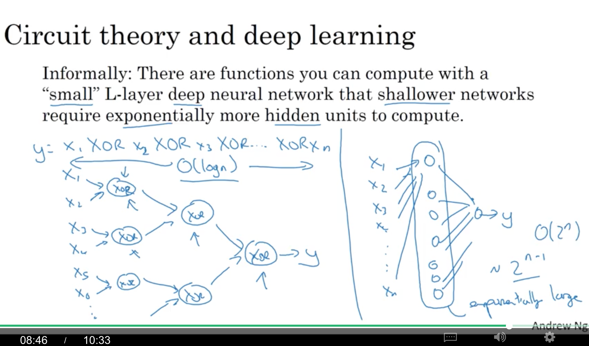

### 1.5. building blocks of deep neural networks

forward时，需要cache $Z^{\[l\]}$以供backward使用。

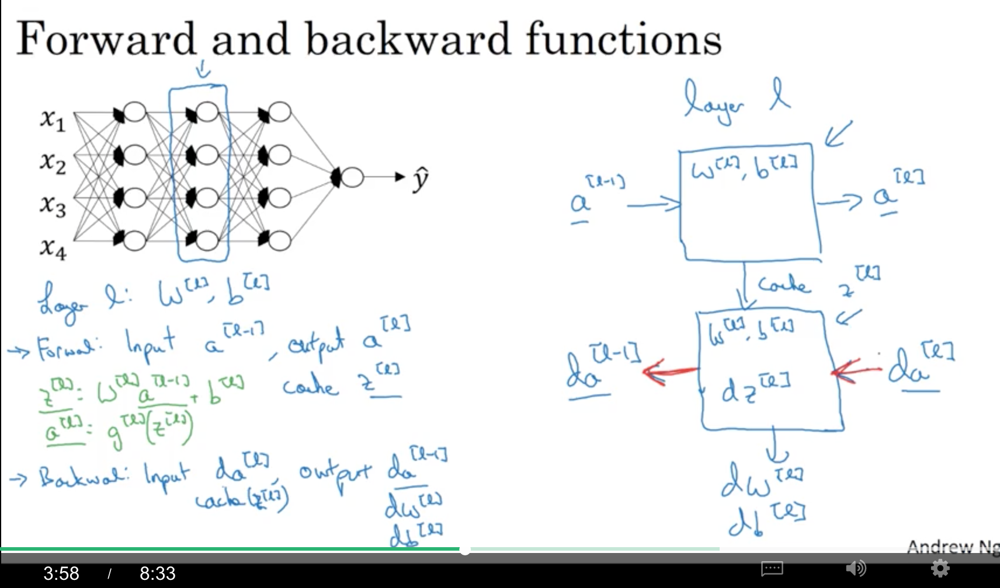

为了计算backward，其实需要cache的有$Z^{\[l\]}$、$W^{\[l\]}$以及$b^{\[l\]}$：

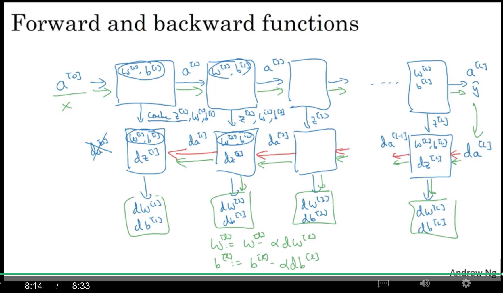

### 1.6. forward and backward propagation

forward propagation for layer l:

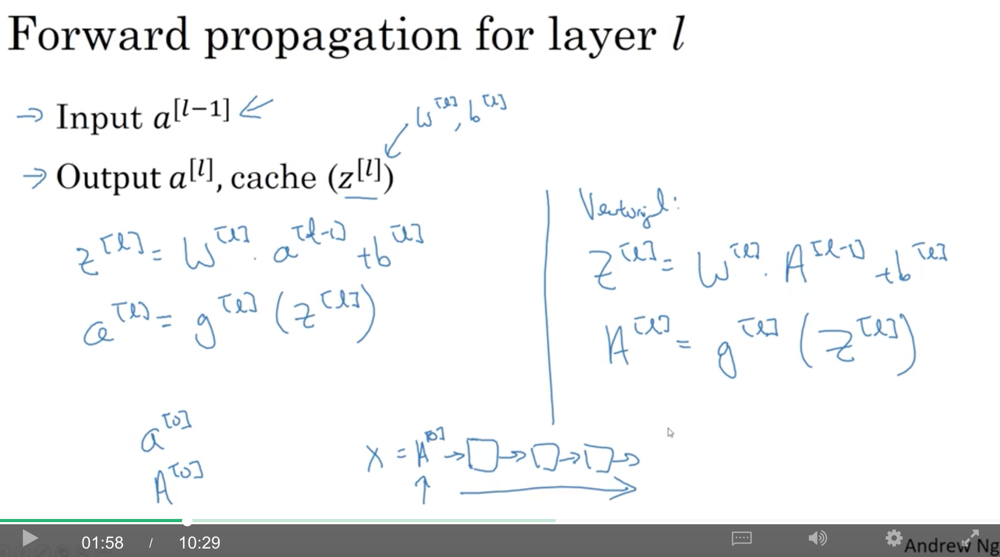

backward propagation for layer l:

参考[C1W2的backward propagation intuition部分](https://github.com/daiwk/dl.ai/blob/master/c1/c1w3.md#backpropagation-intuition)： 注意：$da^{\[l\]}\*g^{\[l\]'}\(z^{\[l\]}\)$是element-wise product。

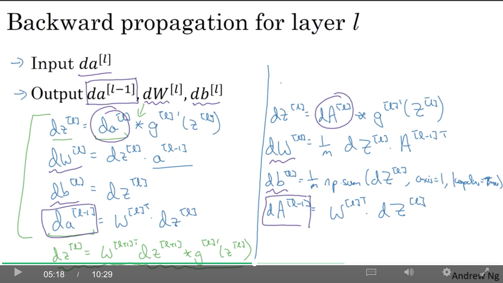

对于最后一层L，如果是sigmoid并采用logloss，那么：

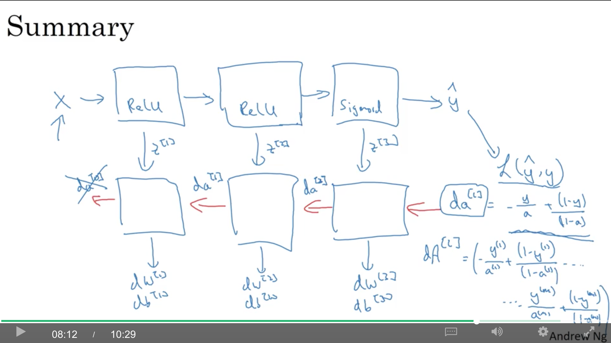

### 1.7. parameters vs hyperparameters

图中下方是：momentum，mini-batch size，regularization

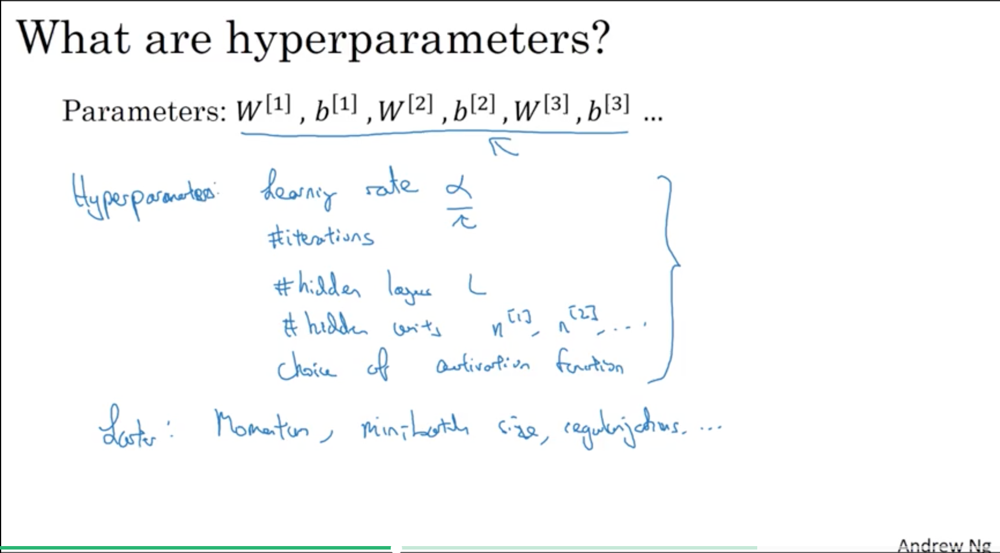

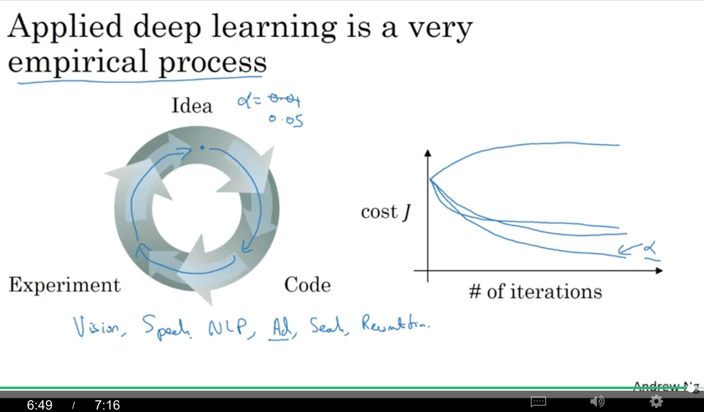

### 1.8. what does this have to do with the brain?

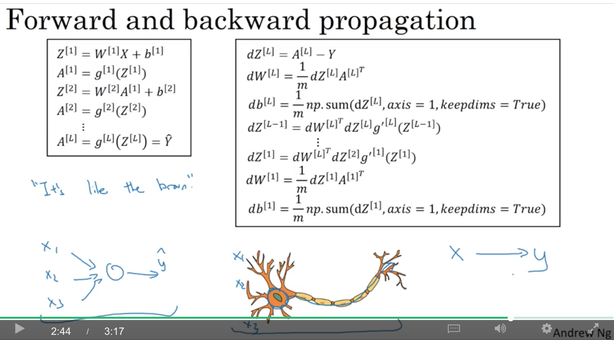

### 1.9. others

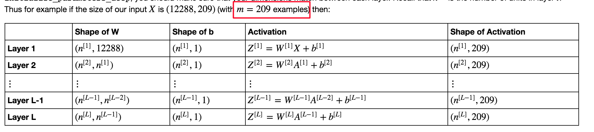

