# c2w1

contents

* [1. setting up your machine learning application](c2w1.md#1-setting-up-your-machine-learning-application)
  * [1.1. train/dev/test sets](c2w1.md#11-traindevtest-sets)
  * [1.2. bias/variance](c2w1.md#12-biasvariance)
  * [1.3. basic recipe for machine learning](c2w1.md#13-basic-recipe-for-machine-learning)
* [2. regularizing your neural network](c2w1.md#2-regularizing-your-neural-network)
  * [2.1. regularization](c2w1.md#21-regularization)
  * [2.2. why regularization reduces overfitting?](c2w1.md#22-why-regularization-reduces-overfitting)
  * [2.3. dropout regularization](c2w1.md#23-dropout-regularization)
  * [2.4. understanding dropout](c2w1.md#24-understanding-dropout)
  * [2.5. other regularization methods](c2w1.md#25-other-regularization-methods)
    * [2.5.1. data augmentation](c2w1.md#251-data-augmentation)
    * [2.5.2. early stopping](c2w1.md#252-early-stopping)
* [3. setting up your optimization problem](c2w1.md#3-setting-up-your-optimization-problem)
  * [3.1. normalizing inputs](c2w1.md#31-normalizing-inputs)
  * [3.2. vanishing/exploding gradients](c2w1.md#32-vanishingexploding-gradients)
  * [3.3. weight initialization for deep networks](c2w1.md#33-weight-initialization-for-deep-networks)
  * [3.4. numerical approximation of gradients](c2w1.md#34-numerical-approximation-of-gradients)
  * [3.5. gradient checking](c2w1.md#35-gradient-checking)
  * [3.6. gradient checking implementation notes](c2w1.md#36-gradient-checking-implementation-notes)

## 1. setting up your machine learning application

### 1.1. train/dev/test sets

传统机器学习，例如数据总量有1w，可以划分train:dev:test=70:0:30，或者，train:dev:test=60:20:20。 但对于大数据，例如100w的数据，那适当的比例应该是98:1:1或者甚至是99.5:0.25:0.25，或者99.5:0.4:0.1。

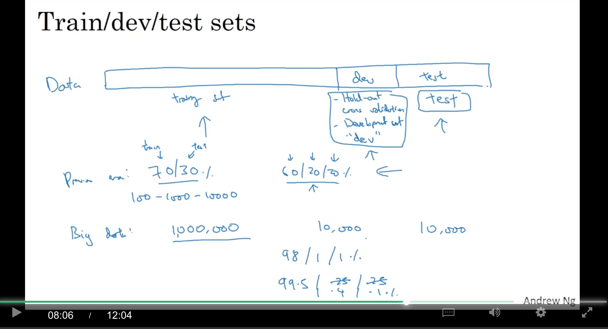

另外，训练集和验证集的分布要保持一致。测试集是为了no-bias地验证模型效果的，有些时候，可以甚至不要测试集，只要验证集就可以了。

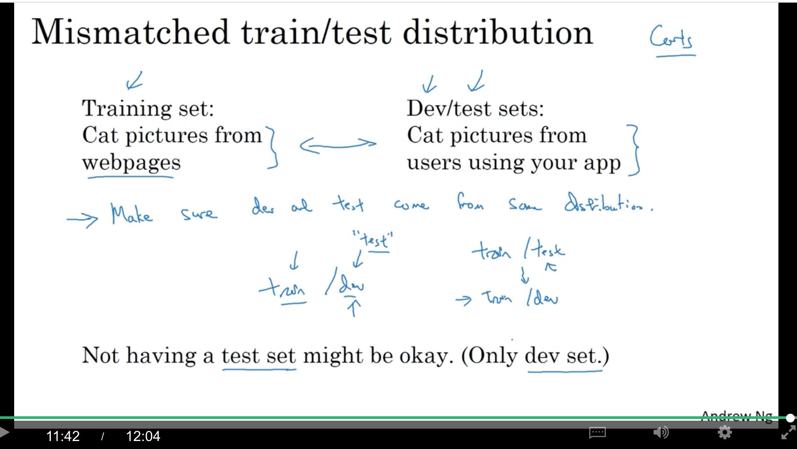

### 1.2. bias/variance

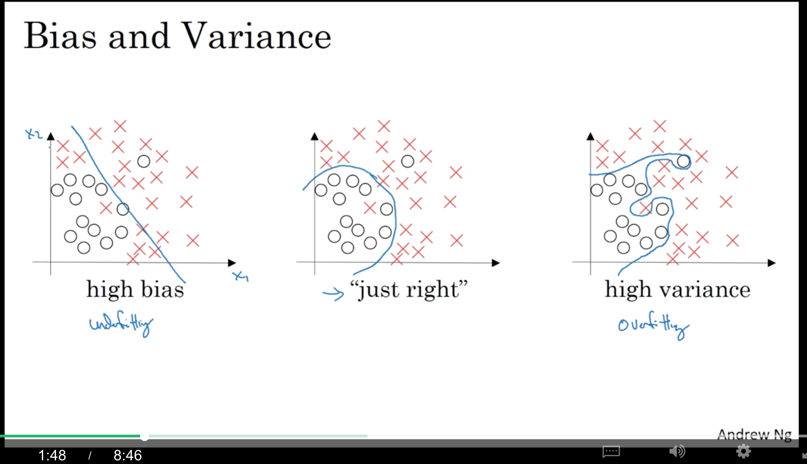

首先 Error = Bias + Variance

Error反映的是整个模型的准确度，Bias反映的是模型在样本上的输出与真实值之间的误差，即模型本身的精准度，Variance反映的是模型每一次输出结果与模型输出期望之间的误差，即模型的稳定性。[https://www.zhihu.com/question/27068705/answer/35151681](https://www.zhihu.com/question/27068705/answer/35151681)

low-high-variance-bias的四象限如下：

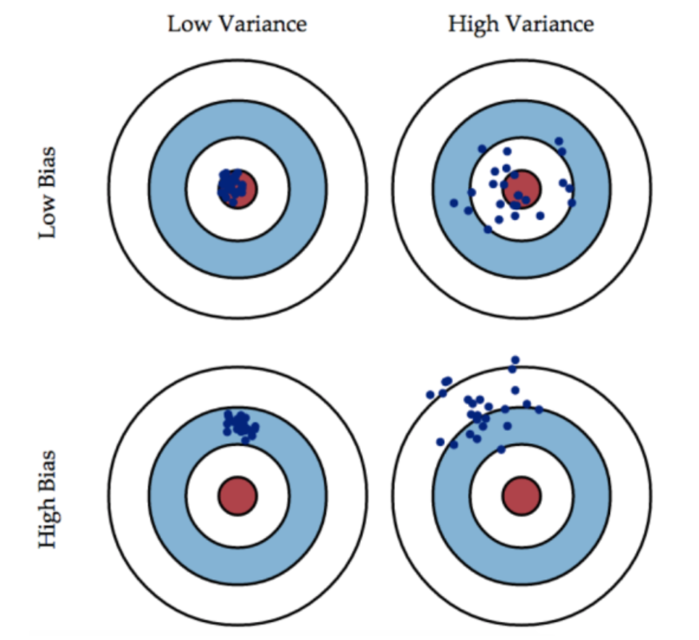

对应模型的最优复杂度如下：

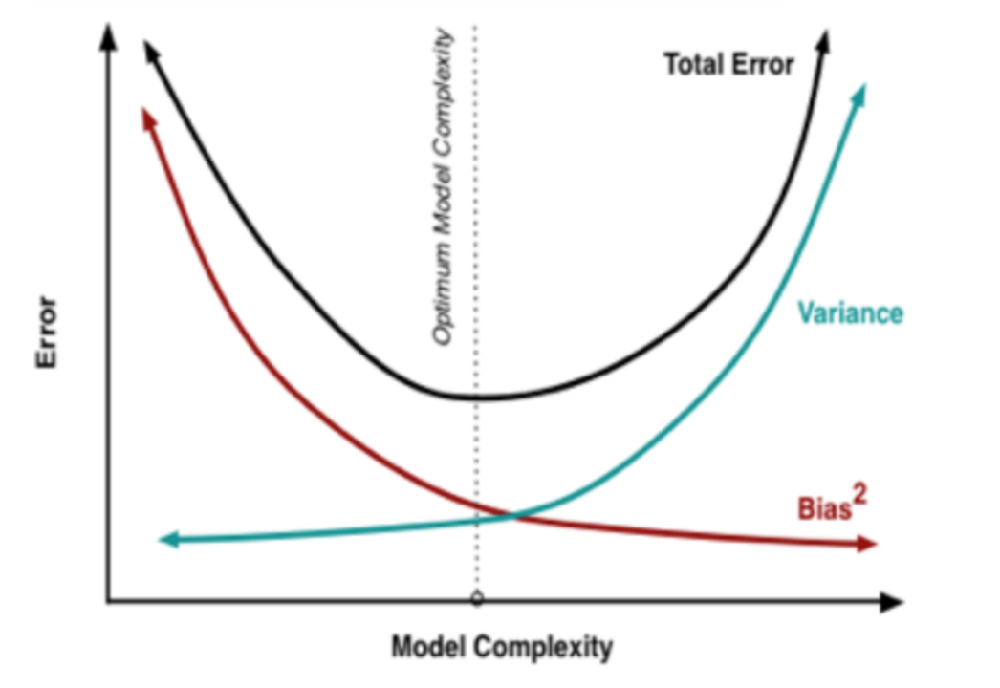

当optimal error(bayes error)约等于0%时（错误率是0，全部才能识别出来），如下图所示。当optimal error是15%时，第二个分类器就是low bias了。

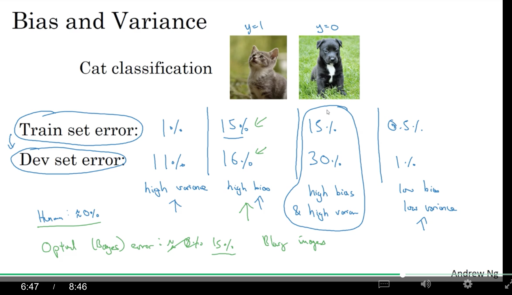

最差情况就是两个都high的，如下紫色曲线（线性部分是high bias，因为有很多没分对的情况；中间两个点是high variance，overfitting了）:

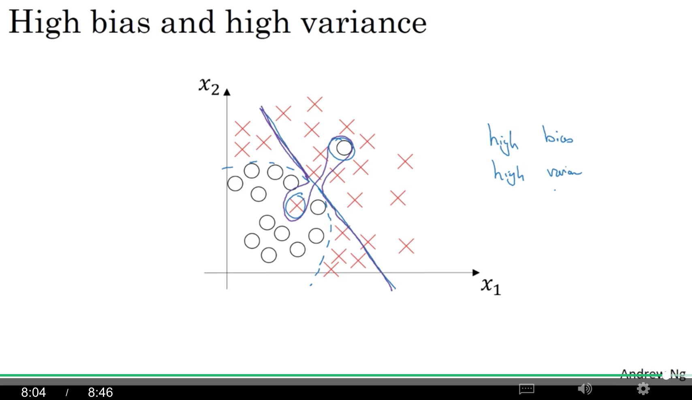

### 1.3. basic recipe for machine learning

首先，如果你的模型有high bias(在训练集上表现很差)，那么，试着用更大的网络（更复杂的模型），或者，训练更久。

如果bias已经变小了，那么看看是否是high viarance(从训练集到验证集的表现的变化)，如果是，那么可以尝试获取更多数据/正则化。

在传统机器学习领域，有bias-variance tradeoff的说法，因为往往优化bias，会让viarance变差，反之亦然。

但在deep learning中，上述方法在提高一个指标的时候，往往并不会太影响另一个指标。所以，如果你已经使用了正则化，那么，使用更大的模型几乎不会有什么负面影响，造成的影响只是计算量的增加而已（Training a bigger network almost never hurts. And the main cost of training a neural network that's too big is just computational time, so long as you're regularizing. ）

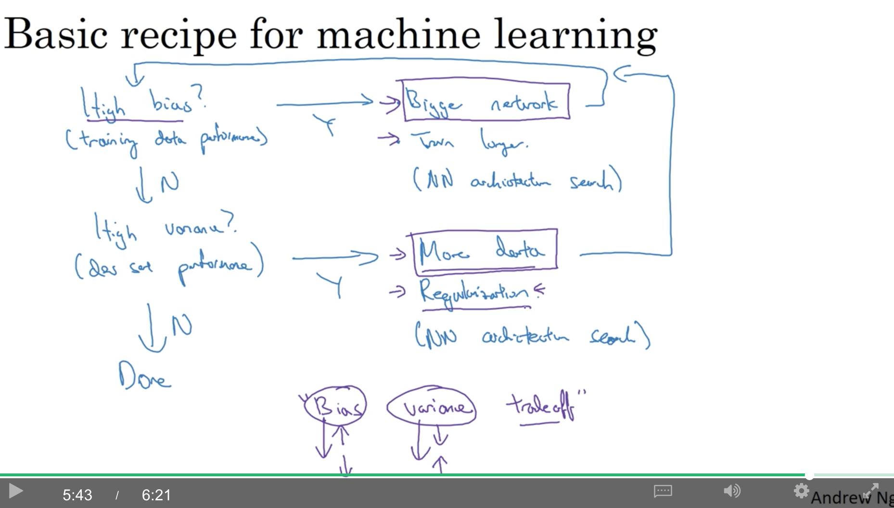

## 2. regularizing your neural network

### 2.1. regularization

在lr中，一般只对w加正则，因为b是一个实数，而w的维度较高$$n_x$$，所以b的影响可以忽略不计。

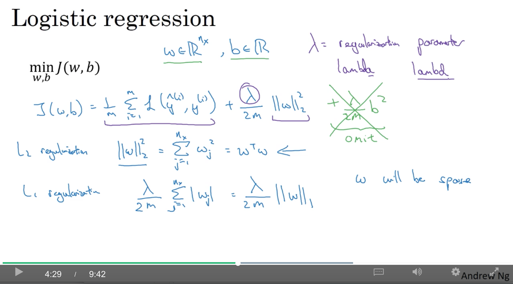

在神经网络的训练中，l1用处不大，l2用得很广泛。其中的$$\lambda$$是正则化参数，一般通过验证集或者cross-validation来设置。

神经网络的l2里，范数是F-范数**的平方**（**F-范数=2-范数=矩阵中所有元素的平方和再开平方**），也叫做weight decay(因为在对w进行梯度下降时，相当于给w乘上了一个小于1的因子：$$(1-\alpha \frac{\lambda }{m})$$)。

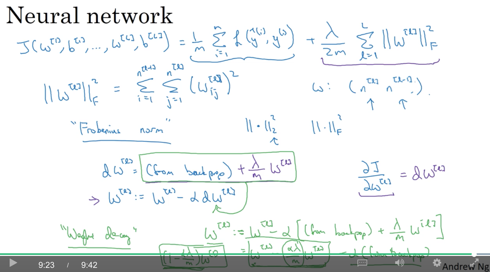

### 2.2. why regularization reduces overfitting?

直观地看，当$$\lambda$$很大时，最小化loss，会使得w趋向0，这样，相当于很多神经元无形地被干掉了，模型变简单了。

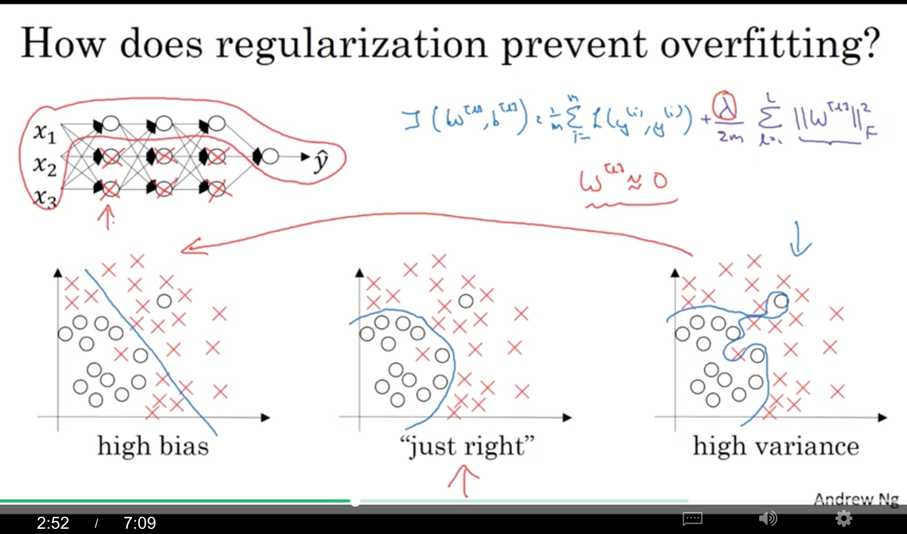

接下来，w接近0，所以z也比较小，而如果激活函数是tanh(z)，那么，tanh(z)的这个区域里是接近线性的，所以模型就更像一个比较大的线性回归。

另外，因为加了正则化项，所以原来的J可能不会在每个elevations(调幅数量？？看着又像iteration..)都单调递减，要看新的J

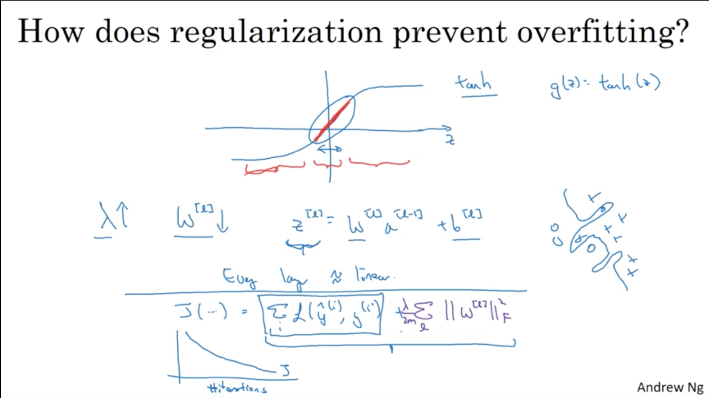

### 2.3. dropout regularization

简单理解，dropout就是对每一层设置一个dropout rate，在训练时，针对每一条训练样本，以这个比例把某些神经元及与其连接的权重直接去掉。

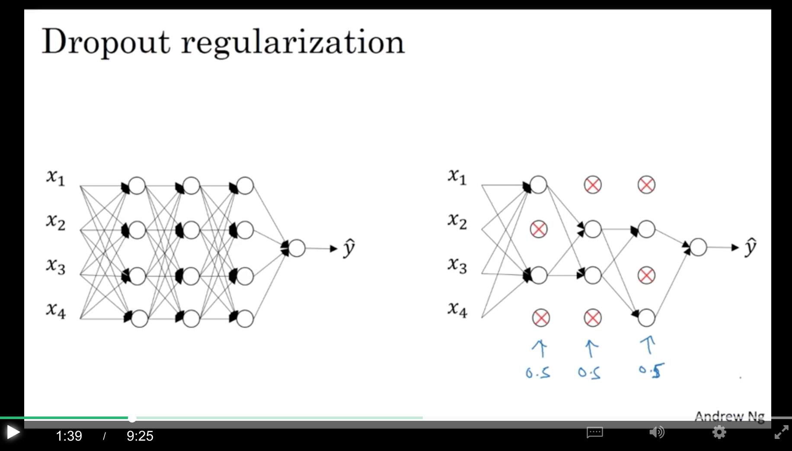

dropout的实现方式： keep_prob=0.8，表示dropout_rate=0.2 第三行的a3/=keep_prob，就是inverted dropout的精髓，这是为了让a3的期望和没有做dropout保持一致。加了这句话，在test的时候就更加容易了，在早期的实现中，可能没这句，test就会比较复杂。

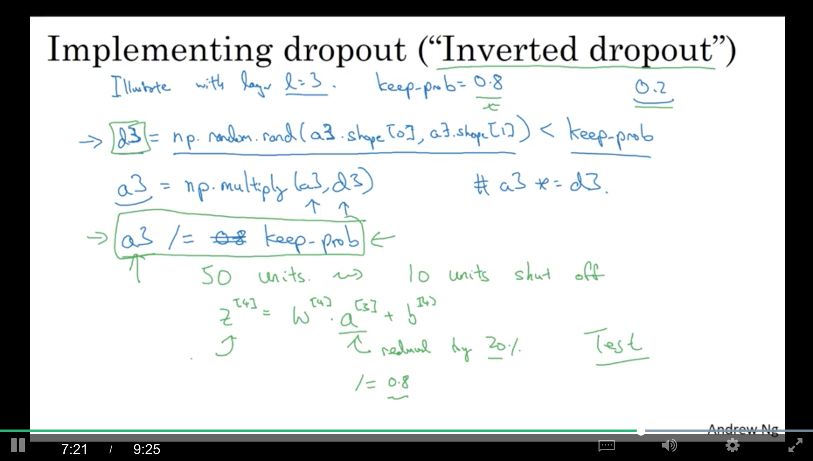

test阶段，**不要使用dropout**，因为我们并不想让预测的结果是random的，或者是有噪音的。如果用了inverted dropout，**在test的时候，就不需要做这个/=keep_prob的操作了。**

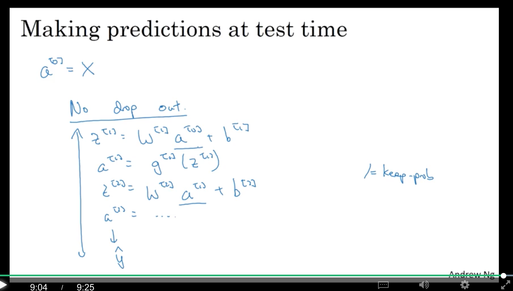

### 2.4. understanding dropout

dropout相当于，每个神经元不只仅依赖某一个输入，所以会倾向于将与各输入神经元的连接权重的值分散开来。==&gt;可以shrink squared norm of the weight，类似于L2的效果。

一般为不同的层设置不同的keep_prob，input层一般接近1.0，如果某两层间的矩阵比较大，可以设小一点的keep_prob，例如图中的0.7, 0.5, 0.7。

一般只有在可能overfitting的时候才用dropout，例如cv中，往往输入的像素很多，但数据量没那么大，所以常用dropout来避免过拟合。

downside of dropout：cost function J is no longer well defined...所以每一轮迭代后J的曲线并不一定是单调递减的，一般的做法是，先关闭dropout（keep_prob=1），然后调整模型到J曲线是递减的，再开启dropout，看看dropout有没有引入bug。。

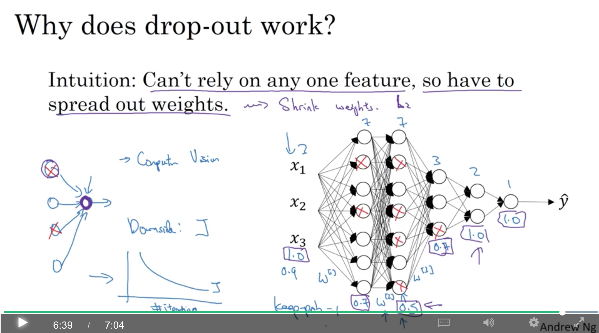

### 2.5. other regularization methods

#### 2.5.1. data augmentation

例如将图片水平旋转，垂直旋转，剪切，缩放，旋转一定角度，增加噪音，可以快速地扩充训练样本。

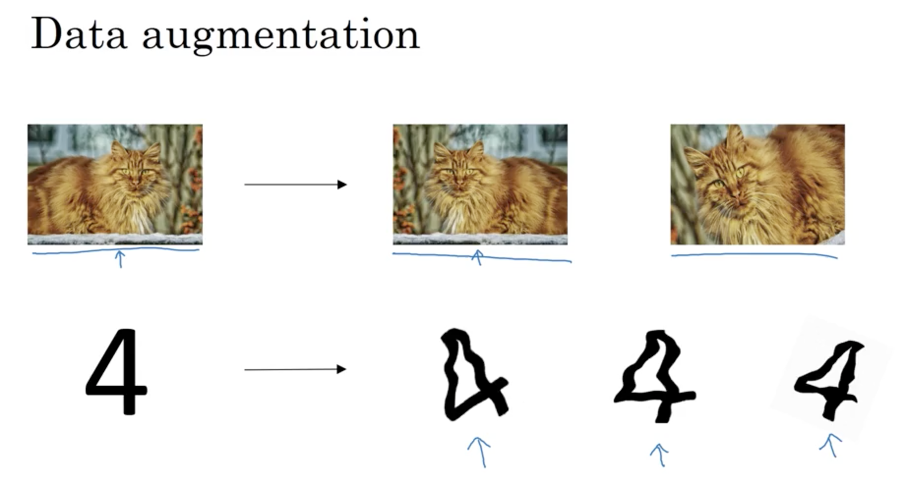

#### 2.5.2. early stopping

在图中一方面画出training set的error或者cost function J(一般会一直下降)，另一方面，画出dev set的error（一般会下降到一个低谷，然后上升）。

early stopping就是在dev set到达低谷时，停止训练。

因为在开始迭代时，一般参数w会接近0（一般随机初始化时会初始化成比较小的值），而训练轮数太多时，可能w就会变得很大，所以early stopping时，可能$$\|\|w\|\|_F^2$$正好是中间大小。

orthogonalization:

* optimize cost function J(例如sgd，momentum等)
* not overfitting（例如regularization等）

上面二者其实是相互正交的，也就是可以相互独立地优化，但dropout的downside就在于它将二者结合在一起了，因此无法独立地优化两个task。

如果不使用dropout，一般使用L2正则，这样就能训练很久，并且会使得超参的搜索空间更加容易分解，也更容易搜索。但L2正则的downside是需要search非常多的$$\lambda$$。而early stopping只需要跑一次梯度下降，就能够试遍small/large/mid的w，不用试那么多的$$\lambda$$。

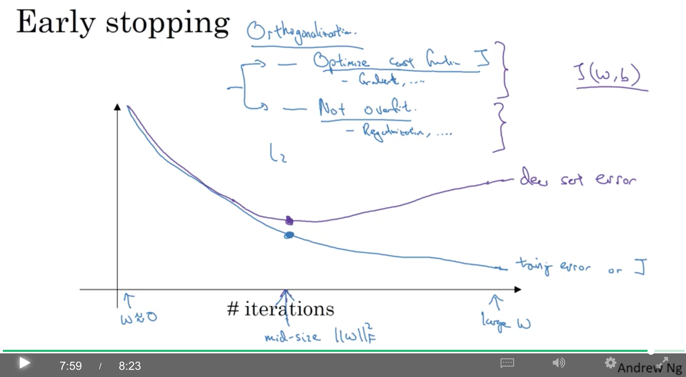

## 3. setting up your optimization problem

### 3.1. normalizing inputs

加速训练的一种方法就是normalize inputs，分为两步：

1. substract out(zero out) mean:

$$\mu =\frac{1}{m} \sum _{i=1}^mx^{(i)}$$ $$x=x-\mu$$

变成0均值的分布

1. normalize the variance：

如第二张图，x1和x2的方差差很远，所以需要

$$\sigma ^2=\frac{1}{m}\sum _{i=1}^mx^{(i)}**2$$ $$x/=\sigma ^2$$

其中的\*\*表示，element-wise squaring。

注意，对训练集做了上述normalize之后，变为0均值，1方差，**对test set也要用相同的$$\mu$$和$$\sigma$$。**

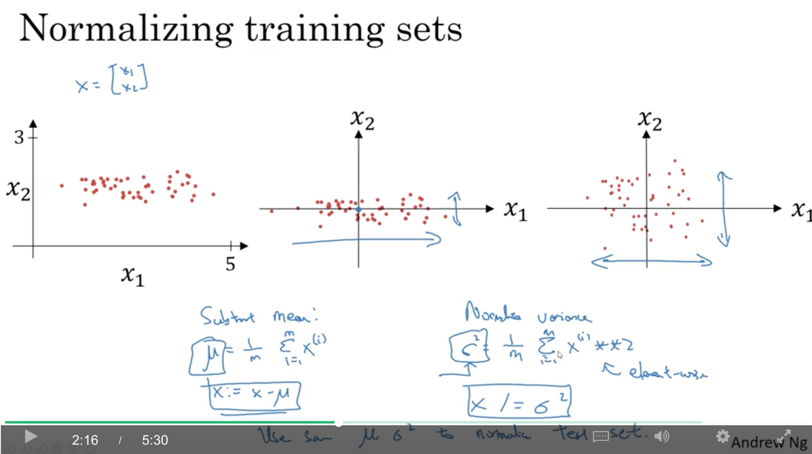

假设w是一维的，如果没有normalize，那么如左图，可能x1和x2的范围差很远，而w1和w2（即w和b）可能也差很远，就需要用非常小的learning rate；而如果normalize了，等高线（上图沿着J轴俯视得到下图）就相对对称了，可以采用比较大的learning rate，很快地到达J的极小点。当然，现实中w是多维的，但也类似。

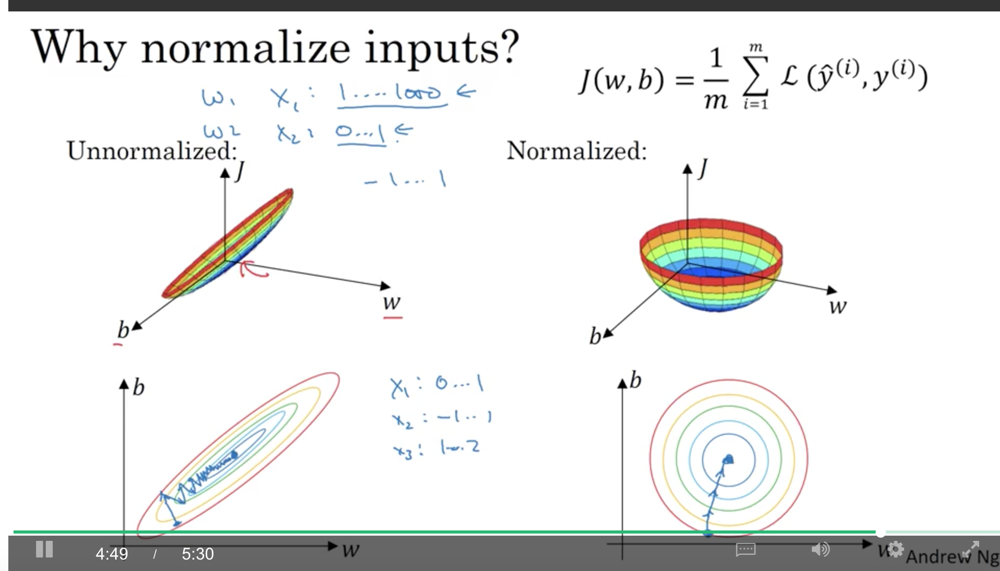

当然，如果x1,x2,x3范围不会差很远，也不一定要用normalize，但用了仍可能会加速。

### 3.2. vanishing/exploding gradients

假设没有b,假设是线性激活函数，g(z)=z，如果w&gt;1，即使只比1大一点，如果层数很深，可能最后的激活值就会特别大，同理，如果w&lt;1，可能最后激活值特别小。

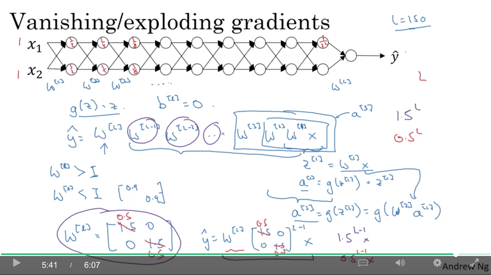

### 3.3. weight initialization for deep networks

partial solution：初始化的技巧

input feature的维度n越大，希望$$w_i$$越小，这样z才不会太大。

令$$w_i$$的方差$$var(w_i)=\frac{1}{n}$$，代码就是

$$w^{[l]}=np.random.rand(shape(l))*np.sqrt(\frac{1}{n^{[l-1]}})$$

如果用的是ReLU，那么，把上面的1改成2【**He initialization**,He et al., 2015】： $$var(w_i)=\frac{2}{n}$$ $$w^{[l]}=np.random.rand(shape(l))*np.sqrt(\frac{2}{n^{[l-1]}})$$

如果是tanh，那么，用**Xavier Initialization**：$$\sqrt{\frac{1}{n^{[l-1]}}}$$

如果是Yoshua Bengio也提出过如下方法：$$\sqrt{\frac{2}{n^{[l-1]}+n^{[l]}}}$$

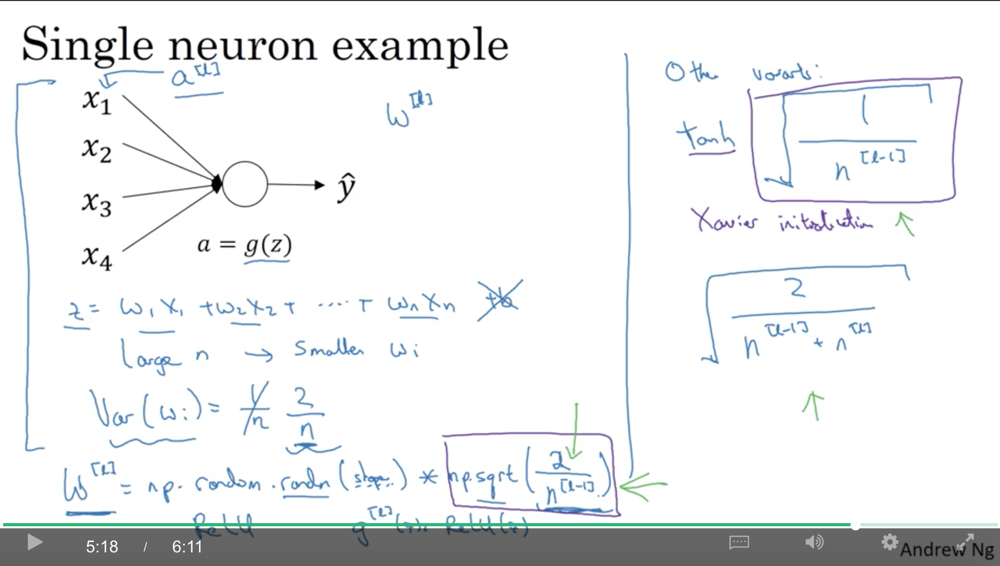

### 3.4. numerical approximation of gradients

有时写完代码后，不确定梯度算得有没有问题，可以通过逼近的方法来检查梯度。

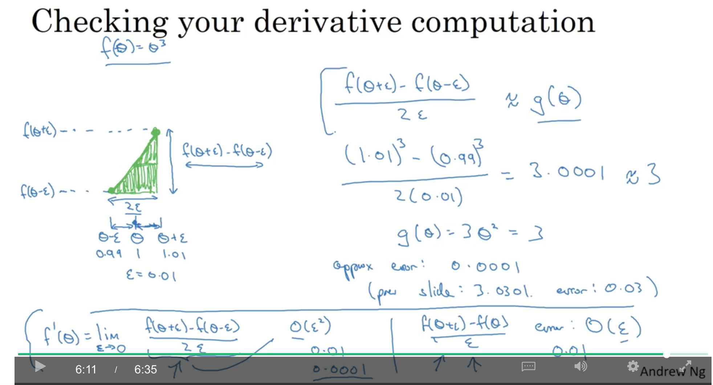

左边的是2-sided difference，逼近误差(approx error)是$$O(\epsilon ^2)$$，右边是1-sided difference，逼近误差是$$O(\epsilon )$$。

如果用1.01和0.99去算2-sided difference，得到的结果是3.0001和梯度的真实值3的approx error是0.0001。

但如果用1.01和1去算1-sided difference，得到的结果是$$(1.01**3-1**3)/0.01=3.0301$$，所以approx error是0.0301

所以，使用2-sided difference会更加逼近真实梯度。

### 3.5. gradient checking

$$W^{[l]}$$和$$dW^{[l]}$$的dim是一样的，如下图，将所有W和b连接在一起，reshape成一个大vector $$\theta$$。同样地，将所有dW和db连接在一起，reshape成一个大vector$$d\theta$$

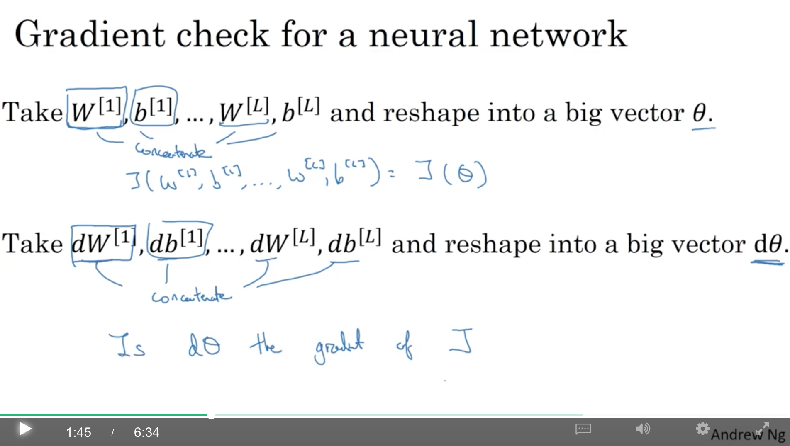

gradient check的步骤如下（$$\epsilon$$常取$$10^{-7}$$）,当下式约等于$$10^{-7}$$时，应该没问题，如果大于$$10^{-3}$$，很可能有问题。

$$\frac{||d\theta_{approx}-d\theta||_2}{||d\theta_{approx}||_2+||d\theta||_2}$$

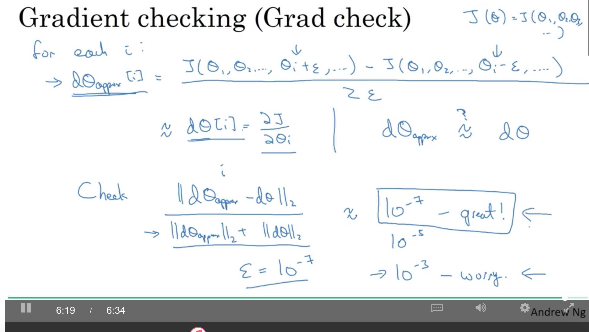

### 3.6. gradient checking implementation notes

1. 只在debug时用grad check，训练时不用（因为计算$$d\theta_{approx}[i]$$很慢）
2. 如果grad check失败，看是哪个的diff比较大（例如，是w还是b，是w1,w2,wi的哪个），然后去对应地找bug
3. 记得regularization term（当损失函数有regularization时，算$$J(\theta)$$时记得带上regularization term）
4. dropout不适用grad check。所以如果要用dropout，可以在grad check时把keep_prob设成1.0，确认ok后，再打开dropout
5. 可能梯度下降在W和b接近0的时候表现是比较好的，所以，可以在random initialization后，进行一次grad check；然后在训练了若干轮后，当W和b都比较接近0时，再进行一次grad check

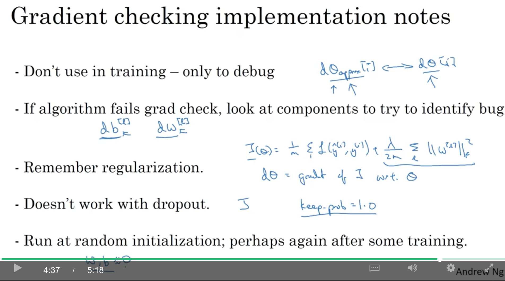

