# c2w2

contents

* [1. optimization algorithms](c2w2.md#1-optimization-algorithms)
  * [1.1. mini-batch gradient descent](c2w2.md#11-mini-batch-gradient-descent)
  * [1.2. understanding mini-batch gradient descent](c2w2.md#12-understanding-mini-batch-gradient-descent)
  * [1.3. exponentially weighted averages](c2w2.md#13-exponentially-weighted-averages)
  * [1.4. understanding exponentially weighted averages](c2w2.md#14-understanding-exponentially-weighted-averages)
  * [1.5. bias correction in exponentially weighted averages](c2w2.md#15-bias-correction-in-exponentially-weighted-averages)
  * [1.6. gradient descent with momentum](c2w2.md#16-gradient-descent-with-momentum)
  * [1.7. RMSprop](c2w2.md#17-rmsprop)
  * [1.8. Adam optimization algorithm](c2w2.md#18-adam-optimization-algorithm)
  * [1.9. learning rate decay](c2w2.md#19-learning-rate-decay)
  * [1.10. the problem of local optima](c2w2.md#110-the-problem-of-local-optima)

## 1. optimization algorithms

### 1.1. mini-batch gradient descent

* batch gradient descent：遍历所有训练样本
* mini-batch gradient descent：一次处理一个min-batch

各符号的表示：

* $$X^{(i)}$$表示第i个训练样本
* $$z^{\[l\]}$$表求第l层的激活函数的输入
* $$X^{{t }},Y^{{t }}$$表示第t个mini-batch的样本

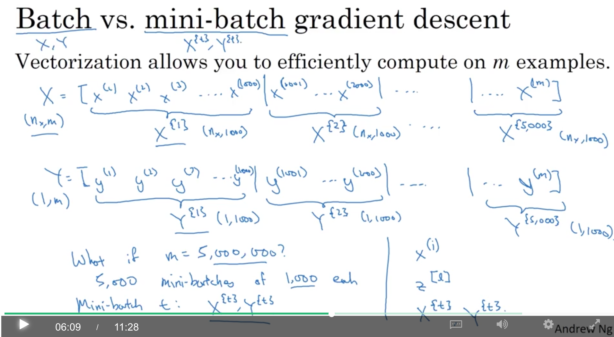

假设有5000000个样本，那么在一个epoch中，遍历5000个mini-batch，每个mini-batch（1000个样本）中【一个iteration】，先前向计算，然后算这1000个样本的loss，然后反向传播。

注意：一个mini-batch就反向传播一次，更新一次参数，所以一个epoch就更新了5000次参数。

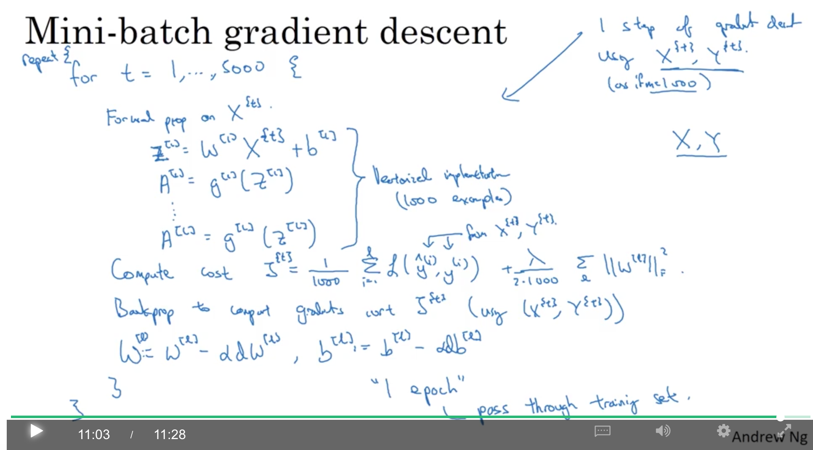

### 1.2. understanding mini-batch gradient descent

可见，使用mini-batch的cost会有不小的抖动和噪音。

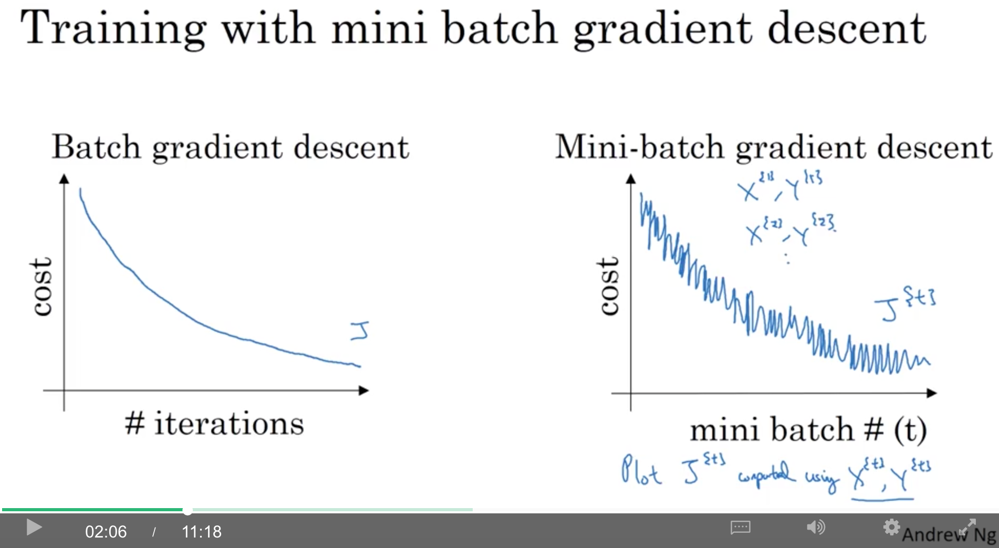

* batchsize=m: batch gradient descent。一般可以顺利到达min。但耗时长。
* batchsize=1: stochastic gradient descent。很可能在min附近徘徊。而且失去了vectorization可以带来了加速
* batchsize between 1,m: 
  * 充分利用vectorization
  * make progress without processing entire training set

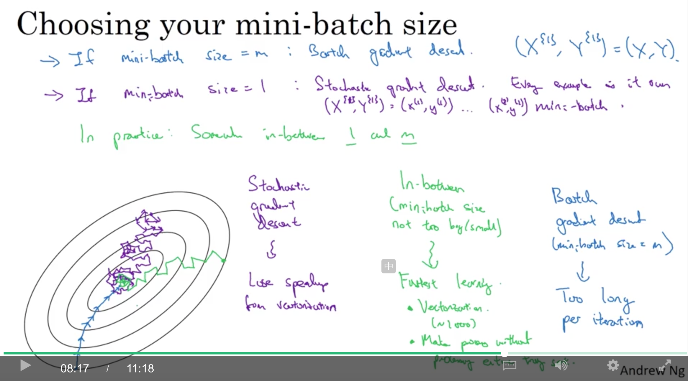

* 训练集很小时（m&lt;=2000）：使用batch gradient descent
* 其他情况下，经典的batchsize：2的指数（64,128,256,512），一般比较少用1024，非2的指数也比较少用（如1000）
* make sure mini-batch里的$$X^{{t}},Y^{{t}}$$能够在cpu/gpu中被容纳下

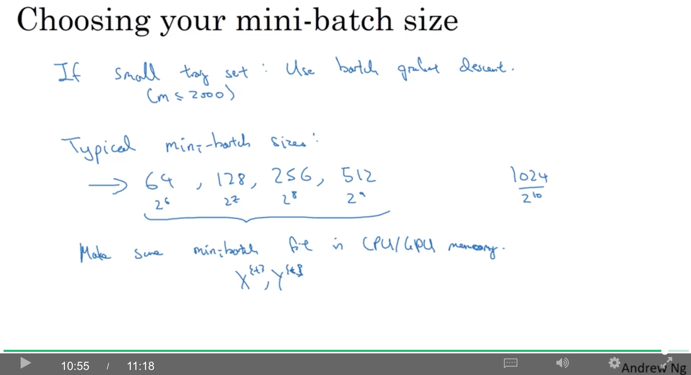

### 1.3. exponentially weighted averages

比gradient descent更快的算法大多使用指数平滑类的算法。通过图中$$v\_t$$的计算，可以得到图中的红线，即exponentially weighted (moving) average

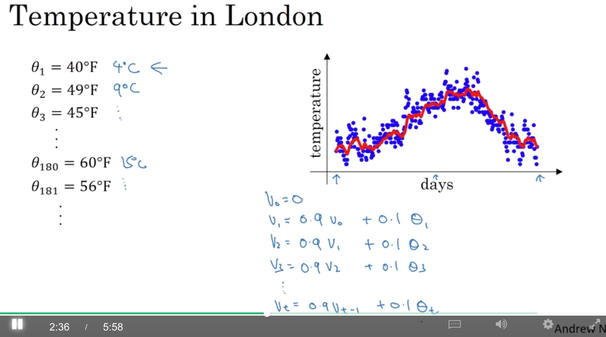

$$v_t=\beta v_{t-1}+(1-\beta)\theta_t$$

**注意，$$\beta$$对应的是$$v\_{t-1}$$，而$$1-\beta$$对应的是$$\theta\_t$$。**

而，曲线描绘了过去大约$$\frac{1}{1-\beta}$$天的变量取值的平均情况，所以，$$\beta$$越大，窗口越大，曲线越滞后，对变量的变化也越不敏感。图中，红线是0.9\[相当于过去10天\]，绿线是0.98\[相当于过去50天\]，黄线是0.5\[相当于过去2天\]。还有一个常用的是0.99\[相当于过去100天\]。

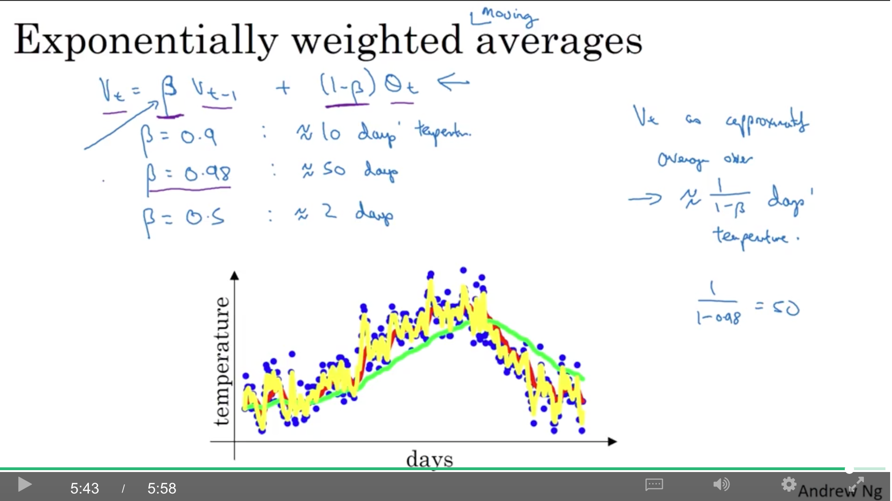

### 1.4. understanding exponentially weighted averages

$$(1-\epsilon)^{1/\epsilon}$$约等于$$1/e$$，而$$\epsilon=1-\beta$$。所以是$${\beta}^{1/(1-\beta)}$$，所以前面提到，大约是$$1/(1-\beta)$$天

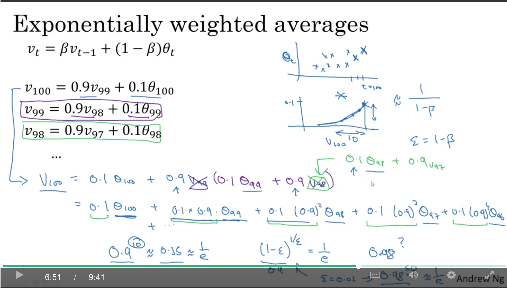

好处：

* 计算简单
* 省内存（只需要存一个变量v就行了）

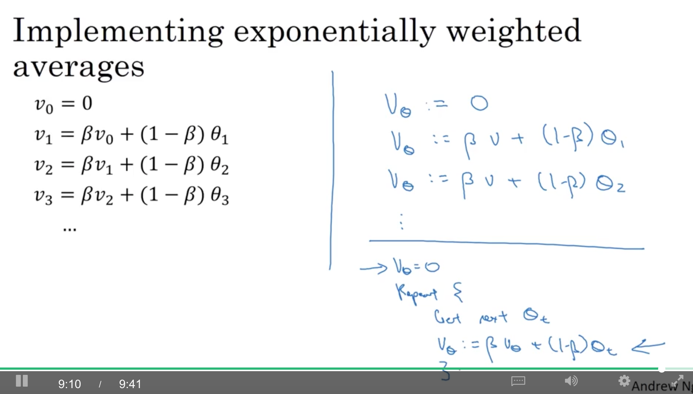

### 1.5. bias correction in exponentially weighted averages

当$$\beta=0.98$$时理论上应该得到绿线，但实际得到的往往是紫线（因为v初始是0，所以而$$\beta$$接近1，所以起始的几个值都比较小，所以起点比较低），通过bias correction可以从紫线纠正到绿线。

$$v\_t=\frac{v\_t}{1-\beta^t}$$，因为$$0&lt;\beta&lt;1$$，所以t越大，$$\beta^t$$越小，分母越大，所以$$v\_t$$越小。反之，t越小，$$v\_t$$越大，就可以补上前面提到的t比较小时较低的起点。

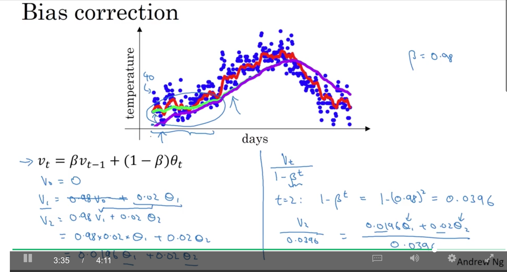

### 1.6. gradient descent with momentum

如果learning rate太大，可能出现紫线的情况，波动太大（oscillation，振动，波动）。所以，希望纵向slower，而橫向faster。

所谓momentum，就是对dW和db，分别使用exponentially weighted average，计算对应的$$v_{dW}$$和$$v_{db}$$，更新时，用这两个v替换掉原来的dW和db。

这样，能够在横向上保持方向不变，而在纵向上，有『平滑』的效果，减少波动。

公式中，$$dW$$相当于加速度，$$v\_{t}$$相当于速度(velocity)，$$\beta$$相当于摩擦力（friction）

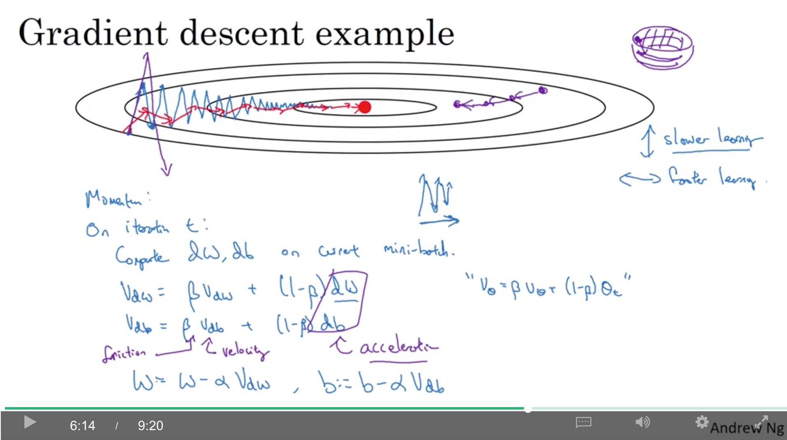

实现时的几个注意点：

* 最常取的$$\beta=0.9$$，也就是相当于最近10个iterations的gradients。
* 而且不一定会用bias correction($$\frac{v\_{dW}}{1-\beta^t}$$)，因为10个iteration左右，这个bias就差不多没了。
* 有的实现是去掉$$(1-\beta)$$（**图中的紫色部分,《深度学习》P182的动量方法就和这个方法类似**），而这相当于$$v_{dW}$$缩小了$$(1-\beta)$$倍，所以更新时，$$\alpha$$相当于要根据$$\frac{1}{1-\beta}$$进行相应的变化。这两种方法其实都行，但会影响到如何选择最佳的$$\alpha$$。而这种方法可能有一些less intuitive的就是，最后要调整$$\beta$$时，会影响到$$v_{dW}$$和$$v\_{db}$$的scaling，从而，可能还要再修改学习率$$\alpha$$。

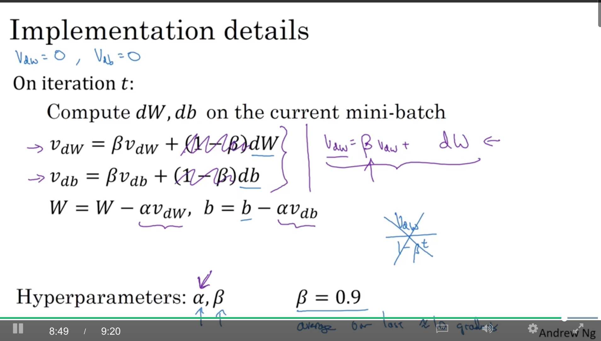

### 1.7. RMSprop

其中$$(dW)^2$$指的是element-wise squaring。

$$s_{dW}=\beta s_{dW}+(1-\beta_2)(dW)^2$$ $$s_{db}=\beta s_{db}+(1-\beta_2)(db)^2$$ $$w=w-\alpha \frac{dW}{\sqrt{s_{dW}}}$$ $$b=b-\alpha \frac{db}{\sqrt{s_{db}}}$$

例如图中的例子，横轴是W，纵轴是b，希望横轴fast，纵轴slow，也就是，希望$$s_{dW}$$小一些，w就减少得快一点，同理，$$s_{db}$$大一些，b就减小得慢一点。

而事实上，图中蓝线部分，也就是每一轮loss的变化方向，可见，横轴方向的分量比较小，也就是dW比较小，所以$$s_{dw}$$也比较小，就满足了上述希望，而正好是比较小的dW除以一个比较小的$$\sqrt{s_{dW}}$$，实现了『自适应』,结果如图中的绿线所示。

因此，**可以使用一个比较大的学习率**，而不会在纵轴上diverge(偏离，也就是上面说的抖动的振幅)太多。

实际上，不只是b和W，是很多维的参数vector。

另外，这里用了$$\beta\_2$$是为了和momentum的$$\beta$$区分开，后面要讲的Adam就是结合了momentum和RMSprop的方法。

另外，分母的$$\epsilon$$是为了防止当分母很小，趋近于0时，不被0除，一般$$\epsilon$$约等于$$10^{-8}$$。

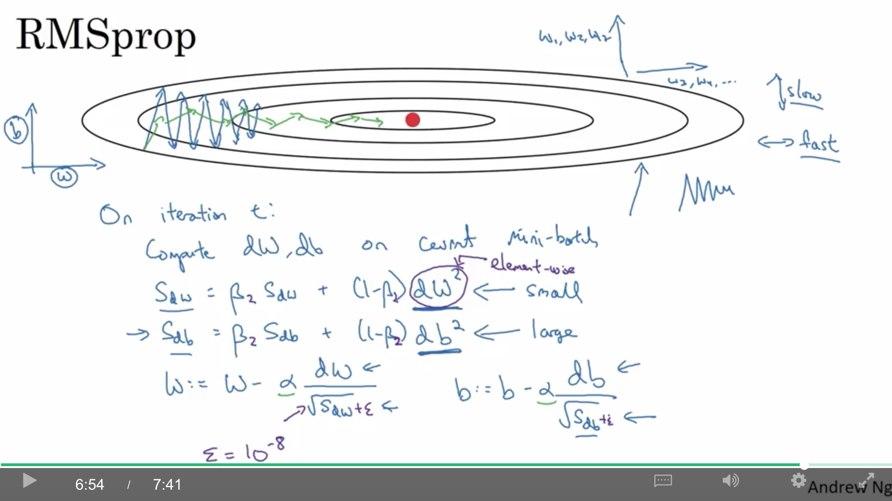

### 1.8. Adam optimization algorithm

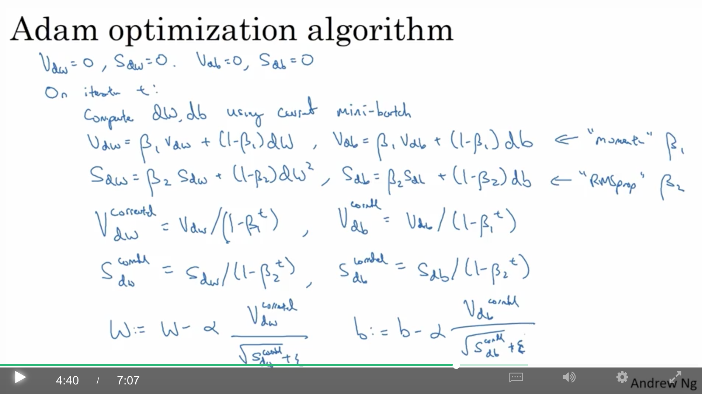

超参:

* $$\alpha$$需要调
* $$\beta\_1$$：momentum的参数，一般设为0.9
* $$\beta\_2$$：RMSprop的参数，一般设为0.999
* $$\epsilon$$：一般不调整，设为$$10^{-8}$$

Adam的由来：

* Adaptive Moment estimation
* $$\beta\_1$$用来计算$$dW$$，称为第一矩（first moment）
* $$\beta\_2$$用来计算$$dW^2$$的指数加权平均，称为第二矩（second moment）

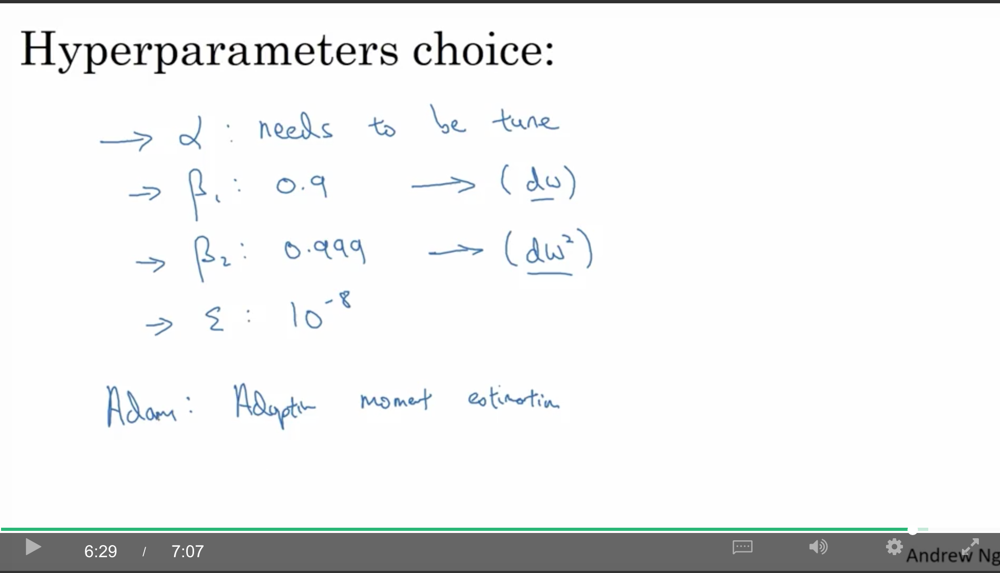

### 1.9. learning rate decay

如果使用固定的learning rate，在mini-batch gradient descent中，因为各个batch不一样，可能最后是在Minimum附近徘徊，不一定会收敛到Minmum。

而如果在快到达Minmum的时候，使用较小的学习率，就可以在minnum附近以更小的振幅徘徊，从而更接近minmum。而这样的话，在前面可以使用更大的学习率。

方法1：

其他方法：

* $$\alpha = 0.95^{epoch\_num}\alpha\_0$$：exponentially decay
* $$\alpha = \frac{k}{\sqrt{epoch\_num}}\alpha\_0$$或者$$\alpha=\frac{k}{\sqrt{t}\alpha\_0}$$其中的t是第t个mini-batch
* descrete staircase：随epoch或者t的变化，每次学习率变为之前的一半

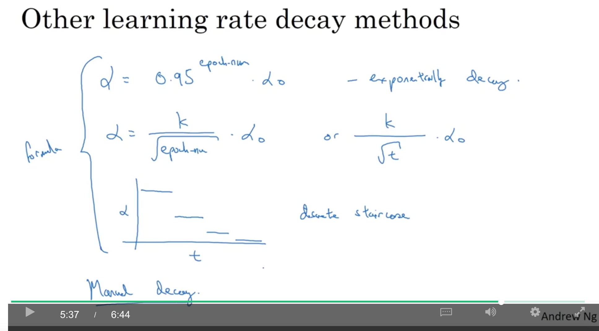

### 1.10. the problem of local optima

在训练神经网络时，大部分loss function的梯度为0的点不是local optima，而大多是saddle point(鞍点)，即，当维度很高时，可能在某些维度是坡谷，而在另一些维度是坡峰（例如，有2w维，在这2w维全是坡谷的概率就是$$\frac{1}{2^{-20000}}$$，很低的概率）

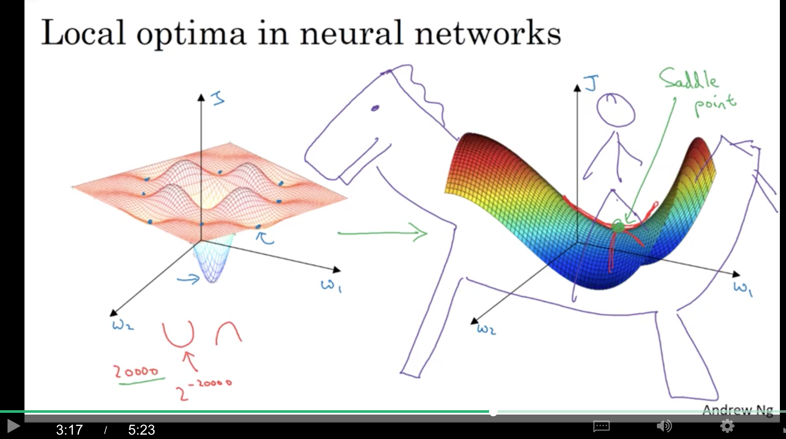

可见，鞍点并不是problem，而problem在于plateaus，也就是梯度在很长一段时间里都很接近0。例如图中的蓝线，可能这段路比较平坦，所以可能会走很久才到达下面那个蓝点，之后才可以比较快地下降（红线）。所以，momentum/RMSprop/Adam就是针对这个问题进行的优化。

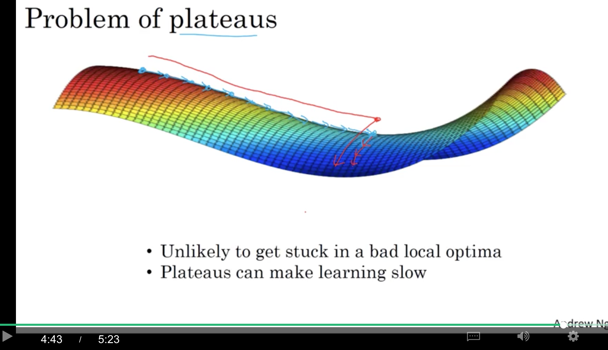

