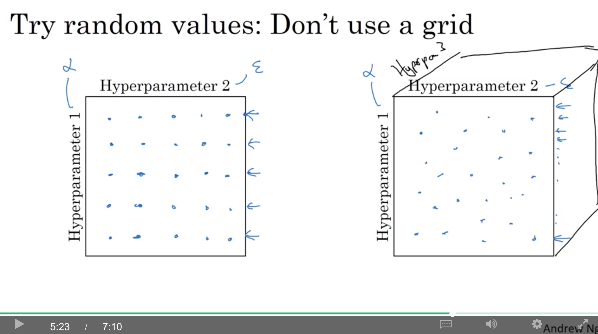
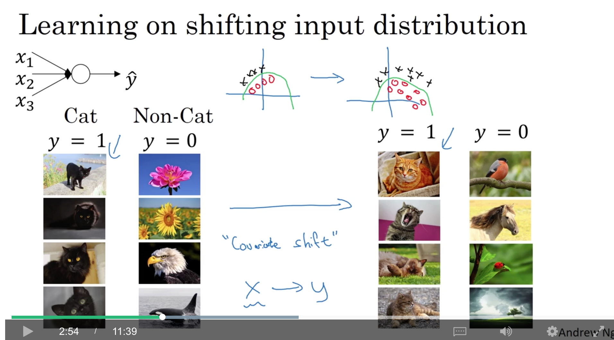
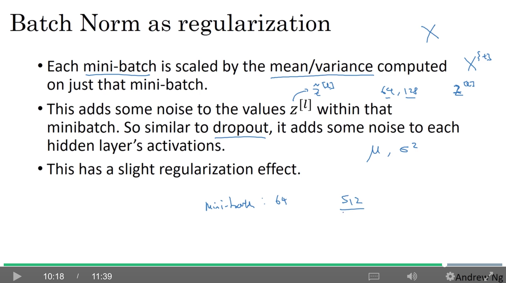

contents

<!-- TOC -->

- [1. hyperparameter tuning](#1-hyperparameter-tuning)
    - [1.1. tuning process](#11-tuning-process)
    - [1.2. using an appropriate scale to pick hyperparameters](#12-using-an-appropriate-scale-to-pick-hyperparameters)
    - [1.3. hyperparameters tuning in practice: Pandas vs. Caviar](#13-hyperparameters-tuning-in-practice-pandas-vs-caviar)
- [2. batch normalization](#2-batch-normalization)
    - [2.1. normalizing activations in a network](#21-normalizing-activations-in-a-network)
    - [2.2. fitting batch norm into a neural network](#22-fitting-batch-norm-into-a-neural-network)
    - [2.3. why does batch norm work?](#23-why-does-batch-norm-work)
    - [2.4. batch norm at test time](#24-batch-norm-at-test-time)
- [3. multi-class classification](#3-multi-class-classification)
    - [3.1. softmax regression](#31-softmax-regression)
    - [3.2. training a softmax classifier](#32-training-a-softmax-classifier)
- [4. introduction to programming frameworks](#4-introduction-to-programming-frameworks)
    - [4.1. deep learning frameworks](#41-deep-learning-frameworks)
    - [4.2. tensorflow](#42-tensorflow)

<!-- /TOC -->

# 1. hyperparameter tuning

## 1.1. tuning process

如图，各超参的优先级为红>黄>紫，而adam的三个参数基本都不调整。


当参数比较少时，可以用表格，两两组合去尝试，但如果超参很多，可以用随机组合，因为事先并不知道各个参数的重新程度。例如，用一个很重要的参数$\alpha$和一个没那么重要的参数$\epsilon$组合，可能会发现试完25种组合，不论$\epsilon$取什么值，效果都基本只和$\alpha$的取值有关。而如果用随机组合的方法，同样的25个模型，可以试25种$\alpha$的取值。



coarse to fine(由粗到精)原则：当发现某个空间里的超参组合表现比较好时，例如图中蓝圈的那几个点，那么，可以在一个小区域（图中的蓝色正方形）内sample更多的参数组合。


## 1.2. using an appropriate scale to pick hyperparameters

一种方法是根据均匀分布(uniform distribution)来随机地选参数值：


但，如果$\alpha$从0.0001到1之间均匀地随机采样，会有90%的值落在0.1-1之间，而0.001到0.1之间只有10%的值。相当于用了90%的资源搜索0.1-1的值，但只用10%的资源搜索0.0001-0.1的值。

更合理的方法是，在log scale上进行搜索，如图中的第二个数轴，每个区域的起点和终点是10倍的关系。

起点是$10^a$，终点是$10^b$，而$0.0001=10^a$，所以，$a=log_{10}0.0001=-4$。所以

```python
r = -4 * np.random.rand() # -4 <= r <= 0
alpha = 10 ** r # 10^-4 <= alpha <= 1
```


而对于exponentially weight average的超参$\beta$，取值范围从0.9(相当于10天的平均)，到0.999（相当于1000天的平均）。这种情况，就做一个变换，对$(1-\beta)$在log scale上进行采样就行了。即
$$\beta =1-10^r$$

如果想在0.99到0.9之间采样$\beta$，则$r\in [-2,-1]$可以用：

```python
r = np.random.rand() * (-1) -1
beta = 1-10 ** r
```

或者

```python
r = np.random.rand()
beta = 1-10**(- r - 1)
```

特别地，**对于exponentially weight average而言，不能使用简单的均匀采样，要用log scale的采样。** 因为，**当$\beta$的取值趋近于1时，$\beta$的微小改变，会导致结果特别敏感**。取$\beta$时，相当于$1/(1-\beta)$天的平均：
+ 当$\beta$比较小时（如0.9000变化成0.9005），这个变化就是从10.0天到10.05的变化
+ 而$\beta$比较大时（如0.9990变化成0.999），那这个变化就是从1/(1-0.999)=1000天变到1/(1-0.9995)=2000天了！


## 1.3. hyperparameters tuning in practice: Pandas vs. Caviar

深度学习可以用在不同领域，而各领域的经验其实可以相互借鉴，所以intuitions do get stale(直觉会变得陈腐，需要与时俱进)，所以至少每几个月都最好调整下超参，保证总是可以得到最优解。


有以下主要两种流派：

1. 精心照料一个模型：当没有足够的资源同时训练多个模型时，会对一个模型天天去微调参数或者发现出问题的话，回滚到上一个checkpoint，重新调参（panda approach，熊猫产子少…）
2. 并行训练多个模型：尝试不同的超参组合，选择一个最好的模型（caviar strategy,鱼子酱，鱼产子多…）


# 2. batch normalization

## 2.1. normalizing activations in a network

normalizing input values在前面提到过(c2w1的3.1部分)，对lr很有效。

如果是多层神经网络，例如图中，想把$W^{[3]}$,$b^{[3]}$训练得更好，应该也对$a^{[2]}$进行normalize。事实上，batch norm就做的这件事，只是区别在于，bn的normalize针对的是$z^{[2]}$，而非$a^{[2]}$。在学术界上，对$a^{[2]}$还是$z^{[2]}$进行normalize是有争议的，但对$z^{[2]}$的normalize比较普遍。


给定一系列的中间值$z^{(1)},z^{(2)},...z^{(m)}$，这里$z^{(i)}$是$z^{[l](i)}$的简写。

经过如下变换，得到0均值，1方差的$z_{norm}^{(i)}$：
$$\mu=\frac{1}{m}\sum_iz^{(i)}$$
$$\sigma^2=\frac{1}{m}\sum_i(z^{(i)}-\mu)^2$$
$$z_{norm}^{(i)}=\frac{z^{(i)}-\mu}{\sqrt{\sigma^2+\epsilon}}$$

注意，其中的$\epsilon$是为了防止分母为0。而我们并不希望所有$z^{(i)}$都变成0均值1方差的结果，也许它们本身的分布就不同[如图中，假设激活函数是sigmoid，并不希望数值是0均值1方差的，因为需要值很大或者很小，这样才能充分利用sigmoid的非线性]，所以，可以做如下处理：

$$ \tilde{z}^{(i)}=\gamma z_{norm}^{(i)}+\beta$$

而其中的$\gamma$和$\beta$是像$W$和$b$一样的可以学习的参数

如果
$$\gamma=\sqrt{\sigma^2+\epsilon}$$
$$\beta=\mu$$
那么，$\tilde{z}^{(i)}=z^{(i)}$

所以，不同层使用不同的$\gamma$和$\beta$，可以使各层的分布不一样。最终使用$\tilde{z}^{[l](i)}$代替$z^{[l](i)}$


## 2.2. fitting batch norm into a neural network


针对mini-batch的bn如下，一次使用一个mini-batch的均值和方差去计算$\tilde{z}^{[l]\{t\}}$。

注意：
$$z^{[l]}=W^{[l]}a^{[l-1]}+b^{[l]}$$

但计算$\tilde{z}^{[l]}$时，$b^{[l]}$是个常数，所以所有mini-batch里的样本，加不加这个常数，最终生成的$z^{[l]}_{norm}$和$\tilde{z}^{[l]}$都是一样的（方差不变，均值会变但$-\mu$后就没变了，**最终的均值和bias是$\beta^{[l]}$决定的**），所以，**其实$b^{[l]}$这个参数可以不用保留和计算，或者，可以直接将$b^{[l]}$永远置为0。**

shape($n^{[l]}$是第$l$层的隐层单元数):
+ $z^{[l]}$: $(n^{[l]},1)$
+ $\beta^{[l]}$: $(n^{[l]},1)$
+ $b^{[l]}$: $(n^{[l]},1)$(可以不要)
+ $\gamma^{[l]}$: $(n^{[l]},1)$


整体实现流程如下：


## 2.3. why does batch norm work?

高层的权重对低层权重的变化更有鲁棒性。例如，训练集里的猫都是黑猫，但希望对其他颜色我猫仍然能很好地识别，即使可能二者用的函数是类似的，决策边界也类似（如图中的绿线），但实际两个的**输入分布**是不一样的：**covariate(相关变量，协变量) shift**。

所以，这种情况下，即使模型可能不需要改变，但最好可以重新训练模型。



在神经网络中，例如针对第三层的$W^{[3]}$和$b^{[3]}$而言，输入的是$a^{[2]}_1,...a^{[2]}_4$，然后还要学习$W^{[4]}$和$b^{[4]}$，从而学习到$\hat y$；而$a^{[2]}_1,...a^{[2]}_4$是通过$W^{[2]}$、$b^{[2]}$以及$W^{[1]}$、$b^{[1]}$生成的，所以输入分布的改变，会引起这些的改变，也会影响到$W^{[3]}$和$b^{[3]}$。

而batch-norm可以保证每一层的$z^{[l]}$的均值和方差受$\beta^{[l]}$和$\gamma^{[l]}$控制，从而对实际的输入的变化更加鲁棒。**相当于减小了前一层的与当前层的参数之前的耦合，所以它允许网络的每一层独立学习，因此可以加速整个网络的训练。**


bn的第二个效果，就是它具有轻微的正则化效果。
+ 每个mini-batch的取值是依据当前mini-batch的均值/方差进行归一化的
+ 所以从$z^{[l]}$到$\tilde z^{[l]}$，是增加了当前mini-batch的带有噪声（不同于全局的均值和方差）的均值和方差的，而且前面提到了还会减去均值，这样又引入了另一个噪声。类似dropout，会对每层的激活值增加一些噪声（对激活值以一定概率\*0，以另一个概率\*1）。
+ 因为加入的噪声比较小，所以正则化效果并没有非常强大，只是轻微的效果。
+ 对dropout而言，通过增加mini-batch size，例如从64变成512，可以减小噪声，从而减小正则化的效果。

**所以不要把bn看成一种正则化方法，用它来归一化隐层单元的激活函数以加速学习就行了，正则化只是一种无意的副作用**。



## 2.4. batch norm at test time

训练时，一个mini-batch中有m个元素的均值和方差，但测试时，只有一个元素，用它的均值和方差并不make sense。

测试时，用exponentially weighted average across the mini-batches来估计(即，对所有mini-batches，算出??一个??$\mu$和$\sigma^{2}$)。

对于第$l$层的不同的mini-batch，$x^{\{1\}}, x^{\{2\}}, ...$而言，相应的均值为$\mu^{\{1\}[l]},\mu^{\{2\}[l]},...$，即$\theta_1,\theta_2,...$。同样地，针对方差也可以使用${\sigma^{2}}^{\{1\}[l]},{\sigma^{2}}^{\{2\}[l]},...$。

最后用估算出来的$\mu$和$\sigma^2$来代替训练时的$\mu$和$\sigma^2$计算$z^{(i)}_{norm}$，从而计算$\tilde z^{(i)}$。

使用指数加权平均的效果一般是可以的，而实际上任何合理的估算均值和方差的方法在测试时效果应该都是可以的。如果使用一些深度学习框架，通常有一些默认的方法来估算均值和方差，效果一般也比较好。


# 3. multi-class classification

## 3.1. softmax regression

$C$表示类别的数量，输出层$\hat y$是一个$(n^{[L]},1)=(C,1)$的向量，每个元素表示对应分类的概率，并且所有分类的概率求和是1。


对于最后一层$L$：

$$z^{[L]}=W^{[L]}a^{[L-1]}+b^{[L]}$$
$$t=e^{(z^{[L]})}$$
$$\hat y=a^{[L]}=g^{[L]}(z^{[L]})=\frac{e^{(z^{[L]})}}{\sum ^C_{j=1}t_j}$$
对于$a^{[L]}$的第$i$个元素而言，就是：
$$a^{[L]}_i=\frac{t_i}{\sum ^C_{j=1}t_j}$$

+ $z^{[L]}$的shape是$(C,1)$
+ $t$的shape是$(C,1)$
+ $a^{[L]}$的shape是$(C,1)$
+ $\hat y$的shape是$(C,1)$

区别于二分类，二分类最后一层的输入和输出都是一个实数，而softmax都是一个vector。


对于一个没有隐层的神经网络而言，对于一个多分类器而言，下面几张图的任意两类之间的decision boundaries都是线性的：


## 3.2. training a softmax classifier

hot max；只保留最大的元素并置为1，其他元素置为0。
而对于softmax而言，仍然有类似的性质，$z^{[L]}_i$最大的元素，$a^{[L]}_i$也最大，但其他元素并没有都变成0，所以叫『soft』max。

另外，可以证明，softmax regression是logistic regression的一般化，而$C=2$时，softmax regression就是logistic regression。


loss function如下：
$$L(\hat y, y)=-\sum ^C_{j=1}y_jlog\hat y_j$$

例如，假设这是[0,1,0,0]也就是类别1，那么
$$L(\hat y,y)=-y_2*log\hat y_2=-log\hat y_2$$

所以，希望$L(\hat y,y)$小，就是希望$\hat y_2$大。其实就是maximum likelihood estimation的一种形式。

对于整个训练集的cost：

$$\frac{1}{m}\sum^m_{i=1}L(\hat y^{(i)},y^{(i)})$$

使用vectorized implementation时，$Y$的shape是$(C,m)$，$\hat Y$的shape也是$(C,m)$


反向传播这里就不细说了，现有的编程框架都能自动求导。


# 4. introduction to programming frameworks

## 4.1. deep learning frameworks

其中的truly open指的是，软件开源，并且不是被单一公司所掌控。例如某些公司可能开源了某个软件，但却独占着领导权，几年后，当人们开始使用该软件时，该公司可能会逐渐关闭开源，或者将一些功能移入私有云服务中


## 4.2. tensorflow

例如，实现求解使得$cost=w^2 +25-10w$，即$(w-5)^2$，取得最小值时$w$的取值：

```python
import tensorflow as tf
import numpy as np

w = tf.Variable(0, dtype=tf.float32)
cost = tf.add(tf.add(w**2, tf.multiply(-10,w)), 25)

#因为tf重载过了运算符，所以也可以直接用下面的

cost = w**2 + 25 - 10 * w

train = tf.train.GradientDescentOptimizer(0.01).minimize(cost)

init = tf.global_variables_initializer()

# 使用with的好处，在程序异常退出时，clean up做得更好
with tf.Session() as session:
    session.run(init)
    for i in range(1000):
        session.run(train) # 每run一次train，训练一轮
    print (session.run(w)) #打印出此时的w

```

上面的例子中，cost函数是固定的（变量只有w），而对于训练数据x（特殊的Variable，其值后续会assign）：

```python
x = tf.placeholder(tf.float32, [3,1]) # 一个shape是(3,1)的array
```

而假设cost function如下：

```python
cost = x[0][0] * w ** 2 + x[1][0] * w + x[2][0]
```

另外，定义x的数据来源（训练样本）：

```python
coefficients = np.array([[1.], [-10.], [25.]])
```

然后通过feed_dict指定x的来源，然后run:

```python
for i in range(1000):
    session.run(train, feed_dict={x: coefficients}) # 每run一次train，训练一轮

print (session.run(w)) #打印出此时的w
```

如果要实现mini-batch gradient descent，每次传给feed_dict的变成每个mini-batch的数据即可。


