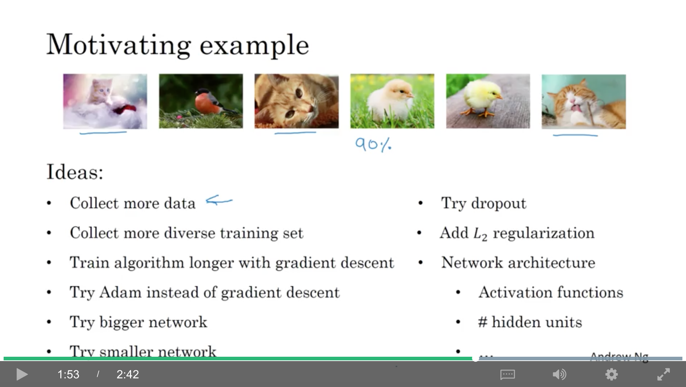
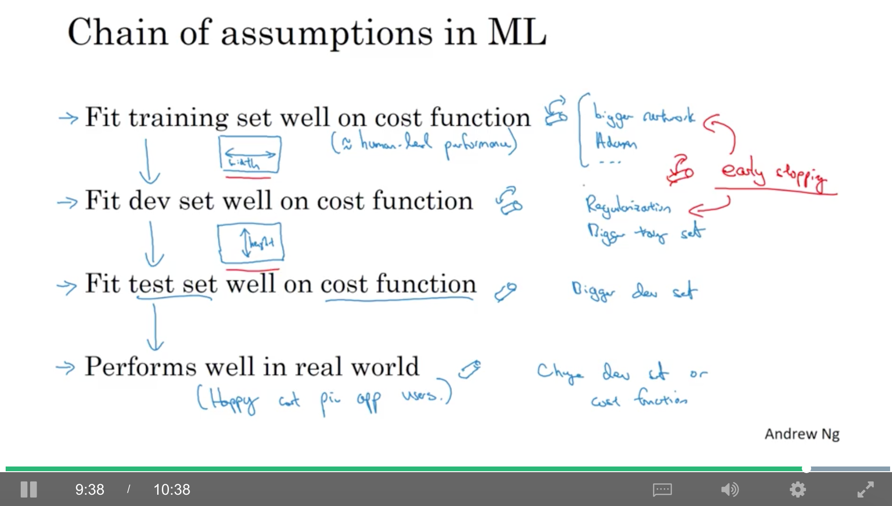
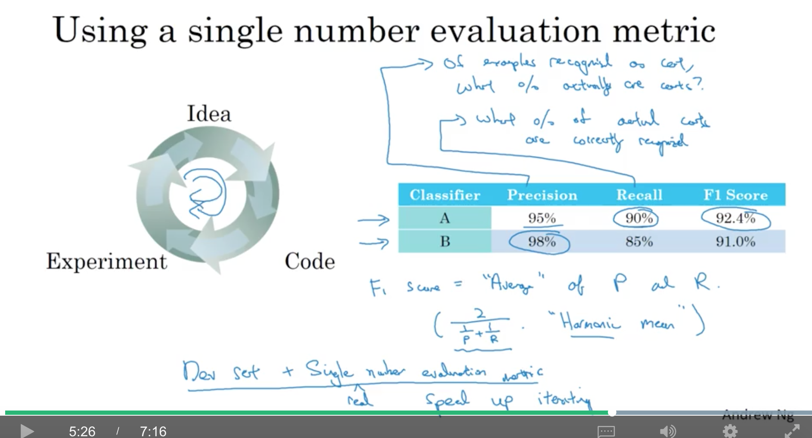
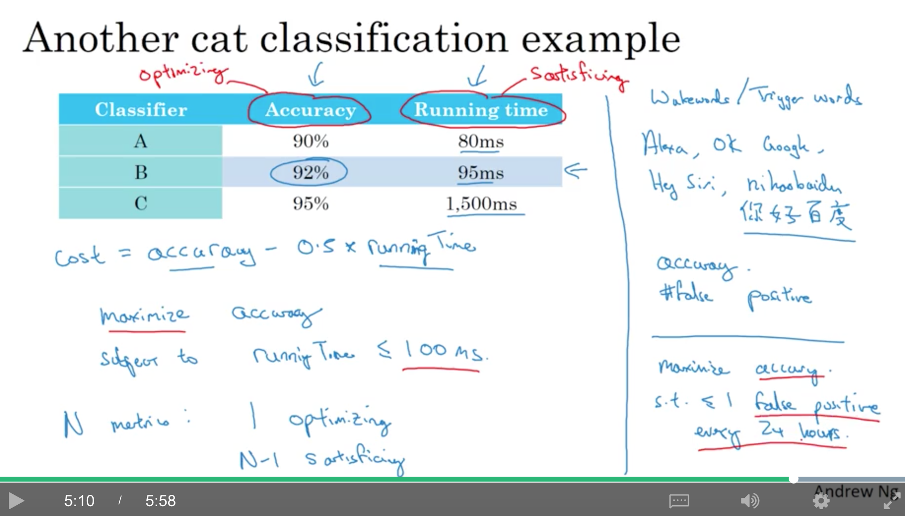
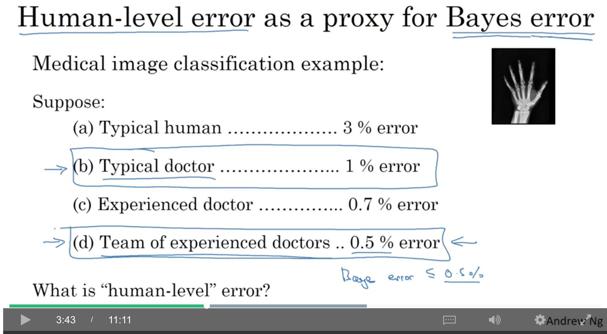

# c3w1

contents

* [1. introduction to ml strategy](c3w1.md#1-introduction-to-ml-strategy)
  * [1.1. why ml strategy](c3w1.md#11-why-ml-strategy)
  * [1.2. orthogonalization](c3w1.md#12-orthogonalization)
* [2. setting up your goal](c3w1.md#2-setting-up-your-goal)
  * [2.1. single number evaluation metric](c3w1.md#21-single-number-evaluation-metric)
  * [2.2. satisficing and optimizing metric](c3w1.md#22-satisficing-and-optimizing-metric)
  * [2.3. train/dev/test distributions](c3w1.md#23-traindevtest-distributions)
  * [2.4. size of the dev and test sets](c3w1.md#24-size-of-the-dev-and-test-sets)
  * [2.5. when to change dev/test sets and metrics](c3w1.md#25-when-to-change-devtest-sets-and-metrics)
* [3. comparing to human-level performance](c3w1.md#3-comparing-to-human-level-performance)
  * [3.1. why human-level performance?](c3w1.md#31-why-human-level-performance)
  * [3.2. avoidable bias](c3w1.md#32-avoidable-bias)
  * [3.3. understanding human-level performance](c3w1.md#33-understanding-human-level-performance)
  * [3.4. surpassing human-level performance](c3w1.md#34-surpassing-human-level-performance)
  * [3.5. improving your model performance](c3w1.md#35-improving-your-model-performance)

## 1. introduction to ml strategy

### 1.1. why ml strategy

在训练好一个网络后，往往有很多想尝试的改进（如下），ml strategy会帮忙给出意见，哪些值得尝试，哪些可以直接放弃

### 1.2. orthogonalization

orthogonalization(正交化)，例如，电视机上有很多个旋钮，每个旋钮只做一件事（夹角90度），而且每件事是『可解释的』。如果有一个东西是可以同时做多件事的（例如，一个摇杆，可能同时控制方向和速度），这样就很难在每件事情上都随心所欲。

ml的几个阶段需要优化cost function在：

* 训练集的表现：增大网络、使用其他优化算法（Adam等）…
* 验证集的表现：正则化、更大的训练集
* 测试集的表现：更大的验证集
* 真实世界的表现：修改验证集（因为可能是验证集或者测试集的分布和现实世界不一样）、修改cost function

上面四个阶段的优化最好是各自正交的，这样就不会因为改变一个而另一个也被改变了，从而找不到真正的问题。

训练神经网络时，不太喜欢用early stopping，因为这种方法会同时影响训练集和验证集，不够『正交』

## 2. setting up your goal

### 2.1. single number evaluation metric

准确：在所有预测为猫的结果中，有多少是预测对的：$$P=\frac{TP}{TP+FP}$$ 召回：在所有的猫中，我预测出来了多少个：$$R=\frac{TP}{TP+FN}$$

如果我们的评价指标有precision和recall这两个，那其实比较难从多个分类器中选出一个比较好的，因此，最好有一个指标可以把recall和precision结合起来——F1（P和R的调和平均【harmonic mean】$$F1=\frac{2}{\frac{1}{P}+\frac{1}{R}}$$）

所以，实践中，往往使用验证集+单一的实数评价指标，可以加速实验的迭代。

### 2.2. satisficing and optimizing metric

图中的accuracy是optimizing metric，而runningTime是satisficing metric（不是那么重要），期望runningTime&lt;100ms时得到最大的accuracy。

所以，如果有N个metrics，期望找到1个optimizing metric，剩下的N-1个是satisficing metric。

另一个场景，希望识别出唤醒的语音（例如，『hey siri』『你好百度』），目标可能就是：maximize accuracy， subject to 每24小时内的false positive数&lt;=1。

### 2.3. train/dev/test distributions

保证dev和test set的数据分布一致（例如将所有数据打乱，然后随机选一些dev，一些test，都覆盖了所有分类类型）

总的来说，**验证集+评估指标决定了需要瞄准的目标**，而**训练集决定了能够击中目标的精度**。

### 2.4. size of the dev and test sets

传统方法(万级别及以下的数据规模)：

* train:test=7:3
* train:dev:test=6:2:2

百万级别以上的数据规模：

* train:dev:test=98:1:1

测试集的size：

* 对最终的performance要求非常高的场景：上百万的样本
* 对最终的performance要求很高的场景：1w/10w的样本就可以了
* 对最终的performance要求不高的场景：可以不要测试集（例如有一个足够大的验证集并且不会过拟合的时候），不过不推荐这种做法

### 2.5. when to change dev/test sets and metrics

有时，在项目的进行过程中，会发现实际的目标和当初设定的不太一样，这个时候就需要改变一下目标。

例如，分类器a的分类error只有3%，但会把一些违法图片也分类为猫。分类器b的分类error有5%，但不会把违法图片分类为猫。这个时候就应该改变，例如,新增一个w来改变error的定义：

$$
\begin{matrix}
\\ error=\frac{1}{m_{dev}}\sum _{i=1}^{m_{dev}}w^{(i)}I(y_{pred}^{(i)}\neq y^{(i)}) 
\\ w^{(i)}=\left\{\begin{matrix}
1,if\ x^{(i)}\ is\ legal \\ 100,if\ x^{(i)}\ is\ illegal
\end{matrix}\right.
\end{matrix}
$$

而为了保证error是在0-1之间的，要把$$\frac{1}{m_{dev}}$$改成$$\frac{1}{\sum_i{w_i}}$$

正交化的思想：

* 放置靶子
* 瞄准和射击

这两个步骤是相互独立的，单独地进行

另一个例子，验证和测试时，用的是网上下载的高清图，a的error是3%，b的error是5%， 而上线使用时，用户上传的图片往往清晰度比较差，或者拍摄角度比较奇怪，可能b的表现反而更好。 这个时候，也需要改变，例如，修改dev和test集，加入更多的非高清图。

## 3. comparing to human-level performance

### 3.1. why human-level performance?

将机器的表现和人的表现进行比较，有个理论上界是Bayes Optimal Error(最小的理论误差)，一般准确率不会达到100%

模型往往会用很快在速度达到或者超越了人类的表现，但之后追赶bayes optimal error的速度却比较缓慢，主要有以下两个原因：

* 人类的表现其实已经很接近bayes optimal error了
* 当水平还达不到人类的表现时，有很工具可以来优化，但超越人类表现后，就很难有工具再来提高了

当水平达不到人类表现时的提高方法：

* 拿到更多人工标注数据
* 人工分析错误的case
* 对bias/variance进行分析

### 3.2. avoidable bias

* 当人类的error是1%，train-error是8%，dev-error是10%是，focus on 减小bias（例如更大的网络，或者更长的训练时间）
* 当人类的error是7.5%，train-error是8%，dev-error是10%是，focus on 减小variance（例如正则化，或者拿到更多的训练样本）

在cv领域，可以把人类的表现，当做贝叶斯最优误差的近似(即，estimate或称为proxy)，因为人类在这些任务上表现得已经足够好

可以将bayes error和train error间的差距称做可避免偏差（avoidable bias），而train error和dev error的差距是variance。

### 3.3. understanding human-level performance

注意：常将human-level error当做bayes error的proxy，所以在如下情况中，如果想要打造一个最好的系统，会拿0.5%当做human-level error。

而如果只是为了发paper，或者只要能推出一个系统就行了，那么，可以把1%当做human-level error。

### 3.4. surpassing human-level performance

当human-level error是0.5%，train-error是0.3%，dev-error是0.4%时，可见模型已经『超越』人类了，但不能确定是过拟合了，而且也很难通过提供更多人工标注数据来改进。

在以下几个任务中，机器已经大大超越人类了：

* 在线广告
* 产品推荐
* 物流（预测物流时间）
* 是否借贷

上述问题都有大量的结构化数据，不是自然感知（Natural Perception）问题，而且机器见过的数据肯定比一个人见过的多，所以容易超越人类

### 3.5. improving your model performance

监督学习中两件最fundemental的事：

* 很好地拟合训练集（很低的avoidable error）
  * 训练更大的模型
  * 训练更久/用更好的优化方法
  * 变换网络结构/搜索更好的超参
* 训练集的性能可以很好的推广到dev/test set（低的variance）
  * 更多的数据
  * 正则化（L2、dropout、数据增强）
  * 变换网络结构/搜索更好的超参 

