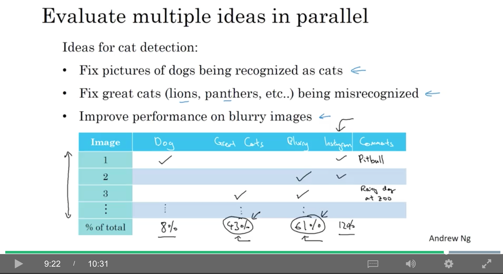
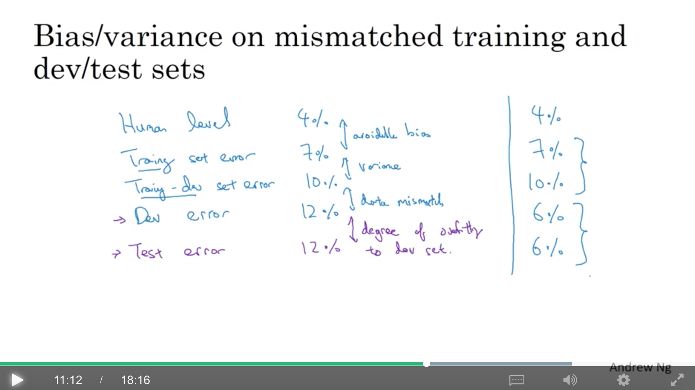
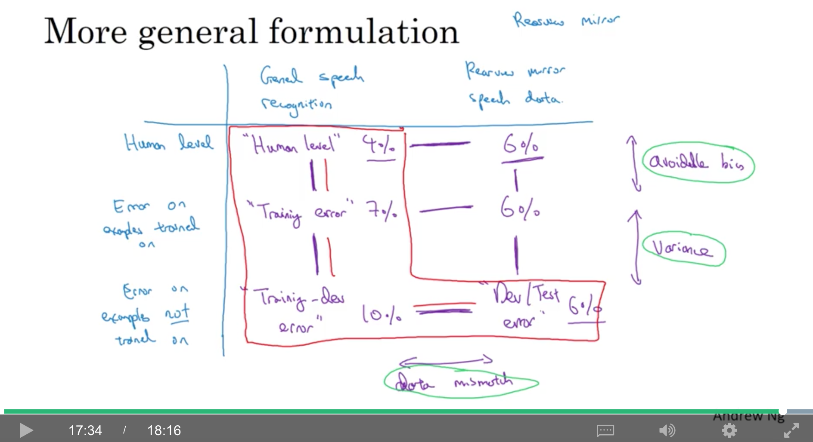

# c3w2

contents

* [1. error analysis](c3w2.md#1-error-analysis)
  * [1.1. carrying out error analysis](c3w2.md#11-carrying-out-error-analysis)
  * [1.2. cleaning up incorrectly labeled data](c3w2.md#12-cleaning-up-incorrectly-labeled-data)
  * [1.3. build your first system quickly, then iterate](c3w2.md#13-build-your-first-system-quickly-then-iterate)
* [2. mismatched training and dev/test set](c3w2.md#2-mismatched-training-and-devtest-set)
  * [2.1. training and testing on different distributions](c3w2.md#21-training-and-testing-on-different-distributions)
  * [2.2. bias and variance with mismatched data distributions](c3w2.md#22-bias-and-variance-with-mismatched-data-distributions)
  * [2.3. addressing data mismatch](c3w2.md#23-addressing-data-mismatch)
* [3. learning from multiple tasks](c3w2.md#3-learning-from-multiple-tasks)
  * [3.1. transfer learning](c3w2.md#31-transfer-learning)
  * [3.2. multi-task learning](c3w2.md#32-multi-task-learning)
* [4. end-to-end deep learning](c3w2.md#4-end-to-end-deep-learning)
  * [4.1. what is end-to-end deep learning?](c3w2.md#41-what-is-end-to-end-deep-learning)
  * [4.2. whether to use end-to-end deep learning](c3w2.md#42-whether-to-use-end-to-end-deep-learning)

## 1. error analysis

### 1.1. carrying out error analysis

例如，一个识别猫的项目，发现有一些是狗的图片被分成了猫，是不是应该用一些方法（例如，加入一些可以区分猫狗的特征，或者加入更多狗的图片去训练）让分类器对狗的识别表现得更好？

分析方法：

* 抽取大约100张dev set中标错的图片
* 看看多少张是狗

如果比例很低，那提高准确率的上限（ceiling）其实也很小，所以没必要。如果比例高，那就值得尝试。

还可以并行地评估不同的想法：

* 修复把狗识别成猫的图片
* 修复把大型猫科动物（如狮子、豹子等）识别成猫的图片
* 改进在模糊图片的识别准确率

可以画个表格，看每一种case的比例，并给每个case标上注释。而在看case的过程中，可能会发现新的问题（例如，加了xxx滤镜），那么，就加新的一列呗。。

### 1.2. cleaning up incorrectly labeled data

可能有些数据的label标错了，分以下几种情况来看：

* 如果是训练集的数据：如果这种标错是**随机**的，因为dl对random errors是很robust的，所以只要数据集够大，且标错的数据很少，就可以不理。但dl对系统误差（systemetic errors）并不robust，例如，如果标记人员把白色的狗都标成了猫，那dl也会倾向于把白色的狗识别成猫
* 如果是dev/test set中的数据，同样地画个表格，然后加一列，表示是否标注错误，然后关注以下三个数字：
  * overall dev set error: 例如是10%
  * 因为标错数据导致的error：例如在100个抽样的case里，有6个，那就是6%\*10%=0.6%
  * 因为其他原因导致的error：10%-0.6%=9.4%

需要保证dev和test set是同一分布的，因为会影响到泛化；但训练集和dev/test set的分布有些小区别是可以接受的。

### 1.3. build your first system quickly, then iterate

举个语音识别的例子，可能有以下几个方向可以尝试来改进一个现有的系统：

* 有噪音的背景
  * 在咖啡厅的噪音
  * 汽车的噪音
* 方言
* 距离麦克风太远（远场语音识别）
* 孩子的声音（发音、常用词库的不同）
* 结巴（或者一些停顿的语气词）

如果想要开始一个新项目，建议：

* 设置dev/test set以及metric
* 快速搭建一个初始的系统（不要搞得太复杂，quick and dirty就行啦）
* 使用bias/variance分析，以及error分析来决定接下来todo的优先级

以上建议不适用于：

* 你已经有丰富经验的领域
* 学术界已经有很多很成熟的研究的领域

## 2. mismatched training and dev/test set

### 2.1. training and testing on different distributions

例如，开发一个应用来识别猫，有两种来源，一种是用户上传的清晰度比较差的图（最终目标，可能只有1w），还有一种是从网上爬的高清图（可能有20w）。有以下两种方法：

* 方案1（不采纳）：全部21w数据混在一起shuffle，然后20500做train，2500做dev，2500做test。
  * 优点：train/dev/test都来自同一分布，易于管理
  * 缺点：dev有一大部分是来自网络的，而非目标分布的。但**设置dev的目的就是找到团队的目标**
* 方案2：将所有20w的网络图像放入train，dev/test全部都来自用户上传(2500+2500)，剩下的5000个用户上传的可以也放进train中
  * 缺点：train和dev/test的分布不一致，接下来会讲如何优化

### 2.2. bias and variance with mismatched data distributions

例如，bayes error接近0%，training-error是1%，而dev-error是10%，这个从train到dev的gap，难以一下子判断出原因，因为有以下两个因素：

* 因为算法只看见了train的数据，而没有见过dev
* dev的数据分布与train不同

因此，定义一个新的数据集：training-dev set，**与train同分布，但训练时并未使用。**

* train-error是1%，training-dev error是9%，dev-error是10%，那么就是一个variance问题，因为这说明在同样分布的数据集上，泛化能力不行。
* train-error是1%，training-dev error是1.5%，dev-error是10%，那这是一个data-mismatch问题，因为两者分布不同导致了这个gap
* train-error是10%，training-dev error是11%，dev-error是12%，但因为bayes error是0%，所以，是一个avoidable bias问题
* train-error是10%，training-dev error是11%，dev-error是20%，那这就是一个avoidable bias加上data mismatch的问题

总结如下：

图中的dev和test的gap表示对dev的过拟合程度，如果过拟合得比较严重，那么就需要增大dev的size。

如果出现图中右边的情况，也就是在dev/test上的表现比train/training-dev要好，那有可能是，训练集比dev/test更难训练。

一个更通用的总结：

图中，第一列是通用的数据集，第二列是特定问题的数据集，第一行是人类的表现，第二行是在参与了训练的数据上的error，第三行是在没有参与训练的数据上的error。

* (1,1)是human-error
* (2,1)是train-error
* (3,1)是training-dev error
* (3,2)是dev/test error
* (2,1)-(1,1)，即train-error与human-error之差，是avoidable bias
* (3,1)-(2,1)，即training-dev error与train-error之差，是variance
* (3,2)-(3,1)，即dev-error与training-dev error之差，是data mismatch
* 而(1,2)是人工对目标数据集的标注error
* (2,2)是有了一些人工标注的目标数据集后，把它们拿来训练，这部分的error
* 而看(1,2)-(1,1)或者(2,2)-(2,1)，能够看出目标问题的难易程度

### 2.3. addressing data mismatch

* 进行人工的error analysis，以理解train和dev/test的difference
* 收集更像dev/test的训练数据，或者构造与dev/test更像的数据

人工数据合成：可以将安静环境中的语音和汽车环境的噪音进行合成。

注意：例如有1w小时的安静环境中的语音和1小时的汽车环境的噪音，可以把这1小时复制1w遍，和安静环境的语音进行合成。虽然在人听起来，这合成的都不一样，但这样可能会让模型对这1小时的噪音(因为汽车噪音非常多，这1小时只是其中很小的一个子集)overfitting。而事实上，获取1w小时的不同噪音其实成本并不大，所以建议去搞1w小时的不同噪音。

## 3. learning from multiple tasks

### 3.1. transfer learning

例如，已经训练好了一个图像分类的模型，想做放射诊断，可以保持前面的网络结构和权重不变(pre-train)，只把最后一层的权重随机初始化，然后fine-tune：

* 如果数据集比较小，可以只re-train最后一层的权重
* 如果数据集够大，可以重训所有权重

when transfer learning makes sense

* A和B两个任务有相同类型的input x
* A的数据比B要多很多
* A的低阶特征或许对B任务是有用的

### 3.2. multi-task learning

例如无人驾驶，需要同时识别行人/车/路标/红绿灯，这样，目标$$y^{(i)}$$就是一个4x1的向量，所以矩阵Y的shape为(4,m)。所以， $$Loss=\frac{1}{m}\sum ^m_{i=1}\sum^4_{j=1}L(\hat{y}_j^{(i)},y_j^{(i)})$$ $$L(\hat{y}_j^{(i)},y_j^{(i)})=-y_j^{(i)}log\hat{y}_j^{(i)}-(1-y_j^{(i)})log(1-\hat{y}_j^{(i)})$$

而这个和softmax regression不同，因为softmax regression要求$$y^{(i)}$$只能是4类之一（即这个4x1的向量是one-hot），而这里一个$$y^{(i)}$$可以同时是多类（即这个4x1的可以同时有多位是1）

如果对于一个样本有一些label没有被标注，例如，某张图，标注人员看不出里面有没有行人，可能行人这一维标了一个『?』。对于这种情况，上式的$$\sum^4_{j=1}$$修改为只对有label不为『?』的$$y_j^{(i)}$$和$$\hat{y}_j^{(i)}$$的loss求和。

when multi-task learning makes sense

* 一系列的task，如果共享一些低层次的特征，会训练得更好
* （不一定必要，但经常是对的）每个task的数据量差别不大，因为其他task的数据量加起来，会对单一task的数据有补充
* 能够训练一个足够大的网络，来使每个task都有很好的表现。因为，如果一个网络不够大，可能与各个task分开训练相比，反而准确率会更低

实际应用中，transfer learning比multi-task要多一些。

## 4. end-to-end deep learning

### 4.1. what is end-to-end deep learning?

例如，语音识别任务，传统方法可能先通过MFCC之类的方法，人工提取特征，然后基于这些特征使用ml算法提取phonemes(音素，是声音的基本单位)，然后得到对应的word，然后把words串起来，得到transcript。而end-to-end，就是直接输入语音，输出transcript。

* 当数据量比较小的时候，例如只有3k小时的数据，可能传统方法比end-to-end效果还要好
* 而当数据量比较大时，例如1w，甚至10w的时候，可能end-to-end会突然变好
* 当数据量中等时，可以分段，例如，从语音到phonemes可以end-to-end，然后后面的步骤按传统方法来搞

例如，人脸闸机的任务，业界最有效的方法并不是直接输入一张图像，识别出这是哪个人，因为人出现的位置可能不同，由于距离的远近，人脸的大小也会有很大的差别，比较有效的方法是分阶段的：

* 首先，用一个探测器识别出人脸的位置
* 然后放大人脸，使人脸位于图像的中心，然后拿这幅图像去识别这个人的身份（其实就是把两张图作为输入，然后判断是不是同一个人，所以如果一个公司有1w人，就是快速判断这张图和这1w个人哪个最像）

如果需要通过一张手掌的x光片，判断孩子的年龄，可以先用nn提取出骨骼，然后通过骨骼的长度，查表去判断孩子的年龄。而如果想直接从图片到年龄，实际上并没有足够多的数据，所以可行性相对差一些。

### 4.2. whether to use end-to-end deep learning

优点：

* let data speak：更容易学到数据内在的统计学特征，而非被迫去反映人的先见
* 所需的人工设计的特征更少了，可以简化整个工作流程

缺点：

* 可能需要非常大量的数据
* 排除了一些具有潜在用途的手工设计组件。当数据量不够多时，一个精心手工设计的系统实际上中以将更多的人对于这个问题的知识注入算法之中

所以核心问题是：是否有足够的数据去学习出具有能够映射x到y所需复杂度的函数。

* 可以用dl来学习一些独立的组成部分
* 根据你想学习的任务获取数据的难易程度，认真选择x-&gt;y的映射类型

