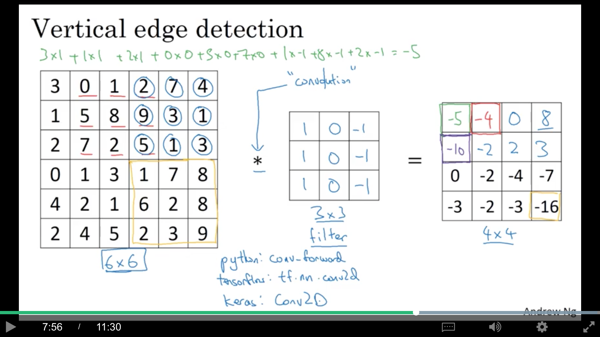
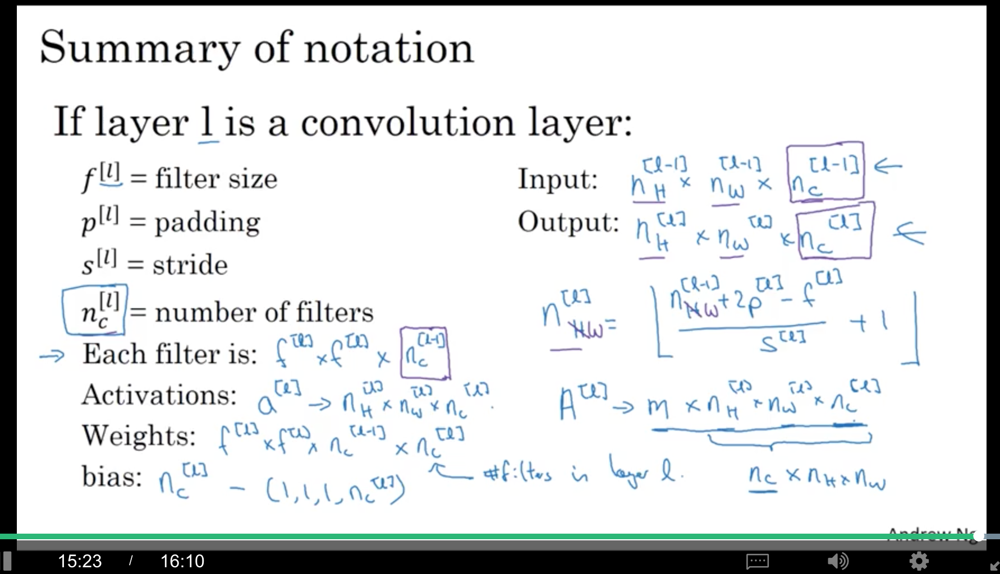
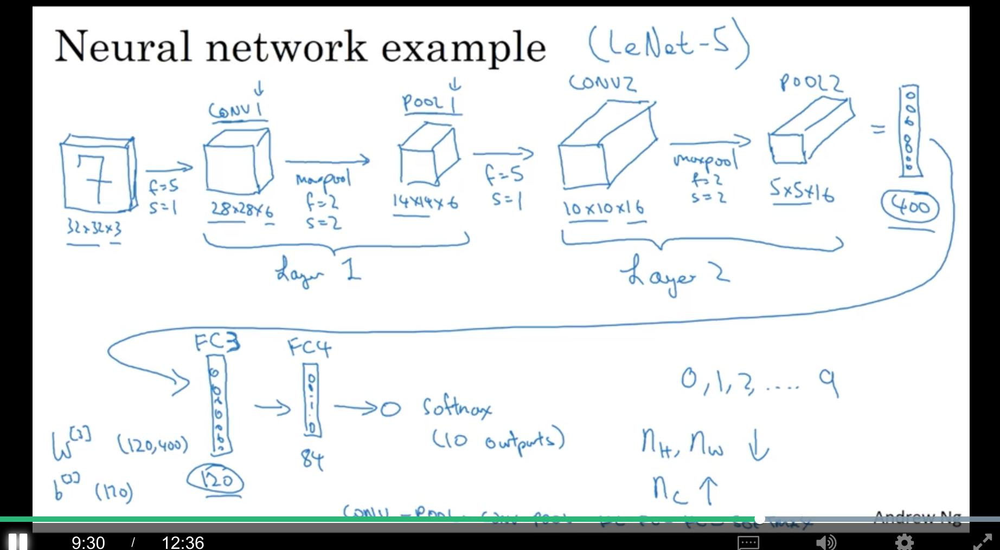

contents

<!-- TOC -->

- [1. Convolutional Neural Networks](#1-convolutional-neural-networks)
    - [1.1 Computer Vision](#11-computer-vision)
    - [1.2 Edge Detection Example](#12-edge-detection-example)
    - [1.3 More Edge Detection](#13-more-edge-detection)
    - [1.4 Padding](#14-padding)
    - [1.5 Strided Convolutions](#15-strided-convolutions)
    - [1.6 Convolutions Over Volume](#16-convolutions-over-volume)
    - [1.7 One Layer of Convolutional Network](#17-one-layer-of-convolutional-network)
    - [1.8 Simple Neural Network Example](#18-simple-neural-network-example)
    - [1.9 Pooling Layers](#19-pooling-layers)
    - [1.10 CNN Example](#110-cnn-example)
    - [1.11 Why Convolutions?](#111-why-convolutions)

<!-- /TOC -->

# 1. Convolutional Neural Networks

## 1.1 Computer Vision

dl对cv的影响：

+ 能够催生cv领域中很多新产品和应用
+ cv的很多思想对其他领域也很有借鉴作用，例如语音识别等

cv problems；

+ image classification
+ object detection
+ neural style transfer

deep learning on large images: 

+ 如果输入是64x64的图像，那么由于有3个通道，所以是64x64x3=12288维
+ 如果输入是1000x1000的图像，就有300w维，如果第一层有1000个隐层单元，那么如果是全连接，$W^{[1]}$就是一个(1000, 300w)，所以有3000m=3billion的参数，一方面难以获得足够的数据来防止过拟合，另一方面对计算量和内存的需求是很大的。因此，需要卷积。

## 1.2 Edge Detection Example

例如，我们希望有两个detector，一个可以检测垂直方向的边缘，一个可以检测水平方向的边缘。

vertical edge detection:

+ 输入一张6x6的灰度图(所以没有3通道，只有1通道)，数字越小，越明亮（白）
+ 可以定义一个3x3的filter（又称kernel），
+ 然后两者之前进行卷积运算，得到的结果是一个4x4的矩阵。计算过程如下：
    + 4x4的左上角的元素是将filter『粘贴』到原始图片的左上角，然后对应元素相乘，再把所有相乘的结果相加起来
    + 其他元素就是将filter不断地shift，然后进行卷积，得到对应的结果，以此类推。

卷积的实现：

+ python: conv_forward
+ tensorflow: tf.nn.conv2d
+ keras: Conv2D

从下图可以看到，这个filter可以学习到原始图像中明暗分界的那条垂直竖线(对中间那个垂直区域的『激活』值比较高)。可见，这个filter（左边亮，右边暗）可以检测从明到暗的transition。

## 1.3 More Edge Detection

如果输入图像左右颠倒，使用同一个filter，可以发现卷积结果仍然可以检测这条明暗交界线，只是这次变成了从暗到明的transition，而结果的中间垂直区域变成黑色的。

类似地，如果要检测水平边缘，可以用如下filter，第一行亮，第三行暗。

+ sobel filter：就是把垂直filter的第二行乘了2，会稍微robust一点
+ scharr filter：把垂直filter第一行和第三行分别乘3，第二行乘10

在dl中，这个3x3的filter的9个元素，不需要手动设置，当做模型的参数，通过bp来学习，这样，这些filter就可以用来检测各种角度的边缘。

## 1.4 Padding

正常的卷积操作，输入图片是$n\times n$，filter是$f\times f$，得到的卷积结果是$(n-f+1)\times (n-f+1)$，有以下两个缺点：

+ **shrinking output**: **卷积的结果比原图像小**，所以只能做比较少次的卷积，不然**图片会越变越小**，最后变成$1\times1$
+ **throwing away info from edges**: 看左上角的元素，其实只被使用了一次；而中间的元素则会被使用很多次。**所以角落或者边缘附近的元素被使用的次数比中间元素少得多，因此，图片边缘的很多信息其实没有被充分利用。**

padding就是在整幅图像的边缘，加上一个宽度为$p$（这个例子中$p=1$）的border(可以都填充上0)，例如，6x6就变成了8x8，即$(n+2)\times (n+2)$，那么与一个3x3的filter做卷积，就得到一个6x6，即$(n+2-3+1)\times (n+2-3+1)$的结果。

假设padding size是$p$，那么，得到的卷积结果是$(n+2p-f+1)\times (n+2p-f+1)$

总结一下，两种卷积：

+ valid convolutioins: no padding
+ same convolutions: padding使得output和input的size一样
$$n+2p-f+1=n=>p=\frac{f-1}{2}$$

在cv的传统中，$f$一般都是奇数，原因如下：

+ 如果是偶数，就会出现不对称的padding
+ 使用奇数$f$的filter话，这样的filter会**有一个中心点**，在cv中，有一个特殊点是很好的，可以描述一个filter的位置

## 1.5 Strided Convolutions

stride=2意味着，算完一个后，要算下一个的时候，往右不只shift一个像素，而是shift stride个像素。纵向shift的时候也一样，一次shift stride个像素。

所以，对于padding是$p$，而stride是$s$的卷积，得到的output大小是$(\frac{n+2p-f}{s}+1)(\frac{n+2p-f}{s}+1)$，**如果这个结果不是一个整数，那么就取floor(向下取整)**。【因为要保证参与计算卷积的都是图像的一部分，或者是padding的一部分，如图右上角超出的部分就不应该参与计算，所以这里要取floor】

在标准的信号处理/数学课本中，在进行卷积的element-wise乘法之前，需要将filter沿水平和垂直方向旋转（如图）。这样，可以使卷积操作满足结合律，即$(A*B)*C=A*(B*C)$，这对信号处理很有用，但对深度学习其实并不重要。

所以，严格意义上说，前面讲到的『卷积』，应该叫做『交叉相关（cross-correlation）』。而在大多数ml相关的文献中，都叫做卷积。

## 1.6 Convolutions Over Volume

对于rgb图像而言，有3个channel，所以，相应的，filter也堆叠了3层。

注意:

+ 输入图片的shape是(height, width, num of channels)，
+ filter的shape是(height_f, width_f, num of channels)，**filter和输入的第三维必须相等。**
+ 输出的图片是(height_o, width_o)，**注意，并没有第三维！！**

卷积操作就是，将这个三维的filter（例如3x3x3）**与输入图像的对应位置相乘，再将这27个数相加**，得到的结果就是output的一个元素。

如果只想检测某一个channel的边缘，可以把另外几个channel的filter全部变成0；如果想检测多个channel，就正常搞。

如果有多个filter，那output就可以有第三维了，例如，有两个3x3x3的filter，那么可以把这两个output堆叠起来，这样output的第三维就是2啦。

总结：

输入是$n\times n\times n_{C}$，有$n'_{C}$个$f\times f\times n_{C}$的filter，那么得到的结果就是$(n-f+1)\times (n-f+1)\times n'_{C}$

另外，这里的channel数，也就是$n_{C}$，通常也会被称为depth。

## 1.7 One Layer of Convolutional Network

对于每一个filter的输出，加上一个bias(输出矩阵的每一维都加上这个bias)，然后再经过非线性激活（如relu），得到最终的输出。

可以把原始输入看成$a^{[0]}$，而filter可以看成是$W^{[1]}$

参数个数：假设有10个3x3x3的filter，因为每个filter有一个bias，所以有(3x3x3+1)x10=280个参数。所以，cnn的参数比全连接的nn少了很多，所以更不容易过拟合。

对于第$l$层，

+ filter的高/宽是$f^{[l]}$
+ padding是$p^{[l]}$
+ stride是$s^{[l]}$
+ filter的个数是$n_C^{[l]}$
+ 每个filter的shape是$f^{[l]}\times f^{[l]}\times n_C^{[l-1]}$
+ input的shape是$n_H^{[l-1]}\times n_W^{[l-1]}\times n_C^{[l-1]}$
+ output的shape是$n_H^{[l]}\times n_W^{[l]}\times n_C^{[l]}$
+ $n^{[l]}=floor(\frac{n^{[l-1]}+p^{[l]}-f^{[l]}}{s^{[l]}}+1)$，对$n_H$和$n_W$是类似的
+ activations$a^{[l]}$的shape是$n_H^{[l]}\times n_W^{[l]}\times n_C^{[l]}$
+ 所以，在做mini-batch梯度下降的时候，有m个examples的矩阵$A^{[l]}$的shape就是$m\times n_H^{[l]}\times n_W^{[l]}\times n_C^{[l]}$
+ 因为有$n_C^{[l]}$个filter，而每个filter的shape是$f^{[l]}\times f^{[l]}\times n_C^{[l-1]}$，所以，权重矩阵的shape就是$f^{[l]}\times f^{[l]}\times n_C^{[l-1]}\times n_C^{[l]}$
+ 而bias的shape就是$n_C^{[l]}$，为了统一，会计为$1\times 1\times 1\times n_C^{[l]}$

在有些开源的代码里，顺序可能不一样，例如$m\times n_H^{[l]}\times n_W^{[l]}\times n_C^{[l]}$可能变成$m\times n_C^{[l]}\times n_H^{[l]}\times n_W^{[l]}$，而在大部分开源的框架里，其实都有一个参数，可以让用户决定把$n_C^{[l]}$放在最前面或者最后面的。

## 1.8 Simple Neural Network Example

如图，在$7\times7\times40$之后，**将这层直接flatten，变成一个1960维的向量**，然后再接一个logistic或者softmax，再进行分类

## 1.9 Pooling Layers

pooling的基本思想，与卷积的运算基本一样，区别在于，filter和原图像做的不是卷积操作，而是对原图像的filter大小的区域做max/min之类的操作，而且**filter并没有第三维，输入和输出的第三维是一样的**。

**同样有f/stride这些参数**，而且$floor(\frac{n+2p-f}{s}+1)$同样适用。这些参数是**超参**，**针对pooling，并没有需要学习的参数。**

average pooling相对于max pooling来说，应用得少很多。有个例外，在非常深的网络里，例如将$7\times7\times1000$的层pooling成$1\times1\times1000$的层时，一般用average pooling，具体原因后面会讲，不急不急。。

超参的设置，一般s=2，f=2或者s=3，f=2，当然，还有padding可以设置，但非常少用，有一个例外，下周再说

## 1.10 CNN Example

以LeNet-5为例，

conv-1的输入有6个filter，有两种叫法：

+ 一个conv加上一个pooling，称为一个layer。
+ conv算一个layer，pooling也算一个layer。

但因为conv有参数可以学习，pooling只有超参，所以本课程中会使用叫法一。

layer2的输出展开成一个400维的向量，然后接FC3（权重矩阵$W^{[3]}$的shape是(120,400)），变成一个120维的向量，然后接一个FC4变成84维，最后接一个softmax。

对于超参的设置，一般不要自己发明新的，直接参考业界取得比较好结果的设置。

一般来说，随着层数的增加，$n_H$和$n_W$会减小，而$n_C$一般会增加。

各层的shape和size，以及参数数目如下表，可见：

+ pool层没有参数
+ conv层的参数比fc的少
+ 随着层数的增加，activation size**逐渐**变小，没有『骤降』

## 1.11 Why Convolutions?

cnn的两个好处：

+ 参数共享：一个feature detector对图片的一部分有效时，很可能对图片的其他部分也有效
+ 稀疏连接：输出的每一个元素只与输入的一部分有关系

因此，cnn可以有更少的参数，从而可以对更小的数据集，更不容易过拟合。

另外，cnn在捕捉translation invariance方面也很擅长，例如，一张猫的图像，往右平移了一些距离，很多feature还是类似的，cnn也能感知到。

