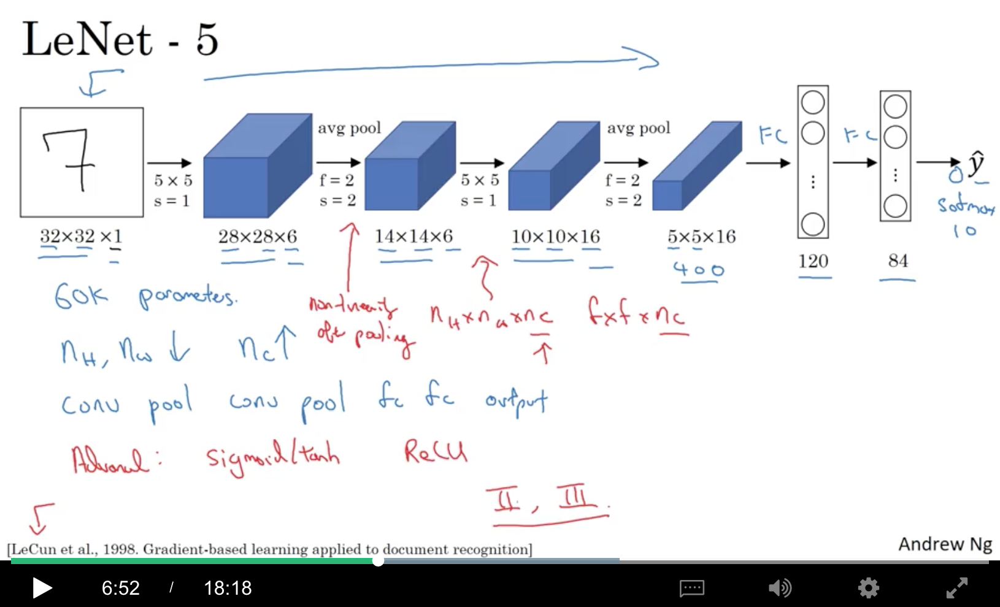
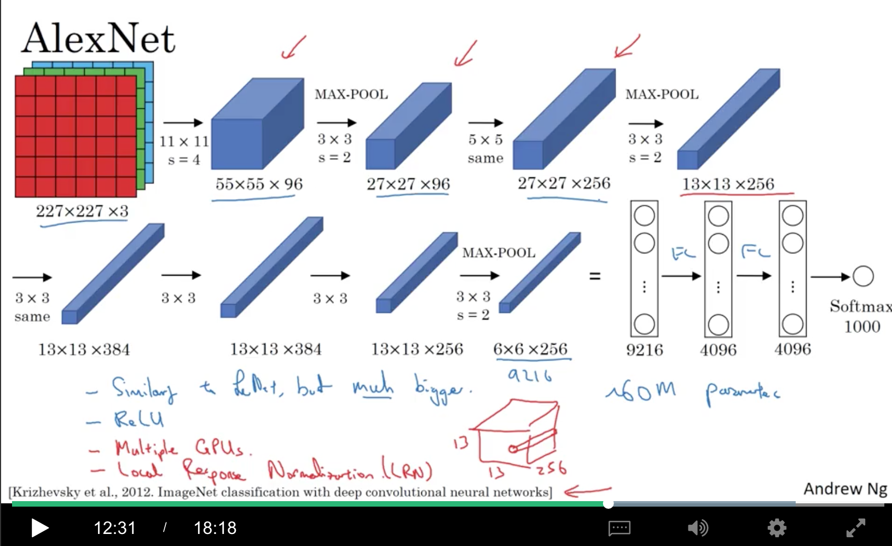
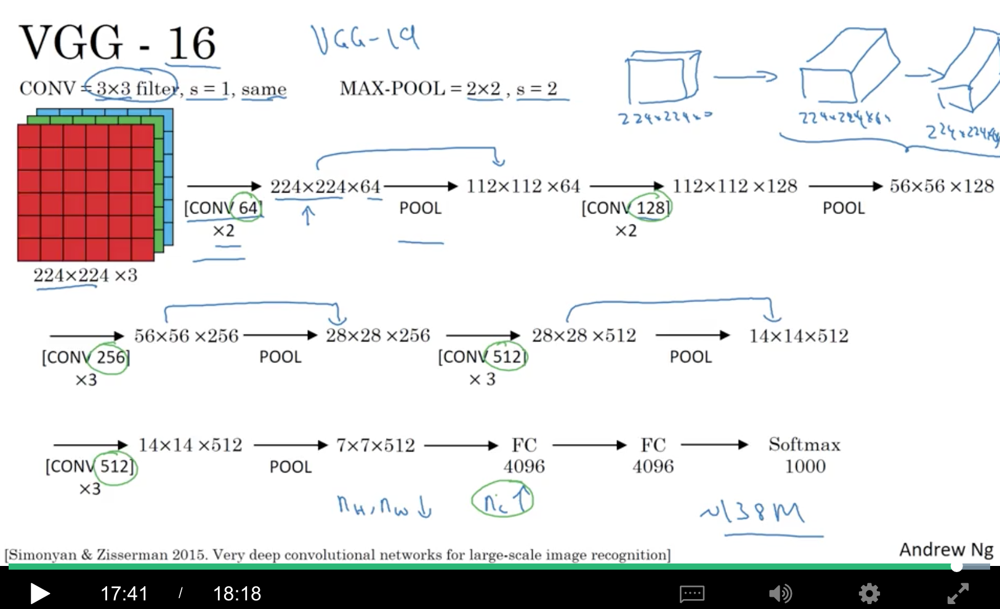
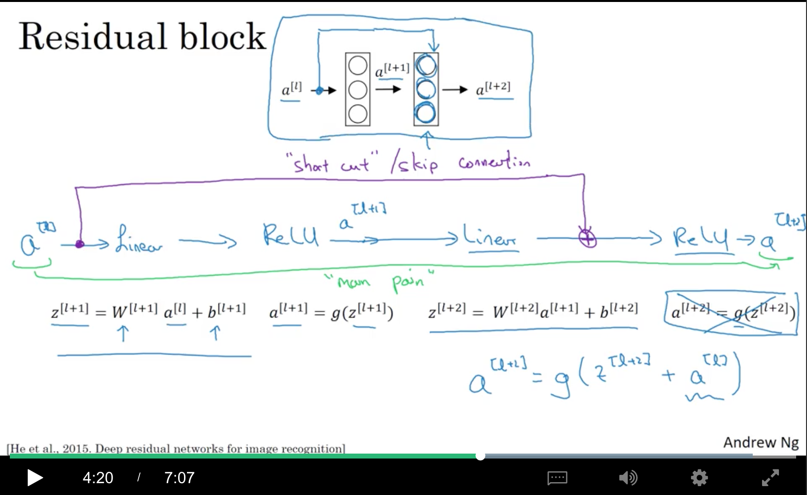
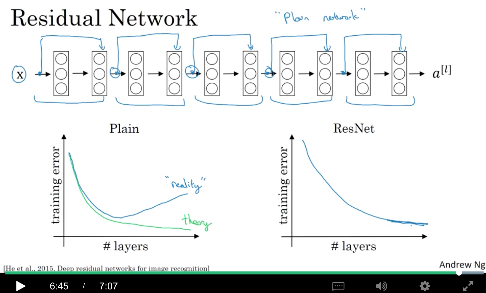
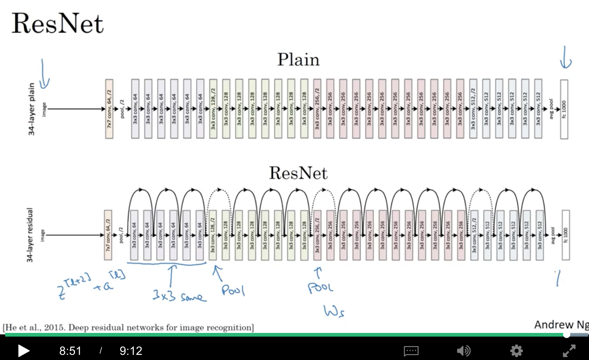

contents

<!-- TOC -->

- [1. Case studies](#1-case-studies)
    - [1.1 Why look at case studies?](#11-why-look-at-case-studies)
    - [1.2 Classic Networks](#12-classic-networks)
        - [1.2.1 LeNet-5（1998年）](#121-lenet-5%EF%BC%881998%E5%B9%B4%EF%BC%89)
        - [1.2.2 AlexNet（2012年）](#122-alexnet%EF%BC%882012%E5%B9%B4%EF%BC%89)
        - [1.2.3 vgg-16(2015年)](#123-vgg-162015%E5%B9%B4)
    - [1.3 ResNets](#13-resnets)
    - [1.4 Why ResNets Work](#14-why-resnets-work)
    - [1.5 Networks in Networks and 1x1 Convolutions](#15-networks-in-networks-and-1x1-convolutions)
    - [1.6 Inception Network Motivation](#16-inception-network-motivation)
    - [1.7 Inception Network](#17-inception-network)
- [2. Practical advices for using ConvNets](#2-practical-advices-for-using-convnets)
    - [2.1 Using Open-Source Implementation](#21-using-open-source-implementation)
    - [2.2 Transfer Learning](#22-transfer-learning)
    - [2.3 Data Augmentation](#23-data-augmentation)
    - [2.4 State of Computer Vision](#24-state-of-computer-vision)

<!-- /TOC -->

# 1. Case studies

## 1.1 Why look at case studies?

其中，ResNet可以达到152层

## 1.2 Classic Networks

### 1.2.1 LeNet-5（1998年）

+ 因为输入是灰度图，所以channel=1，维度是$$n_H^{[0]}\times n_W^{[0]}\times n_C^{[0]}=32\times 32\times 1$$
+ stride=1，有6个filters，每个是5x5，所以输出是，$$n_H^{[1]}\times n_H^{[1]}\times n_H^C{[1]}=(\frac{(32-5+2\times 0)}{1}+1)\times (\frac{(32-5+2\times 0)}{2}+1)\times 6=28\times 28\times 6$$
+ 接下来接的是avg pooling(当时avg很流行，后来大部分是max pooling了)，2x2的filter，stride=2，而pooling的filter并没有第三维，输入和输出的第三维是一样的。所以输出是，$$(\frac{(28-2+2\times 0)}{2}+1)\times (\frac{(28-2+2\times 0)}{2}+1)\times 6=14\times 14\times 6$$
+ 接下来接16个5x5(应该是5x5x6，maybe是同一个5x5，给6个channel用，所以简记为5x5)的filter，stride=1，所以：
$$(\frac{14-5+2\times 0}{1}+1)(\frac{14-5\times 0}{1}+1)\times 16=10\times 10\times 16$$
+ 然后接一个avg pooling，2x2的，输出是
$$(\frac{10-2+2\times 0}{2}+1)(\frac{10-2+2\times 0}{2}+1)\times 16=5\times5\times 16$$
+ 然后把这5x5x16=400个神经元flatten，变成一个400维的向量，再接一个120维的fc，再接一个84维的fc。
+ 目标是一个10分类的结果，现代的方法是用一个10维的softmax，而在当时，用的是gaussian connections，现在已经不用啦。

小结：

+ lenet-5总共有大约60k的参数。
+ 因为都没有用padding，所以随着层数的增加，height和width都会变小。
+ channels是增加的。
+ 形成了pattern：conv+pool+conv+pool+fc+fc+output

看这篇论文时可以关注的点

+ 当时的激活函数还是sigmoid/tanh
+ 由于当时的计算速度比较慢，对$n_H\times n_W\times n_C$的输入，使用$f\times f\times n_C$的filter，每个filter只对对应的通道起作用
+ 当时在pooling后会接非线性

可以关注论文的section II(网络结构)和section III（实验和结论）。

### 1.2.2 AlexNet（2012年）

+ 输入是227x227x3的图片
+ 第一层是96个11x11的filters，stride=4，所以得到55x55x96
+ 然后接一个3x3的max pooling，stride=2，所以得到27x27x96
+ 然后经过256个5x5的卷积，做一个same conv，使得得到的宽和高保持不变[即(25+2p-5)/s+1=25==>(20+2p)/s=24，可以设置stride=1，padding=2]，得到27x27x256。
+ 然后再做一个3x3，stride=2的max pooling，得到13x13x256。
+ 再接384个3x3的卷积，做same conv，得到13x13x384
+ 再接384个3x3的卷积，做same conv，同样得到13x13x384
+ 再接256个3x3的卷积，做same conv，同样得到13x13x256
+ 再接3x3，stride=2的max pooling，得到6x6x256
+ 然后flatten成一个6x6x256=9216维的向量
+ 再接两个4096维的fc
+ 最后接一个1000分类的softmax

小结：

+ 结构和lenet-5相似，但参数上，lenet-5只有60k即6w的参数，而alexnet有60m即6kw的参数
+ 使用了relu

看这篇论文时可以关注的点：

+ 当时的gpu比较慢，所以当时用很复杂的方式在2个gpu上进行训练。大概的思想就是把一些layer拆开到不同gpu上进行训练和通信。
+ 使用了一些特殊的层，例如local response normalization(LRN)。大概思想是，例如针对一个13x13x256的block，看13x13中的某一个点时，对这个点在256个通道上的值进行normalization。动机在于，在13x13上的某一个位置，或许不需要太多的神经元有太高的激活值。但后来，大多数研究者发现这么做其实没什么用…

### 1.2.3 vgg-16(2015年)

CONV都是3x3的filter，stride=1，same padding
MAX-POOL都是2x2，stride=2(刚好可以把宽度和高度缩小一半：(x-2)/2+1=x/2)

+ 输入是224x224x3的图片
+ 然后接两个CONV 64层（每层有64个filter）[右上角的图]，得到224x224x64
+ 然后接一个POOL，得到112x112x64
+ 再接两个CONV 128层，得到112x112x128
+ 再接一个POOL，得到56x56x128
+ 再接3个CONV 256，得到56x56x256
+ 再接一个POOL，得到28x28x256
+ 再接3个CONV 512，得到28x28x512
+ 再接一个POOL，得到14x14x512
+ 再接3个CONV 512，得到14x14x512
+ 再接一个POOL，得到7x7x512
+ 然后flatten，并接2个4096的FC，最后接1000的softmax

小结：

+ 不把POOL当做layer，就总共有2+2+3+3+3+1+1+1，所以叫vgg-16
+ 可以看到，POOL会把高度和宽度减半，而channels则是逐层翻倍(64-238-256-512)
+ 缺点就是参数太多，参数总量有138M，即13.8kw，即1.38亿
+ 还有vgg-19，但效果其实差不多，所以大部分人还是用vgg-16

## 1.3 ResNets

核心思想是skip connections/shortcut。

基本组成单元是Residual Block。所谓的Residual，就是把图中的$a^{[l]}$直接『加』到$z^{[l+2]}$上，即：
$$a^{[l+2]}=g(z^{[l+2]}+a^{[l]})$$

当然，这种shortcut不仅可以跨越一层，还可以跨越好几层

如下图，有5个residual blocks。

理论上，层数加深，training error会一直变小，如左图中的绿线，但实际应用中，一个很深的普通dnn（没有残差连接），训练误差反而会变大。而ResNet能让更深的网络训练效果更好，可能后面会出现平原（怎么加深效果也不会怎么变化）。

## 1.4 Why ResNets Work

$$a^{[l+2]}=g(z^{[l+2]}+a^{[l]})=g(W^{[l+2]}a^{[l+1]}+b^{[l+1]}+a^{[l]})$$

如果使用l2-regularization，即weight decay，会减小$W^{[l+2]}$。如果$W^{[l+2]}$减小到0，方便起见，假设$b^{[l+2]}$也是0，那么，
$$a^{[l+2]}=g(W^{[l+2]}a^{[l+1]}+b^{[l+1]}+a^{[l]})=g(a^{[l]})$$

如果用的relu，那就是$a^{[l+2]}=a^{[l]}$。所以，Residual block能够很容易地学习恒等变换。相当于这两层在神经网络中白加了，其实就是减少了网络的深度。

另外一点需要注意的是，这里使用了『加』，所以要求$z^{[l+2]}$和$a^{[l]}$的维度是一样的，所以在resnet中会有很多的相同conv。

假设输入和输出维度不同，例如$a^{[l]}$是128维的，而$a^{[l+2]}$是256维的，这个时候，可以加一个256x128的$W_s$：

$$a^{[l+2]}=g(z^{[l+2]}+W_sa^{[l]})$$

这里的$W_s$可以是一个可学习的矩阵，也可以是一个固定的矩阵，例如对$a^{[l]}$进行zero-padding。

如何把一个plain network（普通网络）变成一个resnet呢？如图中有大量的same conv，直接变就行了。而图中的pool，输入和输出维度不同，这个时候就需要上面提到的$W_s$了，当然也可以不加residual。

## 1.5 Networks in Networks and 1x1 Convolutions

## 1.6 Inception Network Motivation

## 1.7 Inception Network

# 2. Practical advices for using ConvNets

## 2.1 Using Open-Source Implementation

## 2.2 Transfer Learning

## 2.3 Data Augmentation

## 2.4 State of Computer Vision
