# c4w2

contents

* [1. Case studies](c4w2.md#1-case-studies)
  * [1.1 Why look at case studies?](c4w2.md#11-why-look-at-case-studies)
  * [1.2 Classic Networks](c4w2.md#12-classic-networks)
    * [1.2.1 LeNet-5（1998年）](c4w2.md#121-lenet-51998年)
    * [1.2.2 AlexNet（2012年）](c4w2.md#122-alexnet2012年)
    * [1.2.3 vgg-16(2015年)](c4w2.md#123-vgg-162015年)
  * [1.3 ResNets](c4w2.md#13-resnets)
  * [1.4 Why ResNets Work](c4w2.md#14-why-resnets-work)
  * [1.5 Networks in Networks and 1x1 Convolutions（2013年）](c4w2.md#15-networks-in-networks-and-1x1-convolutions2013年)
  * [1.6 Inception Network Motivation（2014年）](c4w2.md#16-inception-network-motivation2014年)
  * [1.7 Inception Network](c4w2.md#17-inception-network)
* [2. Practical advices for using ConvNets](c4w2.md#2-practical-advices-for-using-convnets)
  * [2.1 Using Open-Source Implementation](c4w2.md#21-using-open-source-implementation)
  * [2.2 Transfer Learning](c4w2.md#22-transfer-learning)
    * [2.2.1 如果训练集较小](c4w2.md#221-如果训练集较小)
    * [2.2.2 如果训练集很大](c4w2.md#222-如果训练集很大)
    * [2.2.3 如果训练集特别大](c4w2.md#223-如果训练集特别大)
  * [2.3 Data Augmentation](c4w2.md#23-data-augmentation)
  * [2.4 State of Computer Vision](c4w2.md#24-state-of-computer-vision)

## 1. Case studies

### 1.1 Why look at case studies?

其中，ResNet可以达到152层

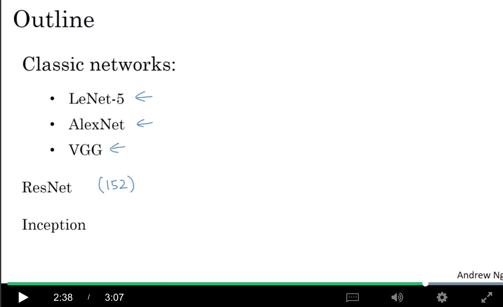

### 1.2 Classic Networks

#### 1.2.1 LeNet-5（1998年）

* 因为输入是灰度图，所以channel=1，维度是$$n_H^{[0]}\times n_W^{[0]}\times n_C^{[0]}=32\times 32\times 1$$
* stride=1，有6个filters，每个是5x5，所以输出是，$$n_H^{[1]}\times n_W^{[1]}\times n_C^{[1]}=(\frac{(32-5+2\times 0)}{1}+1)\times (\frac{(32-5+2\times 0)}{2}+1)\times 6=28\times 28\times 6$$
* 接下来接的是avg pooling(当时avg很流行，后来大部分是max pooling了)，2x2的filter，stride=2，而pooling的filter并没有第三维，输入和输出的第三维是一样的。所以输出是，$$(\frac{(28-2+2\times 0)}{2}+1)\times (\frac{(28-2+2\times 0)}{2}+1)\times 6=14\times 14\times 6$$
* 接下来接16个5x5(应该是5x5x6，maybe是同一个5x5，给6个channel用，所以简记为5x5)的filter，stride=1，所以：

  $$(\frac{14-5+2\times 0}{1}+1)(\frac{14-5\times 0}{1}+1)\times 16=10\times 10\times 16$$

* 然后接一个avg pooling，2x2的，输出是

  $$(\frac{10-2+2\times 0}{2}+1)(\frac{10-2+2\times 0}{2}+1)\times 16=5\times5\times 16$$

* 然后把这5x5x16=400个神经元flatten，变成一个400维的向量，再接一个120维的fc，再接一个84维的fc。
* 目标是一个10分类的结果，现代的方法是用一个10维的softmax，而在当时，用的是gaussian connections，现在已经不用啦。

小结：

* lenet-5总共有大约60k的参数。
* 因为都没有用padding，所以随着层数的增加，height和width都会变小。
* channels是增加的。
* 形成了pattern：conv+pool+conv+pool+fc+fc+output

看这篇论文时可以关注的点

* 当时的激活函数还是sigmoid/tanh
* 由于当时的计算速度比较慢，对$$n_H\times n_W\times n_C$$的输入，使用$$f\times f\times n_C$$的filter，每个filter只对对应的通道起作用
* 当时在pooling后会接非线性

可以关注论文的section II(网络结构)和section III（实验和结论）。

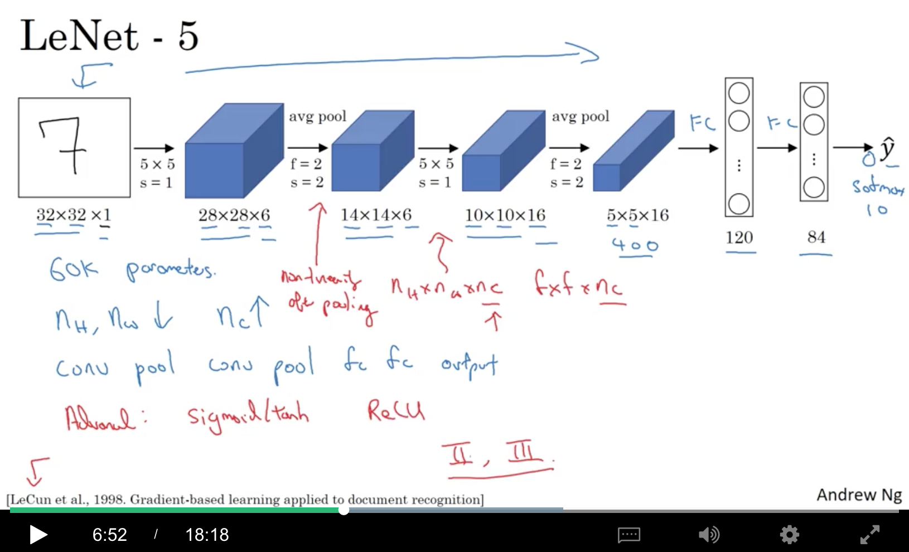

#### 1.2.2 AlexNet（2012年）

* 输入是227x227x3的图片
* 第一层是96个11x11的filters，stride=4，所以得到55x55x96
* 然后接一个3x3的max pooling，stride=2，所以得到27x27x96
* 然后经过256个5x5的卷积，做一个same conv，使得得到的宽和高保持不变[即(25+2p-5)/s+1=25==&gt;(20+2p)/s=24，可以设置stride=1，padding=2]，得到27x27x256。
* 然后再做一个3x3，stride=2的max pooling，得到13x13x256。
* 再接384个3x3的卷积，做same conv，得到13x13x384
* 再接384个3x3的卷积，做same conv，同样得到13x13x384
* 再接256个3x3的卷积，做same conv，同样得到13x13x256
* 再接3x3，stride=2的max pooling，得到6x6x256
* 然后flatten成一个6x6x256=9216维的向量
* 再接两个4096维的fc
* 最后接一个1000分类的softmax

小结：

* 结构和lenet-5相似，但参数上，lenet-5只有60k即6w的参数，而alexnet有60m即6kw的参数
* 使用了relu

看这篇论文时可以关注的点：

* 当时的gpu比较慢，所以当时用很复杂的方式在2个gpu上进行训练。大概的思想就是把一些layer拆开到不同gpu上进行训练和通信。
* 使用了一些特殊的层，例如local response normalization(LRN)。大概思想是，例如针对一个13x13x256的block，看13x13中的某一个点时，对这个点在256个通道上的值进行normalization。动机在于，在13x13上的某一个位置，或许不需要太多的神经元有太高的激活值。但后来，大多数研究者发现这么做其实没什么用…

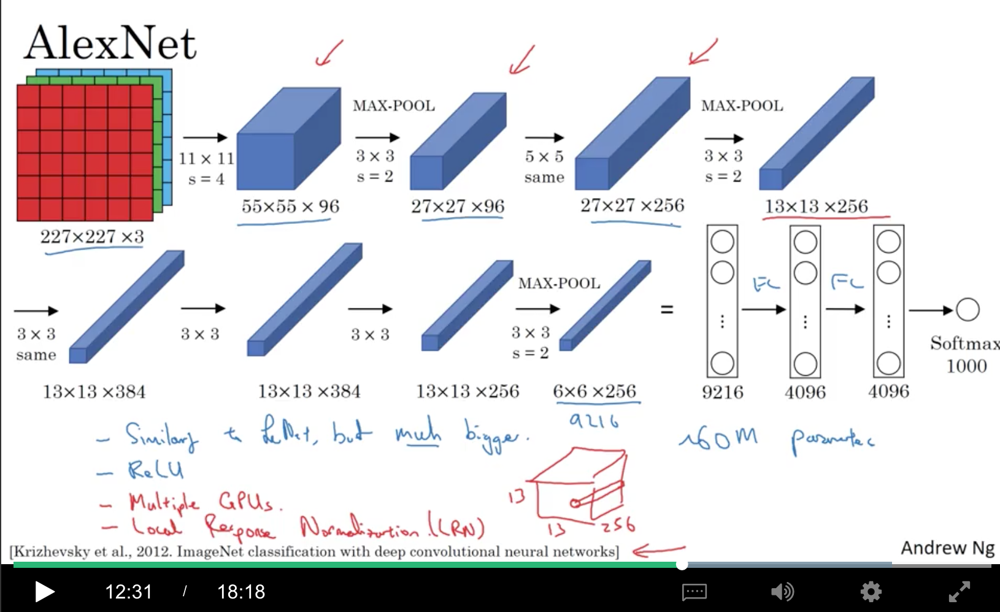

#### 1.2.3 vgg-16(2015年)

CONV都是3x3的filter，stride=1，same padding MAX-POOL都是2x2，stride=2(刚好可以把宽度和高度缩小一半：(x-2)/2+1=x/2)

* 输入是224x224x3的图片
* 然后接两个CONV 64层（每层有64个filter）[右上角的图]，得到224x224x64
* 然后接一个POOL，得到112x112x64
* 再接两个CONV 128层，得到112x112x128
* 再接一个POOL，得到56x56x128
* 再接3个CONV 256，得到56x56x256
* 再接一个POOL，得到28x28x256
* 再接3个CONV 512，得到28x28x512
* 再接一个POOL，得到14x14x512
* 再接3个CONV 512，得到14x14x512
* 再接一个POOL，得到7x7x512
* 然后flatten，并接2个4096的FC，最后接1000的softmax

小结：

* 不把POOL当做layer，就总共有2+2+3+3+3+1+1+1，所以叫vgg-16
* 可以看到，POOL会把高度和宽度减半，而channels则是逐层翻倍(64-238-256-512)
* 缺点就是参数太多，参数总量有138M，即13.8kw，即1.38亿
* 还有vgg-19，但效果其实差不多，所以大部分人还是用vgg-16

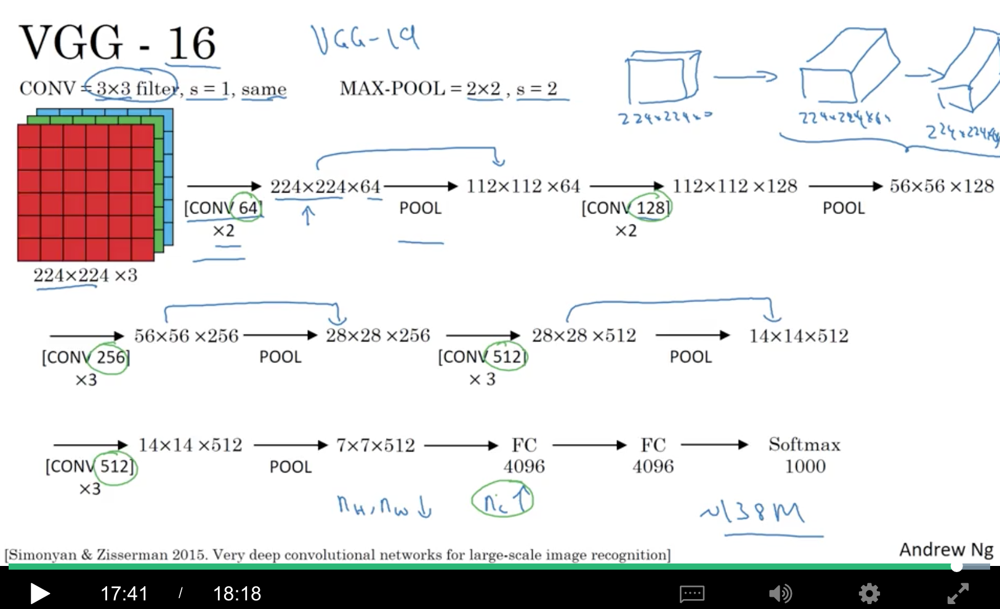

### 1.3 ResNets

核心思想是skip connections/shortcut。

基本组成单元是Residual Block。所谓的Residual，就是把图中的$$a^{[l]}$$直接『加』到$$z^{[l+2]}$$上，即： $$a^{[l+2]}=g(z^{[l+2]}+a^{[l]})$$

当然，这种shortcut不仅可以跨越一层，还可以跨越好几层

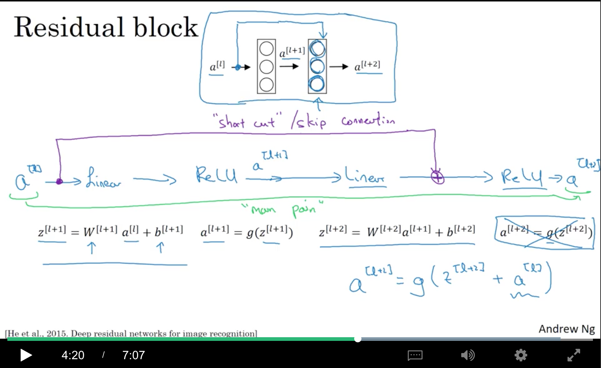

如下图，有5个residual blocks。

理论上，层数加深，training error会一直变小，如左图中的绿线，但实际应用中，一个很深的普通dnn（没有残差连接），训练误差反而会变大。而ResNet能让更深的网络训练效果更好，可能后面会出现平原（怎么加深效果也不会怎么变化）。

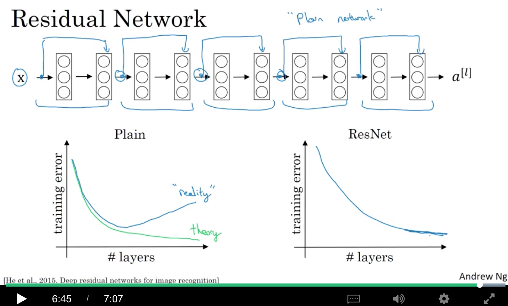

### 1.4 Why ResNets Work

$$a^{[l+2]}=g(z^{[l+2]}+a^{[l]})=g(W^{[l+2]}a^{[l+1]}+b^{[l+1]}+a^{[l]})$$

如果使用l2-regularization，即weight decay，会减小$$W^{[l+2]}$$。如果$$W^{[l+2]}$$减小到0，方便起见，假设$$b^{[l+2]}$$也是0，那么， $$a^{[l+2]}=g(W^{[l+2]}a^{[l+1]}+b^{[l+1]}+a^{[l]})=g(a^{[l]})$$

如果用的relu，那就是$$a^{[l+2]}=a^{[l]}$$。所以，Residual block能够很容易地学习恒等变换。相当于这两层在神经网络中白加了，其实就是减少了网络的深度。

另外一点需要注意的是，这里使用了『加』，所以要求$$z^{[l+2]}$$和$$a^{[l]}$$的维度是一样的，所以在resnet中会有很多的相同conv。

假设输入和输出维度不同，例如$$a^{[l]}$$是128维的，而$$a^{[l+2]}$$是256维的，这个时候，可以加一个256x128的$$W_s$$：

$$a^{[l+2]}=g(z^{[l+2]}+W_sa^{[l]})$$

这里的$$W_s$$可以是一个可学习的矩阵，也可以是一个固定的矩阵，例如对$$a^{[l]}$$进行zero-padding。

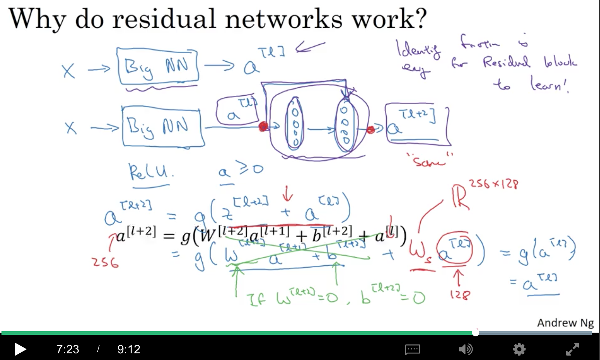

如何把一个plain network（普通网络）变成一个resnet呢？如图中有大量的same conv，直接变就行了。而图中的pool，输入和输出维度不同，这个时候就需要上面提到的$$W_s$$了，当然也可以不加residual。

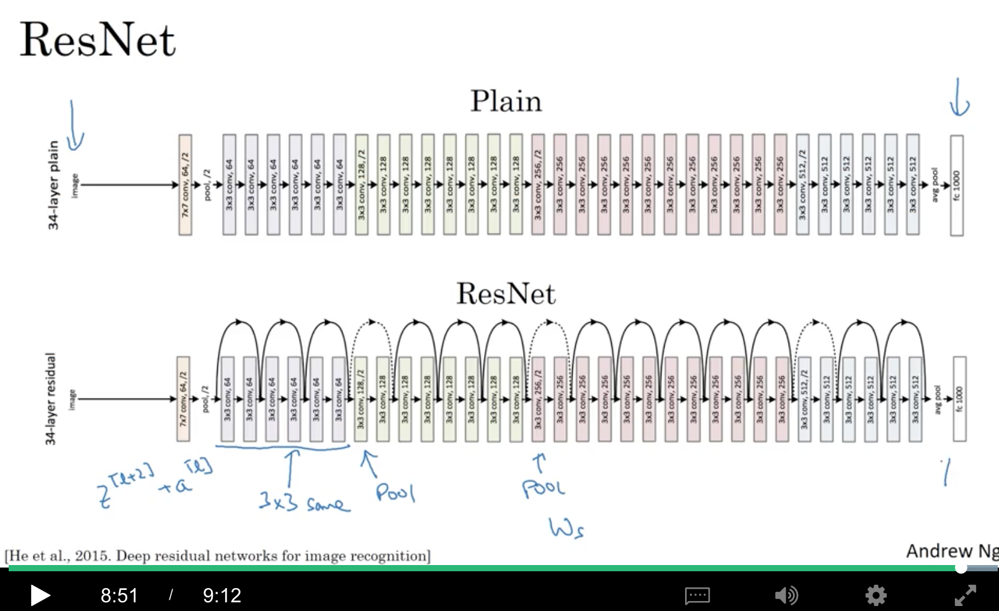

### 1.5 Networks in Networks and 1x1 Convolutions（2013年）

1x1其实就是乘了一个数，有啥用呢？

* 如果channels（即$$n_C$$）=1，确实只是乘了一个数
* 如果$$n_C&gt;1$$，例如，$$n_C=32$$，那么相当于6x6图像中的一个32维的点接受了一个32个数的向量，分别对应相乘再相加，再过一个Relu

所以本质上，1x1的卷积是一个全连接的神经网络，逐一作用于这6x6=36个不同的位置。这个全连接网络输入是32个数，输出filter个数个值（\#filters=$$n_C^{[l+1]}$$），得到6x6x\#filters的输出。

因此，1x1卷积有时也被称作Network in Network(当然，2013年的这篇paper就叫这个名字。。)。

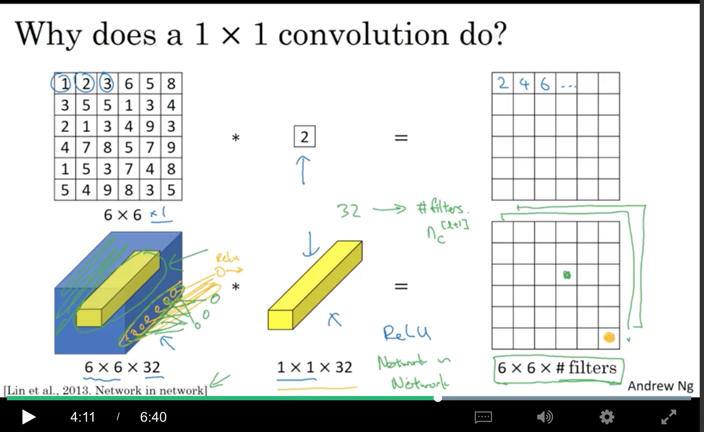

对于一个28x28x192的输入，如果想把height和width变小，可以直接用pooling：

* 如何把channels变小呢？可以用32个1x1的卷积，这样就得到了28x28x32。1x1可以减小channels数，从而减小计算量
* 而如果使用192个1x1卷积呢？这个时候1x1的效果就是增加非线性了

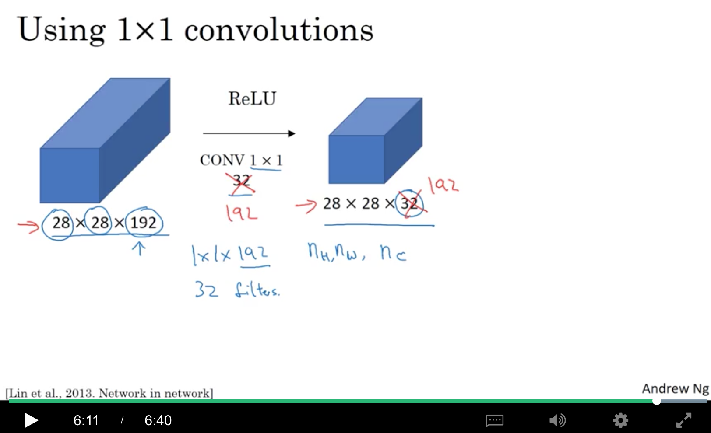

### 1.6 Inception Network Motivation（2014年）

如果输入是28x28x192，

* 经过64个1x1之后，得到28x28x64(绿色部分)，
* 经过128个3x3的same conv之后，得到28x28x128(蓝色)，把蓝色堆在绿色的上面。
* 同样地，堆一个32个5x5的same conv，得到紫色的，堆上去
* 当然，还可以用MAX-POOL，得到黄色的28x28x32。当然，为了维数能match(28x28)，需要对pool做padding，且stride=1
* 最后得到的就是一个28x28x(64+128+32+32)=28x28x256

而inception network有个缺点，就是计算成本问题。这是由图中的5x5卷积导致的。

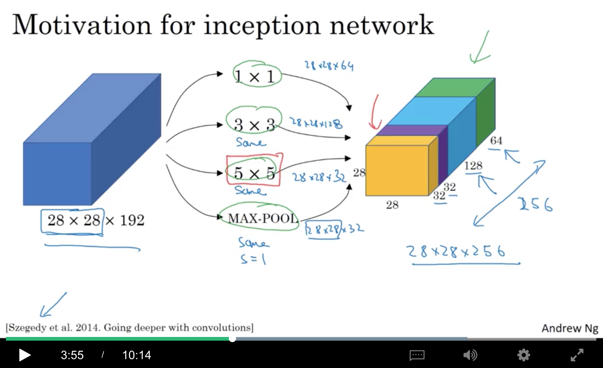

来看看上面说到的5x5的计算成本：

每个filter的大小是5x5x192，输出大小是28x28x32，所以需要计算28x28x32这么多个数，而每个数，需要做5x5x192的乘法，所以总共要做的乘法有$$28\times 28\times 32 \times 5\times 5\times 192=120M$$，也就是1.2亿。。。而接下来，会讲1x1卷积，能够将这个计算成本大概降低到1/10左右！！

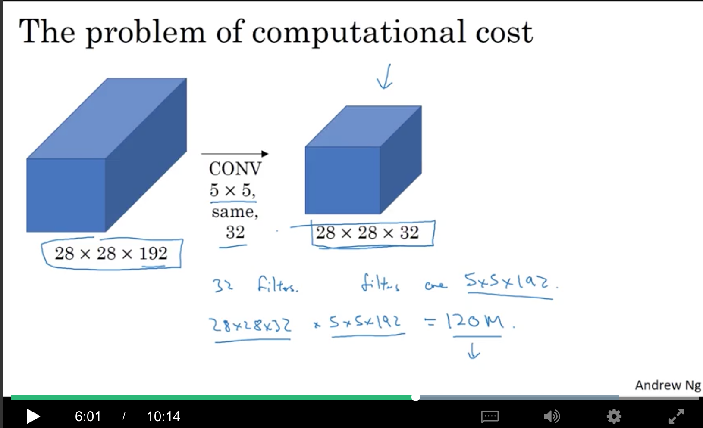

而同样地由28x28x192变成28x28x32，可以中间先接16个1x1，得到28x28x16，再接32个5x5，得到28x28x32。这个中间层，有时被称作bottleneck layer，因为很细（$$n_C$$很小咯）。。是这个网络中最小的部分。

看看计算成本：

* 计算bottleneck的成本：输出是28x28x16，对于每一个，需要做192次乘法，所以是$$28\times 28\times 16 \times 192=2.4M$$
* 对于后半部分，需要$$28\times 28\times 32 \times 5\times 5\times 16=10M$$
* 二者相加，就是12.4M，所以大概减少为原来的1/10左右

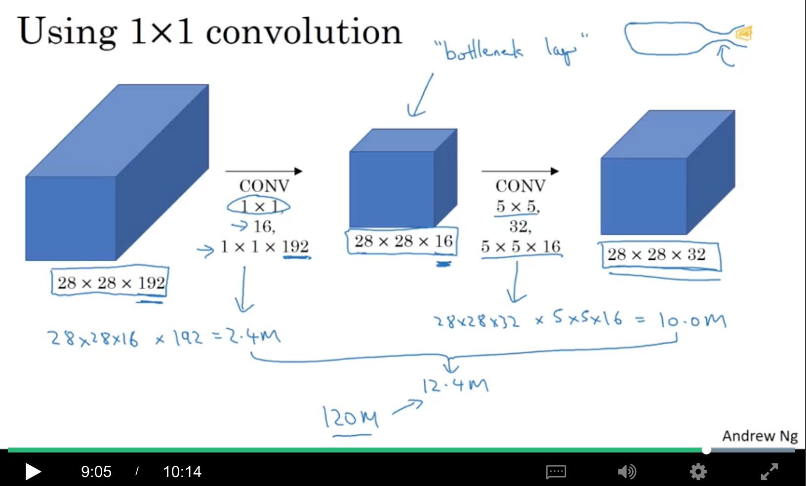

合理地使用1x1，可以减小计算成本，并且可以尽量不对网络的最终效果造成损失。

### 1.7 Inception Network

一个inception module如下（例如，输入是28x28x192），

* 和上一节讲到的一样，这里把5x5拆成了1x1和5x5，中间是16个channel
* 对3x3也做类似的操作，1x1中间是96个channel，输出是28x28x128
* 然后单独接一个1x1，输出28x28x64
* 然后来个pooling，3x3，stride=1，same，得到28x28x192，可见这里的channels还是挺多的，所以加多一个1x1~得到一个28x28x32
* 最后把上面的输出全部concat到一起，得到28x28x(64+128+32+32)=28x28x256

所以2014年的googlenet，其实就是一系列的inception module，可能有一些block不太一样（例如图中有箭头那个，就是先pooling了一下，改变维数，再接的inception block）。

还有一点值得注意的是，inception network还有一些side branches(旁枝)。因为最后是一些FC，再接一个softmax。而这些side branches是试着把一些中间层拿出来，经过一些全连接+softmax来做预测。作用是确保计算的特征值，即使在中间层，在做预测时也不会表现得太差。这其实是一种对inception network起到一种正则化的效果，避免overfitting。

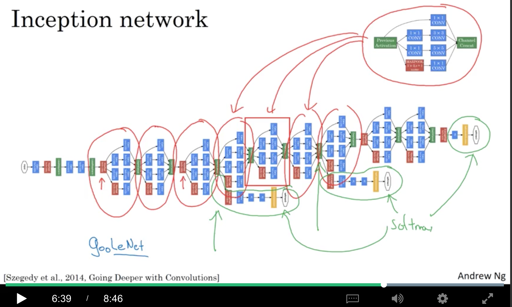

## 2. Practical advices for using ConvNets

### 2.1 Using Open-Source Implementation

很多神经网络的效果很难复现，因为很多超参的调整（例如学习率衰减）等很多细节都会对最终结果带来影响，所以还是从github上找开源实现吧~。。

### 2.2 Transfer Learning

例如需要搞一个三分类问题，可以找一个开源的实现，并把训练好的参数搞下来。

#### 2.2.1 如果训练集较小

然后把最后的softmax层（例如Imagenet就是1000分类）去掉，改成一个三分类的softmax。而前面的参数直接freeze，只训练与softmax层有关的参数。

如何固定参数呢？有的框架可以设置`trainableParameters=0`之类的。

也可以将前面层的当然一个固定的函数，输入一个X，计算其特征向量，把所有特征向量直接存放到磁盘中，然后拿这些向量去经过一个浅层神经网络，训练这个网络。

#### 2.2.2 如果训练集很大

可以只freeze前面的部分层，然后有几种做法：

* 可以把最后几层的参数拿来初始化，然后进行训练
* 也可以直接去掉最后几层，接自己的softmax

如果数据越多，所freeze的层数可以越少~

#### 2.2.3 如果训练集特别大

甚至可以拿下载下来的权重做初始化，直接训练整个网络。

在cv领域，迁移学习往往能取得很好的效果。

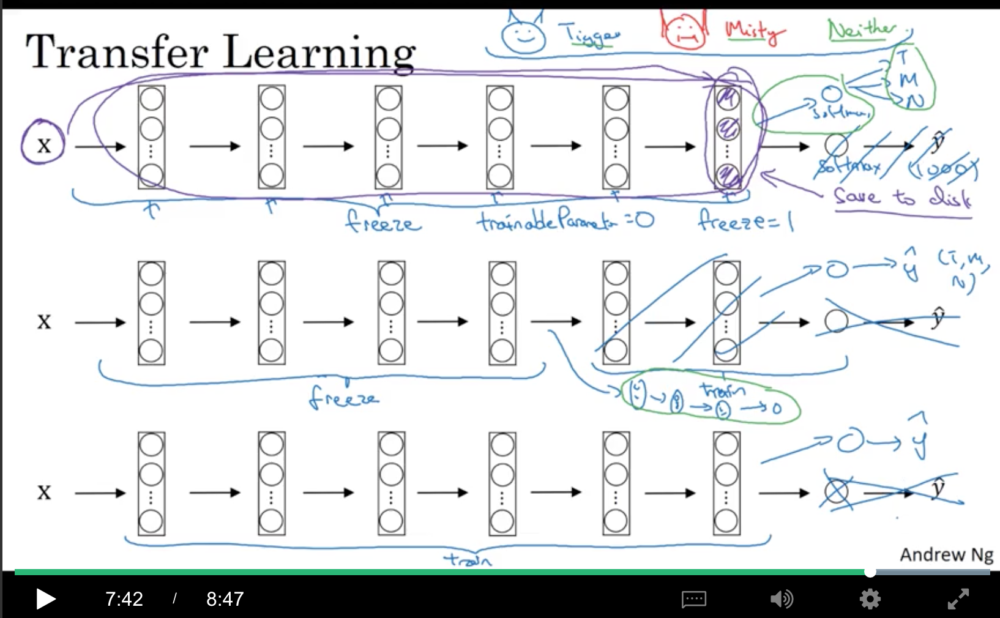

### 2.3 Data Augmentation

最常用的data augmentation如下：

* mirroring：镜像，垂直翻转
* random cropping：随机裁剪

还有其他几个，不太常用：

* Rotation：旋转一定角度
* Shearing：剪切，使图像变形，例如图中的变成平行四边形。。
* Local Warping：局部弯曲

另一种是Color shifting(色彩变化)，在R/G/B分别加上不同的扰动，图中+/-20只是为了看得更明显一点，实际的扰动可能很小。

PCA（主成分分析）也可以用在色彩变化上，在Alexnet的文章中有介绍，被称为PCA色彩增强（PCA color augmentation）：如果图片是偏紫色的，也就是说R和B比较多，G较少，PCA color augmentation会对R和B做比较大的加减，而对G只做微小的变化，从而保持整体与之前有相同的着色。

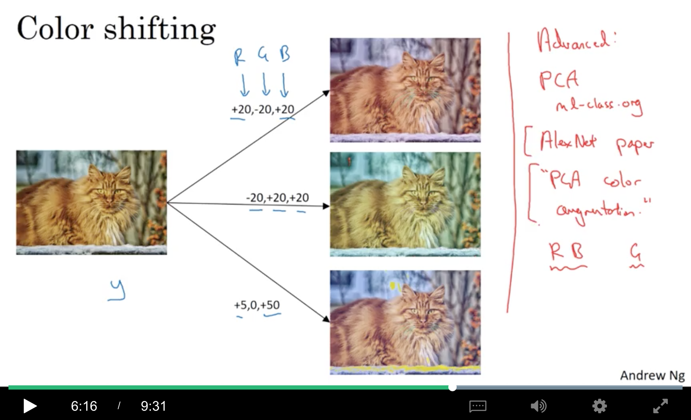

数据增强同样也有很多的超参数，所以可以直接拿开源版本的实现来搞，当然，也可以针对具体任务，自己调一下超参。

### 2.4 State of Computer Vision

从容易获取的数据量来讲，object detection &lt; image recognition &lt; speech recognition，

* 数据足够多时，用的是更简单的算法，更好的人工特征
* 数据较少时，用的是更多的人工特征

knowledge有两种来源：

* 标注数据
* 手工构造的feature/网络架构/其他组成部分

在cv领域，标注数据并不多，所以经常需要设置很复杂的网络结构。object detection任务的数据比图像识别更少，所以它们的架构更复杂，而且有更多的specialized components。

当然，如果数据集不够大，transfer learning是一个很好的方法。

另外，如何在benchmark或者比赛中取得比较好的成绩呢？有以下几种方法（在实际工程领域并不一定有用…）：

* ensembling:
  * 独立地训练一些（一般有3-15个）网络，并将他们的**输出**取平均。注意，是输出，不是权重
* 在test的时候使用multi-crop
  * 针对test image，进行多种crop，对他们分别做预测，然后对结果求平均

使用开源代码：

* 使用已published的网络架构
* 使用开源实现
* 使用pretrained的模型，并在你的数据集上finetune

