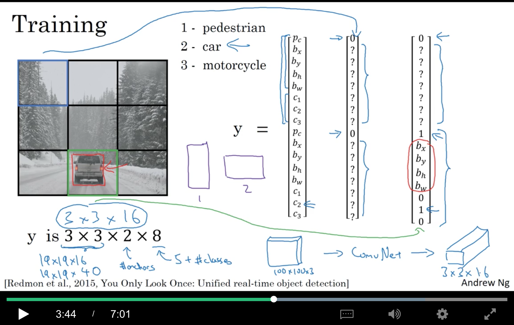
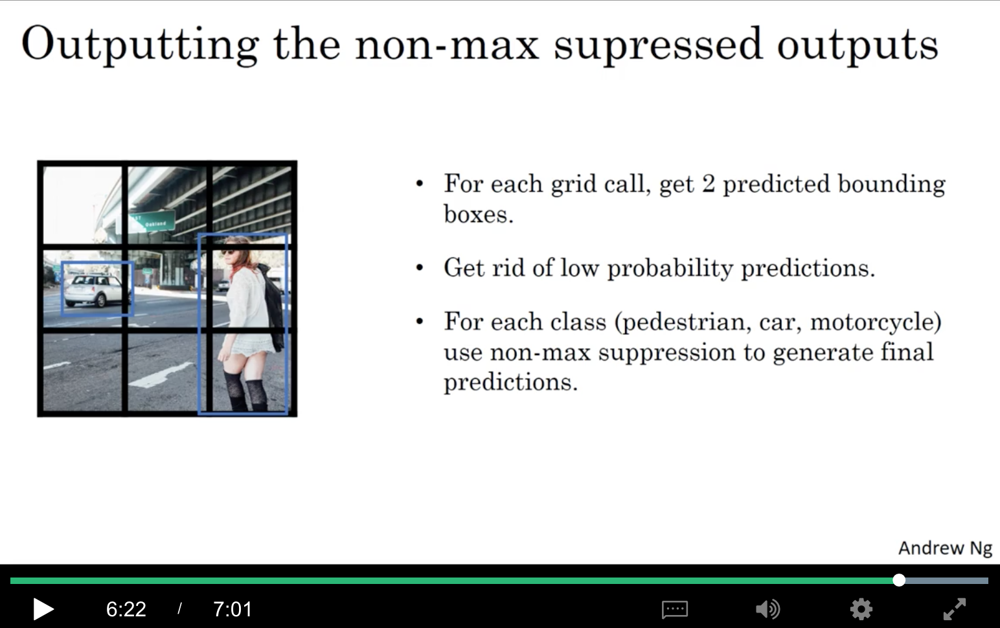
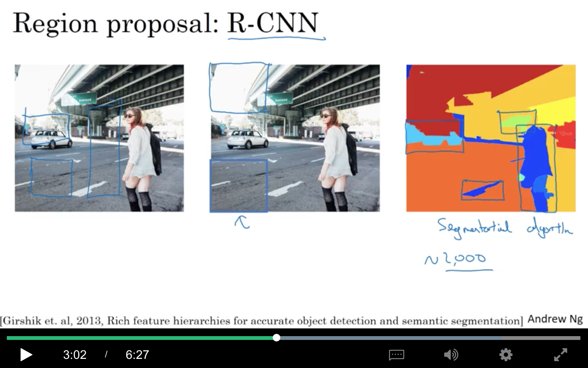

contents

<!-- TOC -->

- [1. Detection Algorithms](#1-detection-algorithms)
  - [1.1 Object Localization](#11-object-localization)
  - [1.2 Landmark Detection](#12-landmark-detection)
  - [1.3 Object Detection](#13-object-detection)
  - [1.4 Convolution Implementation of Sliding Windows](#14-convolution-implementation-of-sliding-windows)
    - [1.4.1 将fc转换为convoluiton](#141-%E5%B0%86fc%E8%BD%AC%E6%8D%A2%E4%B8%BAconvoluiton)
    - [1.4.2 OverFeat(2014)](#142-overfeat2014)
  - [1.5 Bounding Box Predictions](#15-bounding-box-predictions)
  - [1.6 Intersection Over Union](#16-intersection-over-union)
  - [1.7 Non-max Suppression](#17-non-max-suppression)
  - [1.8 Anchor Boxes](#18-anchor-boxes)
  - [1.9 YOLO Algorithm](#19-yolo-algorithm)
  - [1.10 Region Proposals](#110-region-proposals)

<!-- /TOC -->

# 1. Detection Algorithms

## 1.1 Object Localization

classification with localization通常指只识别并定位一个object，而detection指的是从图像中识别并定位多个不同类别的objects。

classification with localization一方面需要输出一个label(例如图中的4分类)，另一方面还要输出4个浮点数($b_x,b_y,b_h,b_w$)，其中，($b_x,b_y$)是中心点的坐标。注意：图片的左上角坐标为(0,0)，右下角标记为(1,1)。

如果类别是1,2,3之一，$p_c=1$，如果类别是4(不是要检测的object)，$p_c=0$。而输出除了$[p_c,b_x,b_y,b_h,b_w]$之外，还应该包括$[C_1,C_2,C_3]$也就是这三类的一个one-hot。注意这里假设的是只有一个object，所以只有一个坐标。

如左图，是有object的情况。如右图，没有object的时候，$p_c=0$，其他元素是什么是无所谓的啦。

损失函数，如果采用mse（均方误差）的话：

$$L(\hat{y},y))=\left\{\begin{matrix}
\sum ^8_{i=1}(\hat{y_i}-y_i)^2&&\ if\ y_1=1\\ 
(\hat{y_1}-y_1)^2&&\ if\ y_1=0
\end{matrix}\right.$$

当然，这里以mse举例只是为了简化描述。在实践中，也可以对不同部分用不同的loss，例如，

+ 对$p_c$用logistic regression loss
+ 对$b_x,b_y,b_h,b_w$用mse
+ 对$c_1,c_2,c_3$的softmax输出，可以用log likelihood loss

## 1.2 Landmark Detection

landmark指的是图中的重要的点，例如对于人脸识别的任务而言，可能眼角的坐标就是一个landmark。当然，还可以有一系列的landmark，例如有64个landmark，那就有128+1个输出元素。基于这些Landmark，可以做一些例如表情识别、戴帽子、面部变形等特效。

而对于pose detection的任务，也有很多类似的landmark。

## 1.3 Object Detection

sliding window detection方法：

例如，针对一个定位car的任务。

训练集，对原始图进行裁图，裁出的图保证car在正中间，而且基本占满整张图，图的尺寸就是window的大小。

然后对原图，拿滑动窗口慢慢滑动，每一个小区域过一遍convnet，看看是否是car。这算做一次slide。

然后把窗口调大，窗口里的图resize一下丢给同一个convnet，再看每一块是否是car。

再用更大的window，再来一次。

缺点：计算成本大。所以在还不是dnn的时代，常用比较简单的分类器，例如线性分类器来识别物体，然后走滑动窗口

## 1.4 Convolution Implementation of Sliding Windows

### 1.4.1 将fc转换为convoluiton

思想来自《[Fully Convolutional Networks for Semantic Segmentation](https://arxiv.org/abs/1411.4038)》，即FCN。

+ 输入是14x14x3
+ 经过16个5x5的filter，得到10x10x16，其中，10=14-5+1
+ 经过一个2x2的maxpooling，s=2,,得到5x5x16
+ 然后flatten成一个400维的向量
+ 然后接一个400维的fc
+ 再接一个400维的fc
+ 最后输出一个4维的softmax

针对上面那个图，前面的conv+pool不变，我们把后面的变成卷积：

+ 输入是5x5x16，用400个5x5的filter(实际是400个5x5x16)，得到400个1x1的结果，看成1x1x400的volume。【解释一下，这个操作相当于两个5x5x16的东西对应相乘相加，得到一个点，然后有400个filter，就有400个点；而如果接一个fc的话，相当于一个400维的向量，经过一个400x400的矩阵，得到一个400维的向量，第一个元素就是原来的400维向量，和这个400x400的矩阵的第一列对应元素相乘再相加得到的，然后有400列，就有400个点】
+ 对于第二个fc，同样地，经过400个1x1x400的filter，就可以得到一个1x1x400的结果
+ 最后接4个1x1x400的filter，替换掉softmax，得到1x1x4的输出

### 1.4.2 OverFeat(2014)

2014年的Lecun的OverFeat这篇文章中，将sliding windows转换为卷积操作。

例如，训练集是14x14x3，即window的大小是14x14，如果测试集是16x16x3，那么，例如一次滑动两格，那就需要过4次convnet，而这4次其实有大量的运算是重复的，可以通过convolution化来进行参数共享。具体如下，可以拿这个16x16x3的图，经过和convnet一样的网络结构：

+ 通过16个5x5的filter，得到12x12x16，其中，12=16-5+1
+ 通过16个2x2的maxpooling，s=2，得到6x6x16
+ 通过400个5x5的filter，得到2x2x400
+ 通过400个1x1的filter，得到2x2x400
+ 通过4个1x1的filter，得到2x2x4

可以发现，最终的这个2x2x4，左上角的1x1x4就是原图左上角经过convnet得到的结果，右上角、左下角、右下角的类推！！

如果输入图是28x28x3，最终输出的是8x8x4。得到的最终结果也是**滑动窗口的步长=2**的结果。这是**因为maxpooling使用的是2x2**，所以相当于在原来的图像上以步长为2运行。(再想想…是因为2x2还是因为stride=2呢)

但有个问题就是，bounding box并不精准，下一节来解决咯~

## 1.5 Bounding Box Predictions

比较有效的精确地画出bounding box的算法是YOLO算法（You Only Look Once, 2015）

+ 首先对图片网格(grid)化，例如，使用一个3x3的网格。
+ 对于每一个grid cell，输出一个8维的向量$[p_c,b_x,b_y,b_h,b_w,c_1,c_2,c_3]$
+ 对于没有物体的grid cell，就是$[0,?,?,?,?,?,?,?]$
+ 对于中间那行，左右两个有car的中心点，所以$p_c=1$，而中间那个grid cell，虽然有一些边界，但没有中心点，所以仍然$p_c=0$。

因此，输入是100x100x3，中间经过若干cnn后，输出的label就是3x3x8。

实践中，往往会使用更大的grid数，例如19x19而不是3x3，这样可以降低一个grid中有多个中心点的概率。

因为是全卷积实现的，所以速度非常快，甚至可以用在实时的目标检测上呢~

对于图中的黄色的grid cell，假定左上角是(0,0)，右下角是(1,1)，那么$b_x,b_y$肯定都是0-1间的float，但$b_h,b_w$可以是大于1的，比如有的车很大。

在YOLO的文章中，还有其他效果也不错的参数化方法(例如，通过sigmoid来保证在0-1之间，用指数函数来保证非负)，但上面讲到的这种比较合理，而且应用很广。

附最新的yolov3的keras实现：[https://github.com/qqwweee/keras-yolo3](https://github.com/qqwweee/keras-yolo3)

c++版本的darknet：[https://github.com/pjreddie/darknet/wiki/YOLO:-Real-Time-Object-Detection](https://github.com/pjreddie/darknet/wiki/YOLO:-Real-Time-Object-Detection)

## 1.6 Intersection Over Union

object localization的评估指标，其实也是计算两个框的相似程度：

例如，真实的Bounding box是图中红色框，但算法预测出来是紫色的框，这个时候Intersection Over Union(IoU)就表示两个框的交集除以并集的比率。

惯例上，IoU >=0.5，就算作correct。当然更严格的阈值也可以。

## 1.7 Non-max Suppression

non-max suppression(非最大值抑制)

如图，理论上应该一个中心点只属于一个grid cell，但在运行的过程中，可能多个grid cell都认为自己应该拥有这个中心点。

+ 第一步，就是在这多个bounding box中，选出$p_c$最大的那个，将它变亮（如图中右边0.9的那个box）
+ 然后对于那些与这个变亮的有很高IoU的box，变暗（即suppressed）
+ 然后找到第二个$p_c$最大的，如图中左边那个0.8
+ 然后把与它有高IoU的也变暗咯

实现细节：

假设只要识别car，这样就可以不要$c_1,c_2,c_3$了

+ 对于19x19=361个grid cell，会输出一个$[p_c,b_x,b_y,b_h,b_w]$的向量
+ 首先扔掉所有$p_c\le 0.6$的box
+ 遍历所有剩下的box
    + 选择最大的$p_c$，当做预测值
    + 把与上一步有$IoU\ge0.5$的box扔掉

如果有3个类别，$c_1,c_2,c_3$，则需要对每个类别独立地进行一次如上操作。

## 1.8 Anchor Boxes

如果一个grid cell想要检测多个object，那就要用到anchor boxes。

例如，一个grid cell可能即是行人的中心点，又是car的中心点，这个时候搞两个anchor box，把原来的输出由8维改成16维，前8维表示是否是第一个anchor box，后8维表示是否是第二个anchor box，衡量是否是某个anchor box的时候，会算IoU，太小的话就不算咯

如图，第一个y是既有人也有车的例子，如果只有车，就是第二个y

+ 如果一个grid cell里有3个东西，这种算法解决不了
+ 如果一个grid cell里有2个东西，他们的anchor box很像，这种算法也解决不了

对于上面的情况，需要做一些tie-breaking(挑选机制)

当然，如果格子是19x19，同一个grid cell是两个东西的中心点的概率远比3x3要小得多。

如何选择anchor box呢？传统的方法是手动挑选，5-10个不同形状的anchor box

最近的yolo文章中，会用k-means，to group together two types of objects shapes you tend to get. And then to use that to select a set of anchor boxes that this most stereotypically representative of the maybe multiple, of the maybe dozens of object classes you're trying to detect.

## 1.9 YOLO Algorithm

训练过程如下：

注：8=1+4+#classes

预测过程如下：

通过non-max supression找到最终的box(图中的grid call是笔误，应该是grid cell)

## 1.10 Region Proposals

region proposals(候选区域)

前面提到的sliding windows，有一个缺点就是，它会去辨别很多显然没有object的区域，因此2013年提出了R-CNN(regions with CNNs)

识别region的方法就是segmentation，如最右图，可以找到大约2000个Blocks，然后为他们分别放置一个bounding box，然后在它们上面跑分类器。这样，你的convnet就不仅是跑正方形的区域了，还可以跑矩形的。

+ R-CNN（2013）：找到regions，然后一次只对一个region进行分类，输出label+bounding box
+ fast R-CNN(2015)：找到regioins，然后使用卷积化的滑动窗口，对所有regions进行一次分类
+ faster R-CNN(2016)：使用CNN而非传统的segmentation算法来找到regions。（不过据说还是没有YOLO快。。）